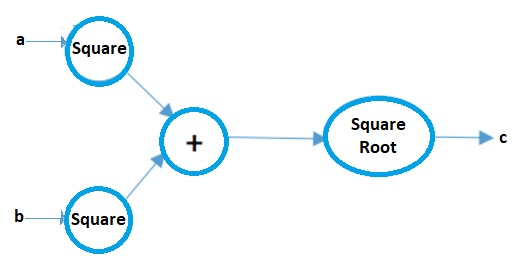
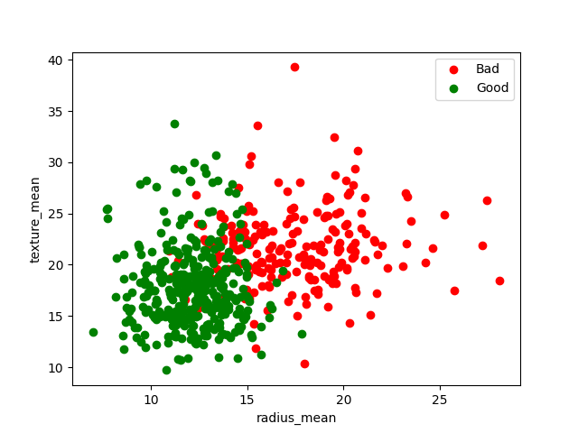

# Classification

Classification is the task of predicting which **category** (class) a data point belongs to. Unlike regression (which predicts a continuous number), classification outputs a discrete label — for example *Malignant vs. Benign*, *Spam vs. Not Spam*, or *Cat vs. Dog*.

All four algorithms below are demonstrated on the **Wisconsin Breast Cancer dataset** (569 samples, 30 numeric features, binary target: `M` = Malignant → `1`, `B` = Benign → `0`).

---

## 1. Logistic Regression

Despite its name, Logistic Regression is a **classification** algorithm, not a regression one. It models the probability that a sample belongs to a given class and outputs a value between 0 and 1 using the **sigmoid function**.

### Why Not Linear Regression for Classification?

Linear regression can predict values outside `[0, 1]`, which makes no sense as a probability. The sigmoid function squashes any real number into `(0, 1)`:

```
σ(z) = 1 / (1 + e^(-z))
```

If `σ(z) ≥ 0.5` → predict class `1`; otherwise predict class `0`.

### Computation Graph

A computation graph is a visual way to express mathematical operations as a directed graph of nodes. Each node represents an operation; edges carry values between them. This makes it easy to reason about the **forward pass** (computing the output) and the **backward pass** (computing gradients).



For logistic regression, the full forward pass looks like this — pixel inputs are multiplied by learned weights, summed with a bias, passed through the sigmoid, and produce a probability output:


```
z = wᵀx + b          → linear combination
ŷ = σ(z)             → apply sigmoid → probability
Loss = −y·log(ŷ) − (1−y)·log(1−ŷ)   → binary cross-entropy
```

### Initializing Parameters

```python
def initialize_weights_and_bias(dimension):
    w = np.full((dimension, 1), 0.01)  # small non-zero value
    b = 0.0
    return w, b
```

- **Weights are initialized to a small constant (0.01)** rather than 0. If all weights were 0, every neuron would compute the same output and gradients would be identical — the network would never learn different features (this is called the *symmetry problem*).
- **Bias starts at 0**, which is fine because the asymmetry issue only applies to weights.

### Forward & Backward Propagation

**Forward propagation** computes the prediction and the cost:

```
z      = wᵀ · X + b
ŷ      = σ(z)
Loss   = −y·log(ŷ) − (1−y)·log(1−ŷ)
Cost   = (1/m) · Σ Loss          # average over all m samples
```

**Backward propagation** computes the gradients of Cost with respect to `w` and `b`:

```
dz = ŷ − y
dw = (1/m) · X · dzᵀ
db = (1/m) · Σ dz
```

These gradients tell us in which direction (and how steeply) the cost increases — so we move the parameters in the **opposite** direction.

### Gradient Descent (Updating Weights)


```
w ← w − α · dw
b ← b − α · db
```

`α` (alpha) is the **learning rate** — how big a step we take each iteration. The update loop repeats for a fixed number of iterations until the cost converges (stops decreasing significantly).

### Loss vs. Cost

| Term | Definition |
|------|-----------|
| **Loss** | Error for a **single** training example |
| **Cost** | Average loss over **all** training examples |

We minimize the **cost** during training.

### Binary Cross-Entropy Loss

```
L(y, ŷ) = −y·log(ŷ) − (1−y)·log(1−ŷ)
```

- When `y = 1`: loss = `−log(ŷ)`. If the model predicts `ŷ = 1`, loss → 0. If `ŷ → 0`, loss → ∞.
- When `y = 0`: loss = `−log(1−ŷ)`. Symmetric reasoning.

This function penalizes confident wrong predictions very heavily.

### Why Sigmoid? Key Properties


1. **Probabilistic output** — result is always in `(0, 1)`, interpretable as probability.
2. **Differentiable** — essential for gradient descent; its derivative is `σ(z)·(1 − σ(z))`.
3. **Monotonic** — larger `z` always means higher predicted probability.

### Implementation in This Notebook

This notebook implements logistic regression **from scratch** using NumPy, then compares the result to **scikit-learn's** `LogisticRegression`. Building it from scratch first is the best way to understand what sklearn is doing under the hood.

---

## 2. K-Nearest Neighbours (KNN)

KNN is a simple, **non-parametric** algorithm — it memorises the entire training set and makes predictions at query time by looking at the closest points.

### Algorithm (Step by Step)

1. **Choose K** — the number of neighbours to consider.
2. **Compute distances** from the query point to every training sample (Euclidean distance is most common).
3. **Find the K closest** training samples.
4. **Vote** — the majority class among those K neighbours becomes the prediction.

### Euclidean Distance

```
d = √((x₂ − x₁)² + (y₂ − y₁)²)
```

In higher dimensions this generalises to:

```
d = √(Σ (xᵢ − yᵢ)²)
```

### Choosing K

- **Small K (e.g. 1):** Very sensitive to noise — a single outlier can change the prediction. Low bias, high variance → **overfitting**.
- **Large K:** Smoother decision boundary but may include irrelevant neighbours. High bias, low variance → **underfitting**.
- **Best practice:** Plot accuracy vs. K on the test set and pick the elbow (the point where accuracy stops improving significantly). In this notebook, `K = 8` gives the best result.

The plot below shows the actual breast cancer data — red = Malignant, green = Benign. KNN uses the spatial separation between these clusters to classify new samples:



### Normalization is Critical for KNN

KNN is entirely distance-based. A feature with large values (e.g. `area_mean` ~ 500) will dominate the distance over a small-valued feature (e.g. `smoothness_mean` ~ 0.1). **Min-Max normalization** scales every feature to `[0, 1]`:

```
x_norm = (x − x_min) / (x_max − x_min)
```

---

## 3. Support Vector Machine (SVM)

SVM finds the **hyperplane** that separates two classes with the **maximum margin** — the widest possible gap between the nearest data points of each class. Those nearest points are called **support vectors**.

### Intuition

Imagine drawing a line between two clusters of points. There are infinitely many lines that separate them correctly. SVM picks the one that is **furthest from both clusters** — maximising the margin makes the classifier more robust to new data.

```
Margin = 2 / ||w||
```

Maximising the margin is equivalent to minimising `||w||² / 2`, subject to the constraint that all points are correctly classified.

### Hard vs. Soft Margin

| Type | Description |
|------|-------------|
| **Hard margin** | No misclassification allowed. Only works when data is perfectly linearly separable. |
| **Soft margin** | Allows some misclassification (controlled by the `C` parameter). More practical for real-world noisy data. |

**`C` (regularisation parameter):**
- Large `C` → penalises misclassification heavily → narrow margin, risk of overfitting.
- Small `C` → tolerates more errors → wider margin, better generalisation.

### Kernel Trick

When data is not linearly separable, SVM maps the data to a **higher-dimensional space** where a separating hyperplane exists. Common kernels:
- `linear` — no transformation (default for linearly separable data)
- `rbf` (Radial Basis Function) — maps to infinite dimensions; handles most non-linear cases
- `poly` — polynomial transformation

scikit-learn's `SVC` uses `kernel='rbf'` by default.

---

## 4. Naive Bayes

Naive Bayes is a **probabilistic classifier** based on Bayes' Theorem. It is called *naive* because it assumes all features are **conditionally independent** given the class label — a simplification that rarely holds in practice but works surprisingly well.

### Bayes' Theorem


```
P(class | features) = P(features | class) × P(class) / P(features)
```

| Term | Name | Meaning |
|------|------|---------|
| `P(class \| features)` | **Posterior** | Probability of the class given the observed features |
| `P(features \| class)` | **Likelihood** | Probability of observing these features from this class |
| `P(class)` | **Prior** | How frequent this class is in the training set |
| `P(features)` | **Evidence** | Constant normaliser; can be ignored for classification |

To classify, we compute the posterior for each class and pick the highest one.

### The "Naive" Independence Assumption

```
P(x₁, x₂, …, xₙ | class) = P(x₁|class) × P(x₂|class) × … × P(xₙ|class)
```

Each feature is treated as if it contributes to the class probability independently. This makes the maths tractable, avoids the curse of dimensionality, and speeds up computation dramatically.

### Gaussian Naive Bayes

When features are **continuous** (like all 30 features in the breast cancer dataset), `GaussianNB` assumes each feature follows a **normal (Gaussian) distribution** within each class:

```
P(xᵢ | class) = (1 / √(2πσ²)) · exp(−(xᵢ − μ)² / (2σ²))
```

The model learns `μ` (mean) and `σ²` (variance) for each feature in each class from the training data. No hyperparameters to tune.

### Strengths & Weaknesses

| Strengths | Weaknesses |
|-----------|-----------|
| Very fast to train and predict | Assumes feature independence (often violated) |
| Works well with small data | Probability estimates can be poorly calibrated |
| Handles high-dimensional data gracefully | Poor on features with complex correlations |
| Naturally multi-class | Sensitive to feature scaling in some variants |

---

## Algorithm Comparison

| Algorithm | Type | Key Hyperparameter | Interpretable? | Scales Well? |
|-----------|------|--------------------|----------------|-------------|
| Logistic Regression | Probabilistic (linear) | Learning rate, iterations | ✅ Yes | ✅ Yes |
| KNN | Instance-based | K (neighbours) | ✅ Yes | ❌ Slow on large N |
| SVM | Geometric margin | C, kernel, gamma | ⚠️ Partial | ✅ Kernel-dependent |
| Naive Bayes | Probabilistic | — | ✅ Yes | ✅ Yes |
