# Classification

🇹🇷 Türkçe sürüm: [Sınıflandırma](Classification.tr.md)

> [!NOTE]
> **Goal:** Understand six classification algorithms from the inside: the intuition, the math that makes each one work, and the code. Every figure and number on this page is computed from the Wisconsin Breast Cancer dataset in my Machine Learning repo, so all of it can be reproduced.

**Contents**

- [The big picture](#the-big-picture)
- [1. Logistic Regression](#1-logistic-regression)
- [2. K-Nearest Neighbours (KNN)](#2-k-nearest-neighbours-knn)
- [3. Support Vector Machine (SVM)](#3-support-vector-machine-svm)
- [4. Naive Bayes](#4-naive-bayes)
- [5. Decision Tree Classification](#5-decision-tree-classification)
- [6. Random Forest Classification](#6-random-forest-classification)
- [7. Confusion Matrix and Evaluation Metrics](#7-confusion-matrix-and-evaluation-metrics)
- [Algorithm Comparison](#algorithm-comparison)
- [Check yourself](#check-yourself)

---

## The big picture

Classification is the task of predicting which **category** (class) a data point belongs to. Unlike regression (which predicts a continuous number, see [Regression](../Regression/Regression.md)), classification outputs a discrete label — for example *Malignant vs. Benign*, *Spam vs. Not Spam*, or *Cat vs. Dog*.

All algorithms below are demonstrated on the **Wisconsin Breast Cancer dataset** (569 samples, 30 numeric features, binary target: `M` = Malignant → `1`, `B` = Benign → `0`). The classes are not balanced: **357 benign (62.7%)** and **212 malignant (37.3%)**. Keep those two numbers in mind; they come back in Naive Bayes and in the evaluation section.

Each algorithm answers the same question with a different idea:

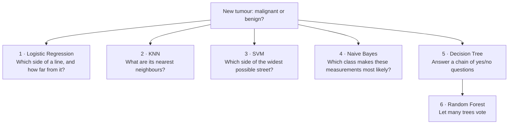
```mermaid
graph TD
    Q["New tumour: malignant or benign?"] --> A["1 · Logistic Regression<br>Which side of a line, and how far from it?"]
    Q --> B["2 · KNN<br>What are its nearest neighbours?"]
    Q --> C["3 · SVM<br>Which side of the widest possible street?"]
    Q --> D["4 · Naive Bayes<br>Which class makes these measurements most likely?"]
    Q --> E["5 · Decision Tree<br>Answer a chain of yes/no questions"]
    E --> F["6 · Random Forest<br>Let many trees vote"]
```

### The pipeline every notebook follows

1. **Load** the CSV and drop `id` and the empty `Unnamed: 32` column.
2. **Encode** the target: `M` → 1, `B` → 0.
3. **Normalize** the features (critical for distance- and gradient-based models, explained in section 2).
4. **Split** into training and test sets.
5. **Fit** on the training set, **score** on the test set.

> [!NOTE]
> Most pictures below use only two of the 30 features, `radius_mean` and `texture_mean`, because two dimensions can be drawn. The accuracies quoted in the text use all 30 features unless I say otherwise.

---

## 1. Logistic Regression

Despite its name, Logistic Regression is a **classification** algorithm, not a regression one. It models the probability that a sample belongs to a given class and outputs a value between 0 and 1 using the **sigmoid function**.

### Why Not Linear Regression for Classification?

Linear regression can predict values outside `[0, 1]`, which makes no sense as a probability. The sigmoid function squashes any real number into `(0, 1)`:

```math
\sigma(z) = \frac{1}{1 + e^{-z}}
```

If $`\sigma(z) \ge 0.5`$ → predict class `1`; otherwise predict class `0`.

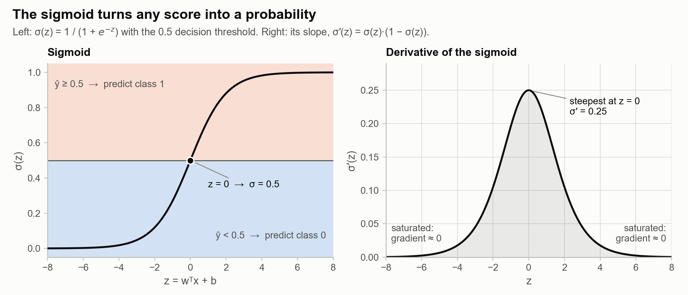

*Left: the sigmoid maps any score z to a probability between 0 and 1. Right: its derivative, largest at z = 0 and almost zero where the curve is flat.*

### The model: a linear score pushed through the sigmoid

```math
z = w^{\top}x + b, \qquad \hat{y} = \sigma(z) = P(y = 1 \mid x)
```

- $`w`$ = one **weight** per feature (30 here), $`b`$ = **bias**
- $`z`$ = a raw score that can be any real number
- $`\hat{y}`$ = the predicted probability of class 1 (malignant)

**What does z mean?** Solve the sigmoid for z and you get the **log-odds**:

```math
\log\frac{\hat{y}}{1 - \hat{y}} = w^{\top}x + b
```

So logistic regression is a *linear model for the log-odds*. Increasing feature $`x_j`$ by 1 adds $`w_j`$ to the log-odds, which multiplies the odds by $`e^{w_j}`$.

**Where is the decision boundary?** $`\hat{y} \ge 0.5`$ exactly when $`z \ge 0`$, so the boundary is the set of points where

```math
w^{\top}x + b = 0
```

That is a straight line in 2-D and a flat hyperplane in 30-D. Logistic regression is a **linear classifier**: the sigmoid only decides how confident it is on each side.

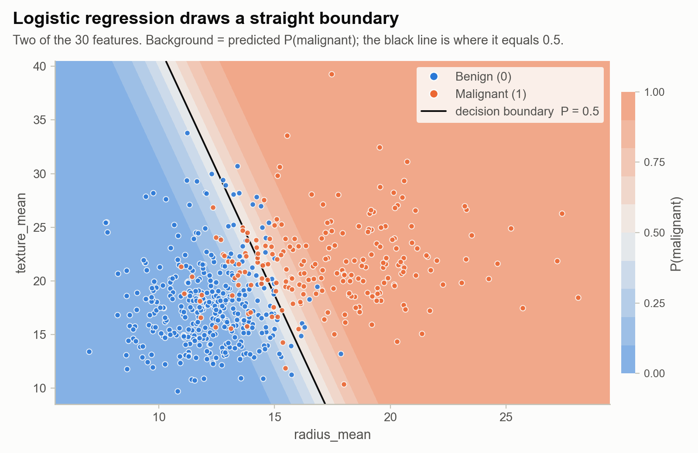

*Logistic regression on two features. The background colour is the predicted probability of malignant; the black line is where it equals 0.5.*

### Computation Graph

A computation graph is a visual way to express mathematical operations as a directed graph of nodes. Each node represents an operation; edges carry values between them. This makes it easy to reason about the **forward pass** (computing the output) and the **backward pass** (computing gradients).

For logistic regression, the full forward pass looks like this — the inputs are multiplied by learned weights, summed with a bias, passed through the sigmoid, and compared with the true label:

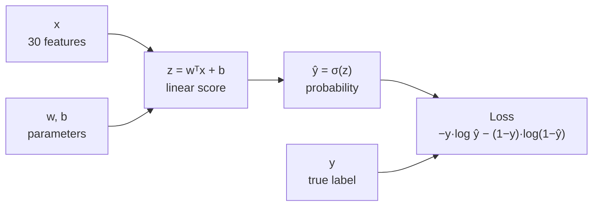
```mermaid
graph LR
    X["x<br>30 features"] --> Z["z = wᵀx + b<br>linear score"]
    W["w, b<br>parameters"] --> Z
    Z --> S["ŷ = σ(z)<br>probability"]
    S --> L["Loss<br>−y·log ŷ − (1−y)·log(1−ŷ)"]
    Y["y<br>true label"] --> L
```

The backward pass walks the same graph **from right to left**, multiplying local derivatives (the chain rule) to find out how the loss changes when each parameter changes.

### Loss vs. Cost

| Term | Definition |
|---|---|
| **Loss** | Error for a **single** training example |
| **Cost** | Average loss over **all** training examples |

We minimize the **cost** during training.

### Binary Cross-Entropy Loss

```math
L(y, \hat{y}) = -\,y\log(\hat{y}) - (1 - y)\log(1 - \hat{y})
```

- When $`y = 1`$: loss = $`-\log(\hat{y})`$. If the model predicts $`\hat{y} = 1`$, loss → 0. If $`\hat{y} \to 0`$, loss → ∞.
- When $`y = 0`$: loss = $`-\log(1 - \hat{y})`$. Symmetric reasoning.

This function penalizes confident wrong predictions very heavily.

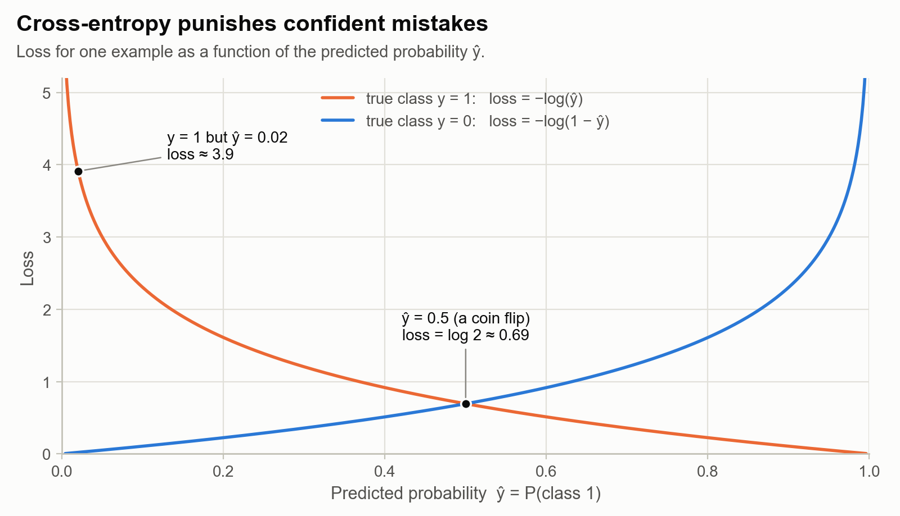

*Cross-entropy for a single example. Being confidently wrong costs far more than being unsure.*

The cost over all $`m`$ training examples:

```math
J(w, b) = \frac{1}{m}\sum_{i=1}^{m}\Big[-y_i\log(\hat{y}_i) - (1 - y_i)\log(1 - \hat{y}_i)\Big]
```

<details>
<summary><b>Deeper: where does this formula come from? (maximum likelihood)</b></summary>

The model says the label is a coin flip with probability $`\hat{y}`$ of landing on 1. Both cases fit in one expression:

```math
P(y \mid x) = \hat{y}^{\,y}\,(1 - \hat{y})^{\,1 - y}
```

Check it: for $`y = 1`$ it gives $`\hat{y}`$, for $`y = 0`$ it gives $`1 - \hat{y}`$. Assuming the examples are independent, the probability of the whole training set is the product, and its logarithm is a sum:

```math
\log \mathcal{L}(w, b) = \sum_{i=1}^{m}\Big[y_i\log(\hat{y}_i) + (1 - y_i)\log(1 - \hat{y}_i)\Big]
```

Training should make the observed labels as probable as possible, so we **maximize** this. Flip the sign and divide by $`m`$ and you have exactly the cost $`J`$. Cross-entropy is not an arbitrary choice: minimizing it is maximum-likelihood estimation.

</details>

<details>
<summary><b>Deeper: why not just use squared error like in regression?</b></summary>

With the sigmoid inside, $`(y - \sigma(w^{\top}x + b))^2`$ is **not convex** in $`w`$: it has flat regions and can trap gradient descent. Its gradient also contains the factor $`\sigma'(z)`$, which is almost zero when the model is confidently wrong, so learning stalls exactly where it should be fastest. Cross-entropy is convex for this model and its gradient has no such factor, as the next section shows.

</details>

### Initializing Parameters

```python
def initialize_weights_and_bias(dimension):
    w = np.full((dimension, 1), 0.01)  # small non-zero value
    b = 0.0
    return w, b
```

- **Weights are initialized to a small constant (0.01)** rather than 0. In a neural network with hidden layers, starting every weight at the same value makes every neuron compute the same output and receive the same gradient, so they can never learn different features (the *symmetry problem*). Plain logistic regression is a single unit with a convex cost, so it would also converge from zero; I keep the small non-zero start because it is the habit that carries over to neural networks.
- **Bias starts at 0**, which is fine because the symmetry issue only applies to weights.
- With weights this small, $`z \approx 0`$ and $`\hat{y} \approx 0.5`$ for every sample, so the very first cost is $`\log 2 \approx 0.693`$: the cost of pure guessing. That is a handy sanity check for any implementation.

### Forward & Backward Propagation

**Forward propagation** computes the prediction and the cost:

```math
z = w^{\top}X + b, \qquad \hat{y} = \sigma(z), \qquad J = \frac{1}{m}\sum_{i=1}^{m} L(y_i, \hat{y}_i)
```

**Backward propagation** computes the gradients of the cost with respect to $`w`$ and $`b`$. Apply the chain rule along the computation graph, one link at a time:

```math
\frac{\partial L}{\partial w} = \frac{\partial L}{\partial \hat{y}}\cdot\frac{\partial \hat{y}}{\partial z}\cdot\frac{\partial z}{\partial w}
```

| Link | Derivative |
|---|---|
| Loss with respect to the prediction | $`\dfrac{\partial L}{\partial \hat{y}} = -\dfrac{y}{\hat{y}} + \dfrac{1 - y}{1 - \hat{y}} = \dfrac{\hat{y} - y}{\hat{y}(1 - \hat{y})}`$ |
| Prediction with respect to the score | $`\dfrac{\partial \hat{y}}{\partial z} = \sigma(z)(1 - \sigma(z)) = \hat{y}(1 - \hat{y})`$ |
| Score with respect to the parameters | $`\dfrac{\partial z}{\partial w} = x, \qquad \dfrac{\partial z}{\partial b} = 1`$ |

Multiply the first two links and the awkward fraction cancels completely:

```math
dz = \frac{\partial L}{\partial z} = \frac{\hat{y} - y}{\hat{y}(1 - \hat{y})}\cdot\hat{y}(1 - \hat{y}) = \hat{y} - y
```

The gradient with respect to the score is simply **prediction minus truth**. Averaging over all $`m`$ samples gives the three lines used in the notebook:

```math
dz = \hat{y} - y, \qquad dw = \frac{1}{m}\,X\,dz^{\top}, \qquad db = \frac{1}{m}\sum_{i=1}^{m} dz_i
```

(Here $`X`$ has one **column** per sample, shape 30 × m, which is why the notebook transposes the data after splitting.)

These gradients tell us in which direction (and how steeply) the cost increases — so we move the parameters in the **opposite** direction.

### Gradient Descent (Updating Weights)

```math
w \leftarrow w - \alpha \cdot dw, \qquad b \leftarrow b - \alpha \cdot db
```

$`\alpha`$ (alpha) is the **learning rate** — how big a step we take each iteration. The update loop repeats for a fixed number of iterations until the cost converges (stops decreasing significantly).

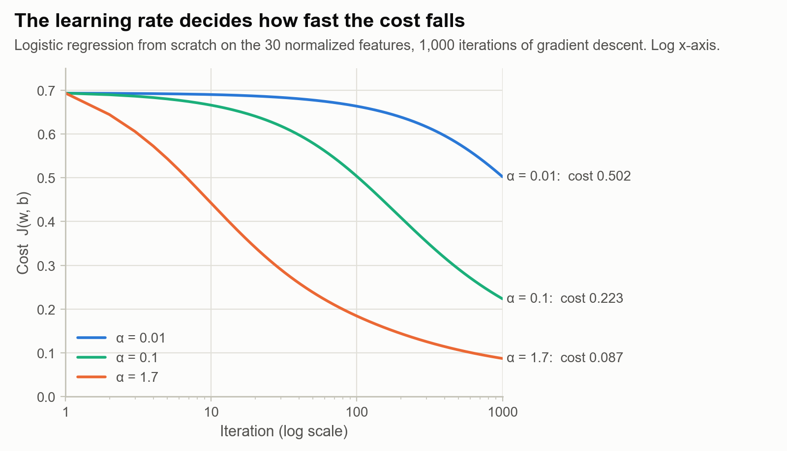

*Cost during training for three learning rates. All three start at log 2 = 0.693; a larger learning rate gets much further in the same 1,000 iterations.*

| Learning rate α | Cost after 1,000 iterations | Train accuracy | Test accuracy |
|---|---|---|---|
| 0.01 | 0.502 | 89.9% | 91.2% |
| 0.1 | 0.223 | 94.3% | 95.6% |
| **1.7** (the notebook’s value) | **0.087** | **98.2%** | **97.4%** |

> [!TIP]
> A learning rate of 1.7 sounds huge, but it works here because every feature was normalized to `[0, 1]`, which keeps the gradients small and the cost surface well-shaped. On unscaled features the same value would make the cost explode. The right learning rate always depends on how the inputs are scaled.

### Why Sigmoid? Key Properties

1. **Probabilistic output** — result is always in `(0, 1)`, interpretable as probability.
2. **Differentiable** — essential for gradient descent; its derivative is $`\sigma(z)(1 - \sigma(z))`$.
3. **Monotonic** — larger $`z`$ always means higher predicted probability.

<details>
<summary><b>Deeper: proof that σ′(z) = σ(z)(1 − σ(z))</b></summary>

Write $`\sigma(z) = (1 + e^{-z})^{-1}`$ and differentiate with the chain rule:

```math
\sigma'(z) = \frac{e^{-z}}{(1 + e^{-z})^2} = \frac{1}{1 + e^{-z}}\cdot\frac{e^{-z}}{1 + e^{-z}} = \sigma(z)\,\big(1 - \sigma(z)\big)
```

The last step uses $`1 - \sigma(z) = \dfrac{e^{-z}}{1 + e^{-z}}`$. The derivative peaks at 0.25 when $`z = 0`$ and vanishes for large positive or negative z, which is the “saturation” shown in the right panel of the sigmoid figure.

</details>

### Implementation in This Notebook

This notebook implements logistic regression **from scratch** using NumPy, then compares the result to **scikit-learn’s** `LogisticRegression`. Building it from scratch first is the best way to understand what sklearn is doing under the hood.

```python
import numpy as np
import pandas as pd
from sklearn.model_selection import train_test_split

data = pd.read_csv("../datasets/data.csv").drop(columns=["id", "Unnamed: 32"])
y = (data.diagnosis == "M").astype(int).values
x = data.drop(columns="diagnosis")
x = ((x - x.min()) / (x.max() - x.min())).values           # min-max normalization
x_train, x_test, y_train, y_test = train_test_split(x, y, test_size=0.2, random_state=42)

def sigmoid(z):
    return 1 / (1 + np.exp(-z))

def train(X, y, alpha=1.7, iterations=1000):
    m, n = X.shape                         # m samples (rows), n features
    w, b = np.full(n, 0.01), 0.0
    for _ in range(iterations):
        y_hat = sigmoid(X @ w + b)         # forward pass
        dz = y_hat - y                     # backward pass: prediction minus truth
        w -= alpha * (X.T @ dz) / m
        b -= alpha * dz.mean()
    return w, b

w, b = train(x_train, y_train)
y_pred = (sigmoid(x_test @ w + b) > 0.5).astype(int)
print((y_pred == y_test).mean())           # 0.9737  (from scratch)

from sklearn.linear_model import LogisticRegression
lr = LogisticRegression(max_iter=5000).fit(x_train, y_train)
print(lr.score(x_test, y_test))            # 0.9825  (scikit-learn)
```

The from-scratch model reaches **97.4%** test accuracy and scikit-learn **98.2%**: a difference of one tumour out of 114. scikit-learn uses a smarter optimizer and adds L2 regularization by default.

---

## 2. K-Nearest Neighbours (KNN)

KNN is a simple, **non-parametric** algorithm — it memorises the entire training set and makes predictions at query time by looking at the closest points. There is no training step at all, which is why it is called a **lazy learner**.

### Algorithm (Step by Step)

1. **Choose K** — the number of neighbours to consider.
2. **Compute distances** from the query point to every training sample (Euclidean distance is most common).
3. **Find the K closest** training samples.
4. **Vote** — the majority class among those K neighbours becomes the prediction.

Written as a formula, with $`N_K(x)`$ the set of the K nearest training points, the estimated probability of class 1 is just the share of neighbours that belong to it:

```math
\hat{P}(y = 1 \mid x) = \frac{1}{K}\sum_{i \in N_K(x)} y_i, \qquad \hat{y} = \begin{cases} 1 & \text{if } \hat{P} \gt 0.5 \\ 0 & \text{otherwise} \end{cases}
```

### Euclidean Distance

In two dimensions (Pythagoras):

```math
d(p, q) = \sqrt{(p_1 - q_1)^2 + (p_2 - q_2)^2}
```

In higher dimensions this generalises to:

```math
d(p, q) = \sqrt{\sum_{j=1}^{n}(p_j - q_j)^2}
```

Euclidean distance is one member of the **Minkowski** family. scikit-learn’s default is `metric="minkowski"` with `p=2`:

```math
d_r(p, q) = \Big(\sum_{j=1}^{n}\lvert p_j - q_j\rvert^{\,r}\Big)^{1/r} \qquad r = 1:\ \text{Manhattan}, \quad r = 2:\ \text{Euclidean}
```

### Choosing K

- **Small K (e.g. 1):** Very sensitive to noise — a single outlier can change the prediction. Low bias, high variance → **overfitting**.
- **Large K:** Smoother decision boundary but may include irrelevant neighbours. High bias, low variance → **underfitting**.
- **Best practice:** Plot accuracy vs. K and pick the point where accuracy stops improving.

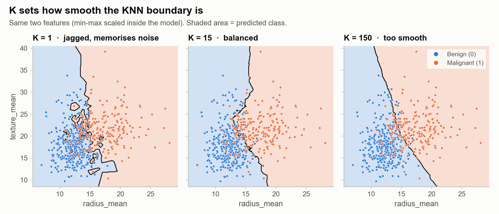

*The same data classified with K = 1, 15 and 150. A small K draws islands around single points; a very large K flattens the boundary.*

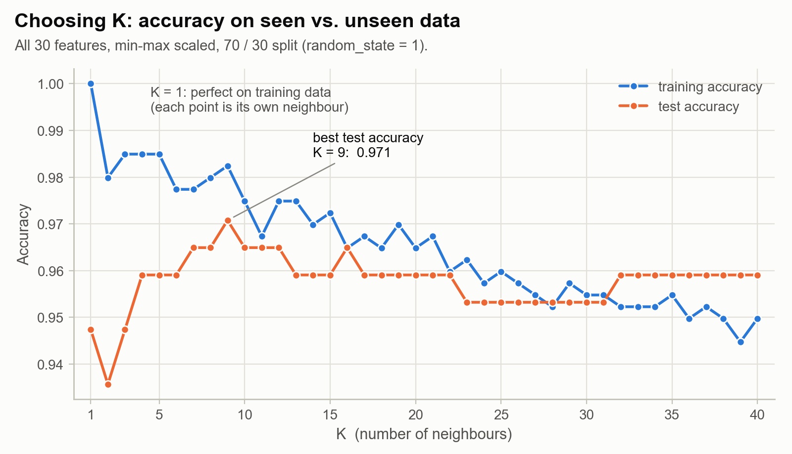

*Training and test accuracy for K = 1 to 40, all 30 features. K = 1 is perfect on the training data and worst on the test data.*

What the curve says on my split (70 / 30, `random_state=1`, 171 test tumours):

- **K = 1** scores 100% on the training set, because every point is its own nearest neighbour, but only 94.7% on the test set. That gap is overfitting.
- Test accuracy peaks at **K = 9 (97.1%, 166 of 171)**. Every K from 7 to 12 lands within one tumour of that, so the curve is flat there. I use **K = 8** in the notebook.
- Beyond K ≈ 20 both curves drift down together: the model is becoming too smooth.

> [!WARNING]
> **Two habits worth building.**
>
> - Picking K by looking at **test** accuracy quietly leaks the test set into the model. The clean way is to choose K with cross-validation on the training data and touch the test set once, at the end.
> - With two classes an **odd K** can never produce a tied vote.

### Normalization is Critical for KNN

KNN is entirely distance-based. A feature with large values (e.g. `area_mean`, 144 to 2,501) will dominate the distance over a small-valued feature (e.g. `smoothness_mean`, 0.05 to 0.16). **Min-Max normalization** scales every feature to `[0, 1]`:

```math
x_{norm} = \frac{x - x_{min}}{x_{max} - x_{min}}
```

**A worked example.** Take two tumours that are almost identical in area but at opposite ends of the smoothness range:

|   | Difference in area_mean | Difference in smoothness_mean | Euclidean distance |
|---|---|---|---|
| **Raw values** | 20 | 0.10 | $`\sqrt{20^2 + 0.10^2} = 20.0002`$ |
| **After min-max** | 20 / 2357.5 = 0.008 | 0.10 / 0.11 = 0.909 | $`\sqrt{0.008^2 + 0.909^2} = 0.909`$ |

On raw values the smoothness difference, almost the entire range of that feature, contributes nothing to the distance. After scaling it dominates, as it should.

| Model (same 70 / 30 split) | Test accuracy, raw features | Test accuracy, min-max scaled |
|---|---|---|
| KNN, K = 8 | 93.0% | **96.5%** |
| SVM, RBF kernel | 91.8% | **97.1%** |
| Gaussian Naive Bayes | 94.7% | 94.7% (scale does not matter) |

> [!TIP]
> Compute $`x_{min}`$ and $`x_{max}`$ from the **training set only**, then apply the same numbers to the test set. Otherwise information about the test data leaks into training. A scikit-learn `Pipeline` does this for you.

### The price of laziness

- **Training is free, prediction is expensive.** `fit` only stores the data. Every single prediction computes a distance to all $`n`$ training points across all $`d`$ features: $`O(n \cdot d)`$ per query.
- **Curse of dimensionality.** As the number of features grows, all points drift towards being equally far from each other, and “nearest” loses its meaning. Removing uninformative features or reducing dimensions first helps a lot.

### Python implementation

```python
from sklearn.neighbors import KNeighborsClassifier
from sklearn.preprocessing import MinMaxScaler
from sklearn.pipeline import make_pipeline

X = data.drop(columns="diagnosis").values                  # raw features
x_train, x_test, y_train, y_test = train_test_split(X, y, test_size=0.3, random_state=1)

for k in range(1, 15):
    knn = make_pipeline(MinMaxScaler(), KNeighborsClassifier(n_neighbors=k))
    knn.fit(x_train, y_train)                              # the scaler is fitted on the training set only
    print(k, round(knn.score(x_test, y_test), 4))          # k = 8: 0.9649, k = 9: 0.9708
```

---

## 3. Support Vector Machine (SVM)

SVM finds the **hyperplane** that separates two classes with the **maximum margin** — the widest possible gap between the nearest data points of each class. Those nearest points are called **support vectors**.

### Intuition

Imagine drawing a line between two clusters of points. There are infinitely many lines that separate them correctly. SVM picks the one that is **furthest from both clusters** — maximising the margin makes the classifier more robust to new data. Think of it as fitting the widest possible street between the two classes; the decision boundary is the centre line.

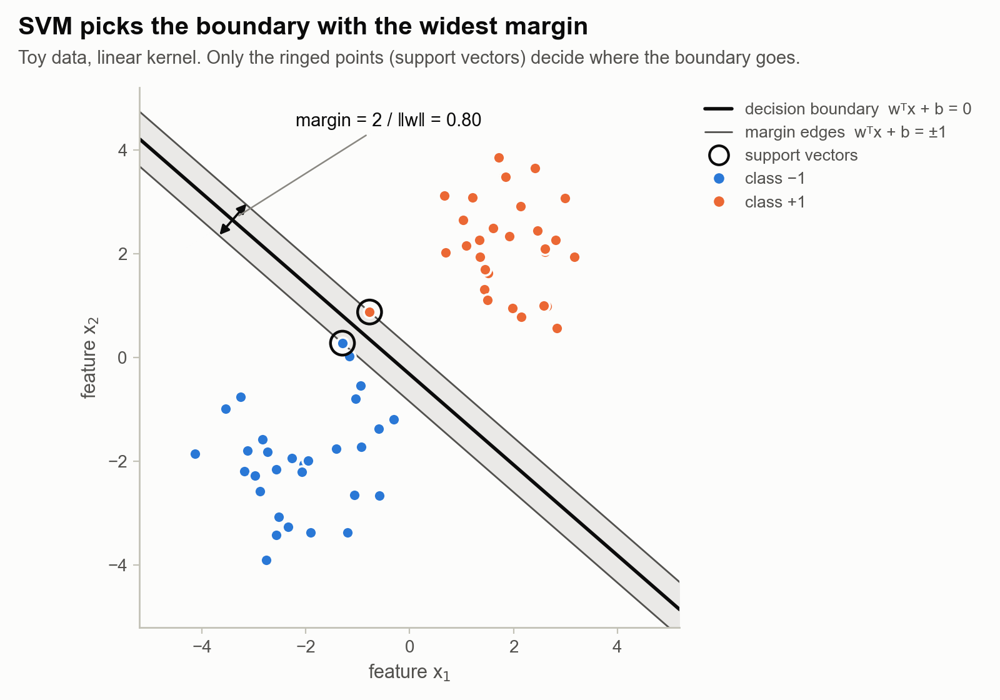

*A linear SVM on toy data. The grey band is the margin. Only the two ringed points touch its edges; every other point could move or disappear without changing the boundary.*

### The math: where the margin formula comes from

SVM uses the labels $`y_i \in \{-1, +1\}`$ instead of 0 and 1. The boundary is the set of points with $`w^{\top}x + b = 0`$, and the distance from any point $`x`$ to it is:

```math
\text{distance}(x) = \frac{\lvert w^{\top}x + b\rvert}{\lVert w\rVert}
```

Multiplying $`w`$ and $`b`$ by the same constant does not move the boundary, so we are free to fix the scale. Choose it so that the closest points on each side satisfy $`w^{\top}x + b = \pm 1`$. Those points then sit at distance $`1/\lVert w\rVert`$, and the street is twice that wide:

```math
\text{Margin} = \frac{2}{\lVert w\rVert}
```

In the figure above $`w = (1.65,\ 1.90)`$, so $`\lVert w\rVert = 2.52`$ and the margin is $`2 / 2.52 = 0.80`$.

Maximising the margin is equivalent to minimising $`\lVert w\rVert^2 / 2`$, subject to the constraint that all points are correctly classified and outside the street:

```math
\min_{w,\,b}\ \frac{1}{2}\lVert w\rVert^2 \qquad \text{subject to} \qquad y_i\,(w^{\top}x_i + b) \ge 1 \quad \text{for every } i
```

### Hard vs. Soft Margin

| Type | Description |
|---|---|
| **Hard margin** | No misclassification allowed. Only works when data is perfectly linearly separable. |
| **Soft margin** | Allows some misclassification (controlled by the `C` parameter). More practical for real-world noisy data. |

The soft margin gives every point a **slack** $`\xi_i \ge 0`$ that measures how far it is allowed to violate the margin, and charges for the total slack:

```math
\min_{w,\,b,\,\xi}\ \frac{1}{2}\lVert w\rVert^2 + C\sum_{i=1}^{m}\xi_i \qquad \text{subject to} \qquad y_i\,(w^{\top}x_i + b) \ge 1 - \xi_i, \quad \xi_i \ge 0
```

**`C`**** (regularisation parameter)** is the price of one unit of slack:

- Large `C` → penalises misclassification heavily → narrow margin, risk of overfitting.
- Small `C` → tolerates more errors → wider margin, better generalisation.

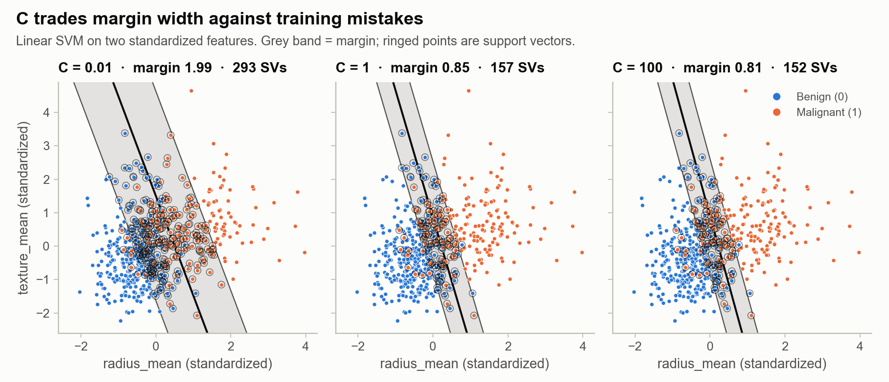

*The same two features with three values of C. A small C buys a wide street and accepts many points inside it; a large C narrows the street to reduce violations.*

| C | Margin width | Support vectors (of 569) |
|---|---|---|
| 0.01 | 1.99 | 293 |
| 1 | 0.85 | 157 |
| 100 | 0.81 | 152 |

### SVM and logistic regression are cousins

At the optimum each slack equals $`\xi_i = \max(0,\ 1 - y_i f(x_i))`$ with $`f(x) = w^{\top}x + b`$. Substituting that back removes the constraints and shows what SVM really minimises:

```math
\min_{w,\,b}\ \frac{1}{2}\lVert w\rVert^2 + C\sum_{i=1}^{m}\max\big(0,\ 1 - y_i f(x_i)\big)
```

The second term is the **hinge loss**. Logistic regression minimises the **log loss** $`\log(1 + e^{-y_i f(x_i)})`$ instead. Both are smooth-ish stand-ins for the 0–1 loss that accuracy counts:

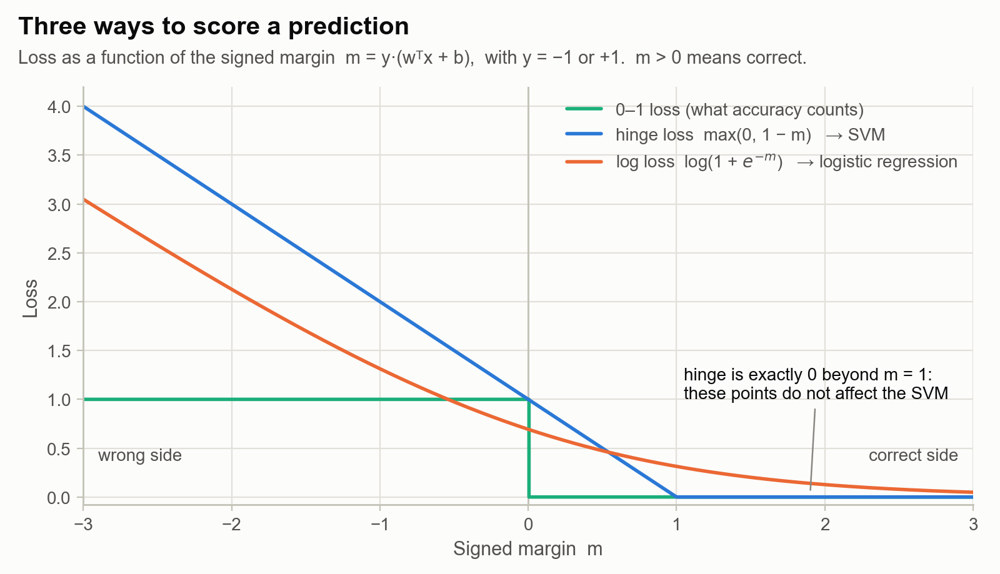

*Three loss functions against the signed margin. Hinge loss is exactly zero for points safely beyond the margin; log loss never quite reaches zero.*

The flat zero part of the hinge loss is the mathematical reason for support vectors: points that are correct and beyond the margin contribute nothing, so the solution depends only on the few points on or inside the street.

### Kernel Trick

When data is not linearly separable, SVM maps the data to a **higher-dimensional space** where a separating hyperplane exists. Common kernels:

- `linear` — no transformation (for linearly separable data)
- `rbf` (Radial Basis Function) — maps to infinite dimensions; handles most non-linear cases
- `poly` — polynomial transformation

scikit-learn’s `SVC` uses `kernel='rbf'` by default.

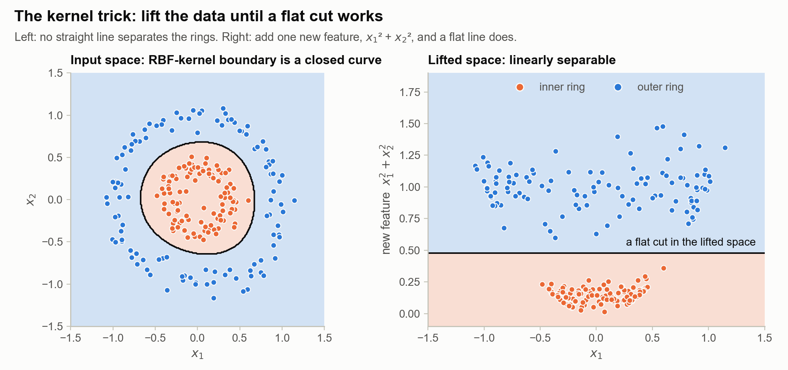

*Left: two rings that no straight line can separate. Right: after adding one new feature, the squared distance from the centre, a flat cut separates them perfectly.*

On those rings a linear SVM gets 62% of the points right; the RBF kernel gets 100%.

**Why is it called a trick?** The SVM solution only ever needs **dot products** between data points. A kernel $`K(x, x') = \phi(x)^{\top}\phi(x')`$ returns the dot product in the lifted space **without ever computing the lifted coordinates** $`\phi(x)`$. For the RBF kernel that lifted space is infinite-dimensional, yet the kernel itself is one line:

```math
K(x, x') = \exp\big(-\gamma\,\lVert x - x'\rVert^2\big)
```

It is a similarity score: 1 for identical points, falling towards 0 as they move apart. $`\gamma`$ sets how fast it falls. Large `gamma` → each support vector only influences its close surroundings → a wiggly boundary that can overfit. Small `gamma` → broad influence → a smoother boundary.

<details>
<summary><b>Deeper: the dual problem (where the dot products appear)</b></summary>

Introduce one Lagrange multiplier $`\alpha_i \ge 0`$ per training point. Solving for $`w`$ gives $`w = \sum_i \alpha_i y_i x_i`$, and the optimisation becomes:

```math
\max_{\alpha}\ \sum_{i=1}^{m}\alpha_i - \frac{1}{2}\sum_{i=1}^{m}\sum_{j=1}^{m}\alpha_i\alpha_j\,y_i y_j\,x_i^{\top}x_j \qquad \text{subject to} \qquad 0 \le \alpha_i \le C, \quad \sum_{i=1}^{m}\alpha_i y_i = 0
```

The data enters only through $`x_i^{\top}x_j`$. Replace that with $`K(x_i, x_j)`$ and the same algorithm works in the lifted space. The prediction for a new point is:

```math
f(x) = \sum_{i=1}^{m}\alpha_i\,y_i\,K(x_i, x) + b
```

Most $`\alpha_i`$ come out exactly zero. The points with $`\alpha_i \gt 0`$ are the support vectors, and they are the only ones needed at prediction time.

</details>

### Python implementation

```python
from sklearn.svm import SVC

svm = make_pipeline(MinMaxScaler(), SVC(kernel="rbf", C=1.0, gamma="scale", random_state=1))
svm.fit(x_train, y_train)
print(svm.score(x_test, y_test))           # 0.9708
print(svm[-1].n_support_)                  # [41 45] -> 86 of 398 training points are support vectors
```

Like KNN, SVM measures distances, so it needs scaled features: on the raw data the same model scores only 91.8%.

---

## 4. Naive Bayes

Naive Bayes is a **probabilistic classifier** based on Bayes’ Theorem. It is called *naive* because it assumes all features are **conditionally independent** given the class label — a simplification that rarely holds in practice but works surprisingly well.

### Bayes’ Theorem

```math
P(c \mid x) = \frac{P(x \mid c)\,P(c)}{P(x)}
```

| Term | Name | Meaning |
|---|---|---|
| $`P(c \mid x)`$ | **Posterior** | Probability of the class given the observed features |
| $`P(x \mid c)`$ | **Likelihood** | Probability of observing these features from this class |
| $`P(c)`$ | **Prior** | How frequent this class is in the training set |
| $`P(x)`$ | **Evidence** | Constant normaliser; can be ignored for classification |

To classify, we compute the posterior for each class and pick the highest one. Because $`P(x)`$ is the same for every class, comparing the numerators is enough:

```math
\hat{c} = \underset{c}{\arg\max}\ P(c)\,P(x \mid c)
```

### The “Naive” Independence Assumption

```math
P(x_1, x_2, \dots, x_n \mid c) = P(x_1 \mid c)\cdot P(x_2 \mid c)\cdots P(x_n \mid c) = \prod_{j=1}^{n} P(x_j \mid c)
```

Each feature is treated as if it contributes to the class probability independently. This makes the maths tractable, avoids the curse of dimensionality, and speeds up computation dramatically.

**How much simpler?** Modelling 30 features jointly with a full Gaussian needs 30 means plus 465 variances and covariances per class. The naive version needs 30 means and 30 variances: 60 numbers per class, each estimated from a simple average.

<details>
<summary><b>Deeper: why implementations add logarithms instead of multiplying</b></summary>

Multiplying 30 small probabilities quickly underflows to zero in floating point. The logarithm is monotonic, so the class with the largest product also has the largest sum of logs:

```math
\hat{c} = \underset{c}{\arg\max}\ \Big[\log P(c) + \sum_{j=1}^{n}\log P(x_j \mid c)\Big]
```

Every Naive Bayes implementation, including scikit-learn’s, works in this log space.

</details>

### Gaussian Naive Bayes

When features are **continuous** (like all 30 features in the breast cancer dataset), `GaussianNB` assumes each feature follows a **normal (Gaussian) distribution** within each class:

```math
P(x_j \mid c) = \frac{1}{\sqrt{2\pi\sigma_{jc}^2}}\exp\!\left(-\frac{(x_j - \mu_{jc})^2}{2\sigma_{jc}^2}\right)
```

The model learns $`\mu`$ (mean) and $`\sigma^2`$ (variance) for each feature in each class from the training data. “Training” is nothing more than computing those averages, so there is almost nothing to tune.

### A worked example on one feature

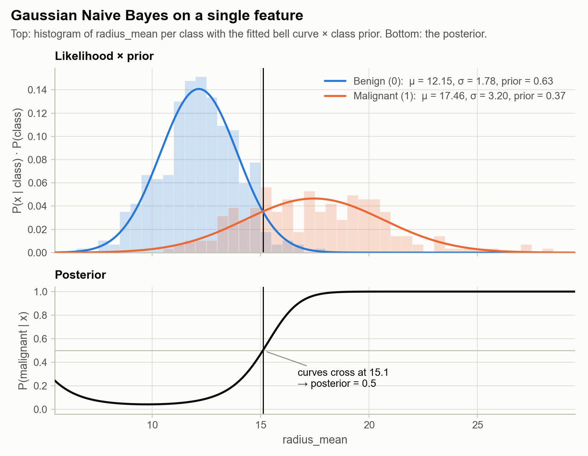

*Top: the distribution of radius_mean in each class with its fitted bell curve, scaled by the class prior. Bottom: the resulting probability of malignant. The decision flips where the two curves cross.*

Classify a tumour with **radius_mean = 15** using only this feature:

|   | Benign | Malignant |
|---|---|---|
| Prior $`P(c)`$ | 0.627 | 0.373 |
| Mean, standard deviation | 12.15, 1.78 | 17.46, 3.20 |
| Likelihood $`P(15 \mid c)`$ | 0.0619 | **0.0928** |
| Likelihood × prior | **0.0388** | 0.0346 |
| Posterior | **52.9%** | 47.1% |

> [!TIP]
> **The prior changes the answer.** A radius of 15 is more typical of a malignant tumour (likelihood 0.093 vs 0.062). But benign tumours are simply more common in the data, and after multiplying by the priors the benign side wins, narrowly. The two curves cross at **15.1**: above that, this one-feature model says malignant.

One more thing the bottom panel shows: far to the left the malignant probability creeps up again. No tumour is that small. It happens only because the malignant bell curve is wider, so its tail eventually overtakes the narrow benign one. A reminder that the Gaussian assumption is a model, not a fact.

### Strengths & Weaknesses

| Strengths | Weaknesses |
|---|---|
| Very fast to train and predict | Assumes feature independence (often violated) |
| Works well with small data | Probability estimates can be poorly calibrated |
| Handles high-dimensional data gracefully | Poor on features with complex correlations |
| Naturally multi-class | Sensitive to feature scaling in some variants |

In this dataset many features are near-copies of each other (radius, perimeter and area all measure size). Naive Bayes counts that same evidence several times, which is one reason it ends up below the other models in the comparison at the end.

### Python implementation

```python
from sklearn.naive_bayes import GaussianNB

nb = GaussianNB().fit(x_train, y_train)
print(nb.score(x_test, y_test))            # 0.9474
print(nb.class_prior_)                     # P(benign), P(malignant) in the training set
print(nb.theta_[:, 0], nb.var_[:, 0])      # per-class mean and variance of the first feature
```

---

## 5. Decision Tree Classification

**CART** stands for *Classification and Regression Trees*: one algorithm, two jobs. The regression version is explained on the [Regression](../Regression/Regression.md) page. For classification only two things change:

|   | Regression tree | Classification tree |
|---|---|---|
| A leaf predicts | The **mean** of its training rows | The **majority class** of its training rows |
| A split is scored by | Variance (MSE) of the children | **Impurity** of the children: entropy or Gini |

Everything else is identical: try every feature and every threshold, keep the best split, repeat inside each child.

### The math: measuring how mixed a node is

A node is **pure** if all its samples belong to one class and **impure** if the classes are mixed. With $`p_k`$ the share of class $`k`$ in the node:

```math
\text{Entropy:}\quad H = -\sum_{k} p_k\log_2 p_k \qquad\qquad \text{Gini:}\quad G = 1 - \sum_{k} p_k^2
```

For two classes with $`p`$ = share of class 1:

```math
H(p) = -p\log_2 p - (1 - p)\log_2(1 - p), \qquad G(p) = 2p(1 - p)
```

- **Entropy** comes from information theory: the average number of yes/no questions (bits) needed to learn the class of a random sample from the node. A pure node needs 0 questions; a 50 / 50 node needs 1.
- **Gini** is the probability of labelling a random sample wrongly if you guess according to the node’s own class shares.

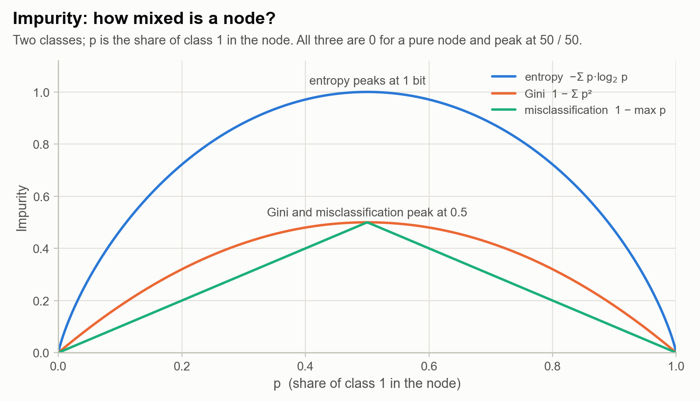

*Entropy, Gini and misclassification rate for a two-class node. All are zero for a pure node and largest at a 50 / 50 mix.*

### The math: minimizing entropy = maximizing information gain

A split sends the $`n`$ samples of a node into a left child ($`n_L`$) and a right child ($`n_R`$). Its **information gain** is the entropy we had minus the weighted entropy we are left with:

```math
IG = H(\text{parent}) - \left[\frac{n_L}{n}H(L) + \frac{n_R}{n}H(R)\right]
```

The tree picks the split with the **largest information gain**, which is the same as the split with the **lowest weighted child entropy**.

### The root split, computed by hand

On the two features `radius_mean` and `texture_mean`, the best first question is “radius_mean ≤ 15.05?”.

| Node | Samples | Benign | Malignant | Share malignant | Entropy (bits) |
|---|---|---|---|---|---|
| Parent (all data) | 569 | 357 | 212 | 0.373 | 0.953 |
| Left: radius_mean ≤ 15.05 | 397 | 346 | 51 | 0.128 | 0.553 |
| Right: radius_mean above 15.05 | 172 | 11 | 161 | 0.936 | 0.343 |

```math
H(\text{parent}) = -0.373\log_2 0.373 - 0.627\log_2 0.627 = 0.953
```

```math
IG = 0.953 - \left[\frac{397}{569}\cdot 0.553 + \frac{172}{569}\cdot 0.343\right] = 0.953 - 0.490 = 0.463 \text{ bits}
```

One question about the radius removes almost half of the uncertainty about the diagnosis. The full depth-2 tree:

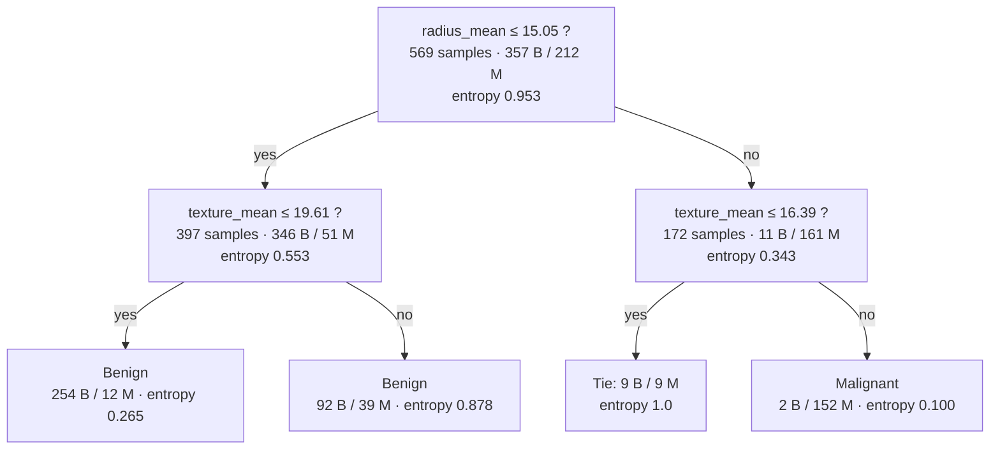
```mermaid
graph TD
    R["radius_mean ≤ 15.05 ?<br>569 samples · 357 B / 212 M<br>entropy 0.953"] -->|"yes"| L["texture_mean ≤ 19.61 ?<br>397 samples · 346 B / 51 M<br>entropy 0.553"]
    R -->|"no"| Q["texture_mean ≤ 16.39 ?<br>172 samples · 11 B / 161 M<br>entropy 0.343"]
    L -->|"yes"| L1["Benign<br>254 B / 12 M · entropy 0.265"]
    L -->|"no"| L2["Benign<br>92 B / 39 M · entropy 0.878"]
    Q -->|"yes"| R1["Tie: 9 B / 9 M<br>entropy 1.0"]
    Q -->|"no"| R2["Malignant<br>2 B / 152 M · entropy 0.100"]
```

Notice the leaf with 9 benign and 9 malignant tumours: entropy exactly 1, a coin flip. A deeper tree would keep splitting there.

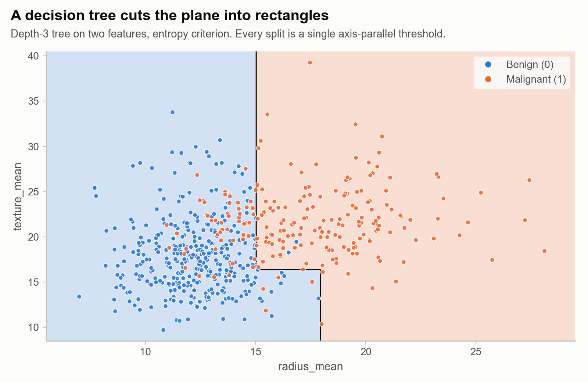

*A depth-3 tree on two features. Every split is one threshold on one feature, so the regions are always rectangles with edges parallel to the axes.*

### Entropy or Gini?

They almost always choose the same splits. Gini needs no logarithm, so it is slightly faster, and it is scikit-learn’s default (`criterion="gini"`). Use `criterion="entropy"` to get the information-gain version described above.

### Pros and cons

- **Pros:** Reads like a flowchart; no feature scaling needed; handles non-linear boundaries and feature interactions.
- **Cons:** Boundaries are always axis-parallel steps; a deep tree memorises the training set; small changes in the data can change the whole tree (high variance). The same hyperparameters as for regression trees keep it in check: `max_depth`, `min_samples_split`, `min_samples_leaf`.

### Python implementation

```python
from sklearn.tree import DecisionTreeClassifier, export_text

tree = DecisionTreeClassifier(random_state=42).fit(x_train, y_train)      # all 30 features
print(tree.score(x_test, y_test))          # 0.9591

# the small two-feature tree drawn above
X2 = data[["radius_mean", "texture_mean"]].values
small = DecisionTreeClassifier(criterion="entropy", max_depth=2, random_state=42).fit(X2, y)
print(export_text(small, feature_names=["radius_mean", "texture_mean"]))
```

---

## 6. Random Forest Classification

**Ensemble learning:** instead of trusting one model, train many and combine their answers. A random forest is an ensemble of decision trees.

### Algorithm (Step by Step)

1. From the $`n`$ training rows, pick $`n`$ rows at random **with replacement**. The selected rows are called a **sub-sample** (bootstrap sample). Some rows appear several times, about a third not at all.
2. Grow a decision tree on that sub-sample. At every split, consider only a **random subset of the features** (by default $`\sqrt{30} \approx 5`$ of the 30).
3. Repeat steps 1 and 2 for $`B`$ trees (`n_estimators`).
4. To classify a new sample, let **every tree vote** and take the majority. (scikit-learn averages the trees’ class probabilities, a “soft” vote.)

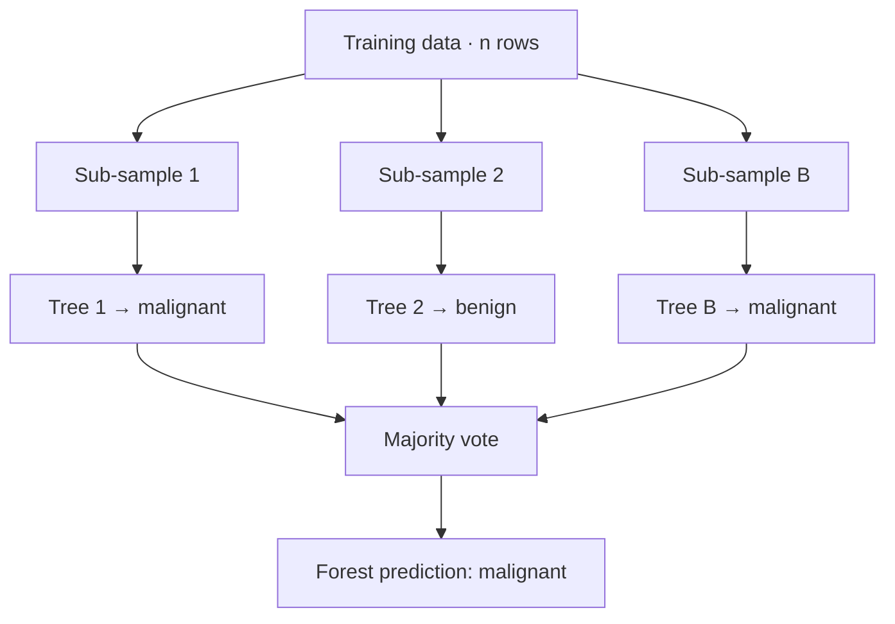
```mermaid
graph TD
    D["Training data · n rows"] --> S1["Sub-sample 1"]
    D --> S2["Sub-sample 2"]
    D --> S3["Sub-sample B"]
    S1 --> T1["Tree 1 → malignant"]
    S2 --> T2["Tree 2 → benign"]
    S3 --> T3["Tree B → malignant"]
    T1 --> V["Majority vote"]
    T2 --> V
    T3 --> V
    V --> P["Forest prediction: malignant"]
```

### The math: why a vote beats a single voter

Suppose each tree is right with probability $`p \gt 0.5`$ and the trees make their mistakes **independently**. The majority of $`B`$ trees is right with probability:

```math
P(\text{majority correct}) = \sum_{k \gt B/2}\binom{B}{k}\,p^{k}(1 - p)^{B - k}
```

| Trees B (each 70% accurate) | Accuracy of the majority vote |
|---|---|
| 1 | 70.0% |
| 11 | 92.2% |
| 101 | 99.999% |

> [!WARNING]
> **The catch is the word “independently”.** Real trees are trained on overlapping data and make many of the same mistakes, so the gain is far smaller than this table promises. That is exactly why the forest injects randomness (sub-samples and random feature subsets): the less alike the trees are, the more a vote helps. The Regression page derives the same idea as a formula for the variance of an average, $`\rho\sigma^2 + \tfrac{1-\rho}{B}\sigma^2`$.

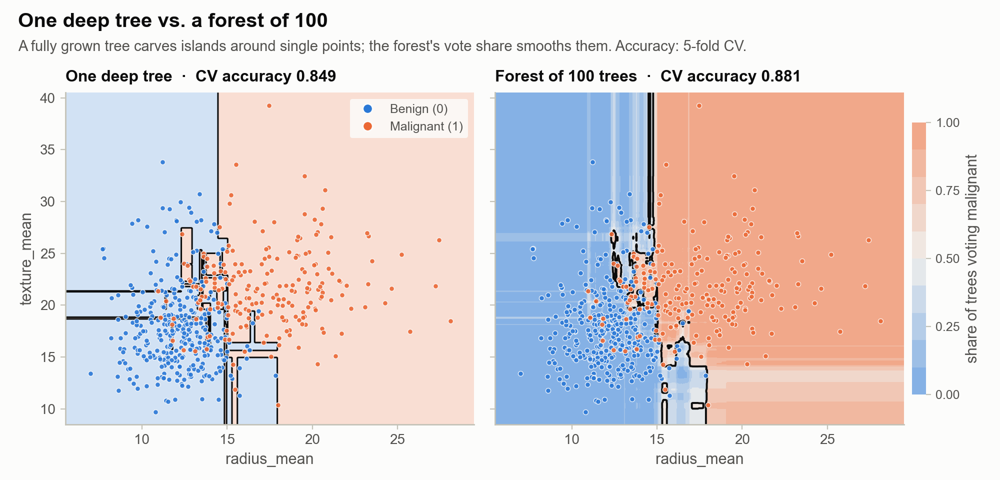

*Left: one fully grown tree draws small islands around single tumours. Right: the share of 100 trees voting malignant changes gradually, and the islands dissolve.*

| Cross-validated accuracy | Single tree | Forest of 100 trees |
|---|---|---|
| Two features (5-fold) | 84.9% | **88.1%** |
| All 30 features (10-fold) | 92.6% | **95.6%** |

### Two free extras

- **Out-of-bag score.** Each tree can be tested on the rows that were left out of its sub-sample. Averaged over the forest this gives an accuracy estimate without touching the test set: 95.7% here, next to 95.9% on the real test set.
- **Feature importance.** Summing how much each feature reduced impurity across all trees ranks the features. The top five on this dataset: `concave points_worst` (0.150), `area_worst` (0.131), `concave points_mean` (0.094), `perimeter_worst` (0.092), `radius_worst` (0.083).

### Python implementation

```python
from sklearn.ensemble import RandomForestClassifier

rf = RandomForestClassifier(n_estimators=100, random_state=42, oob_score=True)
rf.fit(x_train, y_train)
print(rf.score(x_test, y_test))            # 0.9591
print(rf.oob_score_)                       # 0.9573  (estimated without the test set)
print(rf.feature_importances_)             # one value per feature, sums to 1
```

---

## 7. Confusion Matrix and Evaluation Metrics

Accuracy tells you **how many** predictions were right. A **confusion matrix** tells you **which kind** of mistakes were made, and for a cancer test the two kinds are not equally bad.

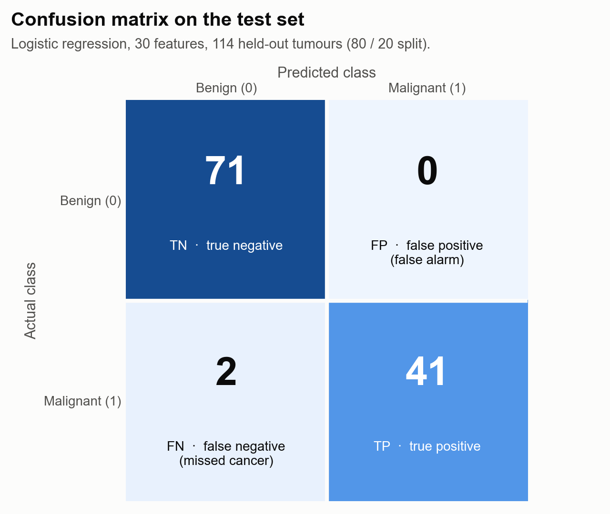

*Confusion matrix of the logistic regression model from section 1 on its 114 test tumours.*

|   | Predicted benign (0) | Predicted malignant (1) |
|---|---|---|
| Actually benign (0) | **TN = 71** true negative: healthy, and the model says so | **FP = 0** false positive: a false alarm |
| Actually malignant (1) | **FN = 2** false negative: a missed cancer | **TP = 41** true positive: cancer, and the model finds it |

### The metrics built from those four numbers

| Metric | Formula | This model | Question it answers |
|---|---|---|---|
| **Accuracy** | $`\dfrac{TP + TN}{TP + TN + FP + FN}`$ | 112 / 114 = 0.982 | How often is the model right overall? |
| **Precision** | $`\dfrac{TP}{TP + FP}`$ | 41 / 41 = 1.000 | When it says malignant, how often is that true? |
| **Recall** (sensitivity) | $`\dfrac{TP}{TP + FN}`$ | 41 / 43 = 0.953 | Of all malignant tumours, how many did it find? |
| **Specificity** | $`\dfrac{TN}{TN + FP}`$ | 71 / 71 = 1.000 | Of all benign tumours, how many did it clear? |
| **F1 score** | $`2\cdot\dfrac{\text{precision}\cdot\text{recall}}{\text{precision} + \text{recall}}`$ | 0.976 | One number balancing precision and recall |

> [!WARNING]
> **Why accuracy alone can fool you.** A “model” that calls every tumour benign is right 62.7% of the time on this dataset, because that is the share of benign cases, and it finds exactly zero cancers (recall = 0). In screening, a missed cancer (FN) is far more costly than a false alarm (FP), so **recall** is the number to watch. Here it is 95.3%: two malignant tumours slipped through.

### The threshold is a dial

Predicting class 1 when $`\hat{y} \ge 0.5`$ is only a convention. Lowering the threshold catches more cancers and raises more false alarms; raising it does the opposite.

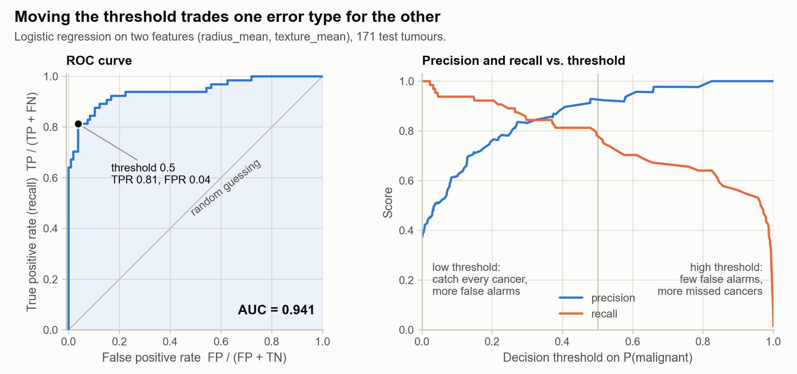

*Left: the ROC curve, which traces every possible threshold. Right: precision and recall as the threshold moves from 0 to 1.*

For the two-feature logistic regression in the figure (its errors are frequent enough to show the trade-off clearly):

| Threshold | Precision | Recall |
|---|---|---|
| 0.2 | 0.77 | 0.92 |
| 0.5 | 0.92 | 0.77 |
| 0.8 | 1.00 | 0.64 |

- The **ROC curve** plots the true positive rate (recall) against the false positive rate $`FP / (FP + TN)`$ for every threshold. A perfect model hugs the top-left corner; random guessing follows the diagonal.
- **AUC**, the area under that curve, summarises it in one number: the probability that a randomly chosen malignant tumour gets a higher score than a randomly chosen benign one. 0.5 is guessing, 1.0 is perfect; this two-feature model reaches **0.941**.

### Python implementation

```python
from sklearn.metrics import confusion_matrix, classification_report, roc_auc_score

# lr, x_test and y_test are the model and the 80 / 20 split from section 1
y_pred = lr.predict(x_test)
print(confusion_matrix(y_test, y_pred))
# [[71  0]
#  [ 2 41]]
print(classification_report(y_test, y_pred, target_names=["benign", "malignant"]))
print(roc_auc_score(y_test, lr.predict_proba(x_test)[:, 1]))
```

---

## Algorithm Comparison

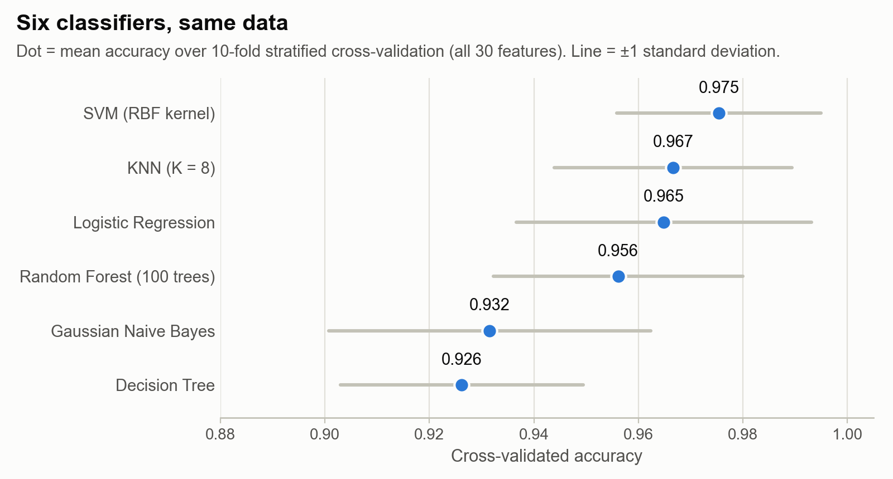

*Mean accuracy of the six classifiers over 10-fold cross-validation on all 30 features. The horizontal line through each dot shows how much the score varies from fold to fold.*

| Algorithm | 10-fold CV accuracy | Standard deviation across folds |
|---|---|---|
| SVM (RBF kernel) | **0.975** | 0.020 |
| KNN (K = 8) | 0.967 | 0.023 |
| Logistic Regression | 0.965 | 0.028 |
| Random Forest (100 trees) | 0.956 | 0.024 |
| Gaussian Naive Bayes | 0.932 | 0.031 |
| Decision Tree | 0.926 | 0.023 |

> [!TIP]
> **Read the ranking with care.** The top four models differ by less than their own fold-to-fold spread, so on this dataset they are effectively tied. The gaps that are real: a single decision tree and Naive Bayes sit clearly below the rest, and the forest clearly beats the single tree it is built from.

| Algorithm | Type | Key Hyperparameter | Interpretable? | Scales Well? | Needs feature scaling? |
|---|---|---|---|---|---|
| Logistic Regression | Probabilistic (linear) | Learning rate, iterations | ✅ Yes | ✅ Yes | Yes (gradient descent) |
| KNN | Instance-based | K (neighbours) | ✅ Yes | ❌ Slow on large N | Yes (distances) |
| SVM | Geometric margin | C, kernel, gamma | ⚠️ Partial | ✅ Kernel-dependent | Yes (distances) |
| Naive Bayes | Probabilistic | — | ✅ Yes | ✅ Yes | No |
| Decision Tree | Rule-based | max_depth | ✅ Yes | ✅ Yes | No |
| Random Forest | Ensemble of trees | n_estimators, max_features | ⚠️ Partial | ✅ Yes | No |

## Check yourself

<details>
<summary>1. A logistic regression model computes z = 0 for a tumour. What does it predict?</summary>

$`\sigma(0) = 0.5`$: the tumour lies exactly on the decision boundary $`w^{\top}x + b = 0`$, and the model is maximally unsure.

</details>

<details>
<summary>2. Why is the cost almost exactly 0.693 at the first iteration of training?</summary>

With tiny initial weights every prediction is about 0.5, and the cross-entropy of a 0.5 prediction is $`-\log(0.5) = \log 2 \approx 0.693`$, whatever the true label is.

</details>

<details>
<summary>3. KNN with K = 1 scores 100% on the training set. Is it the best K?</summary>

No. Each training point is its own nearest neighbour, so 100% is guaranteed and says nothing. On the test set K = 1 is among the worst choices (94.7% versus 97.1% at K = 9).

</details>

<details>
<summary>4. You delete a training point that lies far from an SVM’s boundary. Does the boundary move?</summary>

No. Its hinge loss is zero and its multiplier $`\alpha_i`$ is zero, so it is not a support vector. Only the points on or inside the margin determine the solution.

</details>

<details>
<summary>5. For radius_mean = 15 the likelihood is higher for malignant, yet Naive Bayes predicts benign. How?</summary>

The posterior is likelihood × prior. Benign tumours are more common (prior 0.627 vs 0.373), and $`0.0619 \cdot 0.627 = 0.0388`$ beats $`0.0928 \cdot 0.373 = 0.0346`$.

</details>

<details>
<summary>6. What is the entropy of a leaf with 9 benign and 9 malignant tumours? And of a leaf with 20 benign only?</summary>

1 bit for the 50 / 50 leaf (the maximum for two classes) and 0 for the pure leaf.

</details>

<details>
<summary>7. A model has precision 1.000 and recall 0.953. Which kind of mistake did it make?</summary>

Precision 1 means no false positives: every “malignant” call was correct. Recall below 1 means false negatives: it missed some malignant tumours (2 of 43 here).

</details>
