# Sınıflandırma

🇬🇧 English version: [Classification](Classification.md)

> [!NOTE]
> **Amaç:** Altı sınıflandırma algoritmasını içeriden anlamak: sezgi, her birini çalıştıran matematik ve kod. Bu sayfadaki her grafik ve her sayı Machine Learning repomdaki Wisconsin Meme Kanseri veri setinden hesaplandı; yani hepsi yeniden üretilebilir.

**İçindekiler**

- [Büyük resim](#büyük-resim)
- [1. Lojistik Regresyon](#1-lojistik-regresyon)
- [2. K-En Yakın Komşu (KNN)](#2-k-en-yakın-komşu-knn)
- [3. Destek Vektör Makinesi (SVM)](#3-destek-vektör-makinesi-svm)
- [4. Naive Bayes](#4-naive-bayes)
- [5. Karar Ağacı ile Sınıflandırma](#5-karar-ağacı-ile-sınıflandırma)
- [6. Rastgele Orman ile Sınıflandırma](#6-rastgele-orman-ile-sınıflandırma)
- [7. Karmaşıklık Matrisi ve Değerlendirme Metrikleri](#7-karmaşıklık-matrisi-ve-değerlendirme-metrikleri)
- [Algoritma Karşılaştırması](#algoritma-karşılaştırması)
- [Kendini sına](#kendini-sına)

---

## Büyük resim

Sınıflandırma, bir veri noktasının hangi **kategoriye** (sınıfa) ait olduğunu tahmin etme görevidir. Sürekli bir sayı tahmin eden regresyonun aksine (bkz. [Regresyon](../Regression/Regression.tr.md)), sınıflandırma ayrık bir etiket üretir — örneğin *Kötü huylu / İyi huylu*, *Spam / Spam değil* ya da *Kedi / Köpek*.

Aşağıdaki bütün algoritmalar **Wisconsin Meme Kanseri veri seti** (Wisconsin Breast Cancer) üzerinde gösteriliyor (569 örnek, 30 sayısal öznitelik, ikili hedef: `M` = Malignant, kötü huylu → `1`; `B` = Benign, iyi huylu → `0`). Sınıflar dengeli değil: **357 iyi huylu (%62.7)** ve **212 kötü huylu (%37.3)**. Bu iki sayıyı aklında tut; Naive Bayes’te ve değerlendirme bölümünde yeniden karşımıza çıkacaklar.

Her algoritma aynı soruyu farklı bir fikirle yanıtlar:

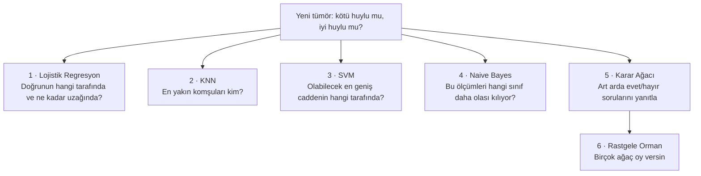
```mermaid
graph TD
    Q["Yeni tümör: kötü huylu mu, iyi huylu mu?"] --> A["1 · Lojistik Regresyon<br>Doğrunun hangi tarafında ve ne kadar uzağında?"]
    Q --> B["2 · KNN<br>En yakın komşuları kim?"]
    Q --> C["3 · SVM<br>Olabilecek en geniş caddenin hangi tarafında?"]
    Q --> D["4 · Naive Bayes<br>Bu ölçümleri hangi sınıf daha olası kılıyor?"]
    Q --> E["5 · Karar Ağacı<br>Art arda evet/hayır sorularını yanıtla"]
    E --> F["6 · Rastgele Orman<br>Birçok ağaç oy versin"]
```

### Her notebook’un izlediği hat

1. CSV dosyasını **yükle**; `id` ve boş `Unnamed: 32` sütunlarını at.
2. Hedefi **kodla**: `M` → 1, `B` → 0.
3. Öznitelikleri **normalize et** (uzaklık ve gradyan tabanlı modeller için kritik; bölüm 2’de açıklanıyor).
4. Eğitim ve test kümelerine **ayır**.
5. Eğitim kümesinde **eğit**, test kümesinde **puanla**.

> [!NOTE]
> Aşağıdaki görsellerin çoğu 30 öznitelikten yalnızca ikisini, `radius_mean` ve `texture_mean`, kullanıyor; çünkü iki boyut çizilebilir. Metinde verilen doğruluk değerleri, aksini söylemediğim sürece 30 özniteliğin tamamını kullanır.

---

## 1. Lojistik Regresyon

Adına rağmen Lojistik Regresyon bir regresyon değil, **sınıflandırma** algoritmasıdır. Bir örneğin belirli bir sınıfa ait olma olasılığını modeller ve **sigmoid fonksiyonu** ile 0 ile 1 arasında bir değer üretir.

### Sınıflandırma için neden doğrusal regresyon değil?

Doğrusal regresyon `[0, 1]` dışında değerler tahmin edebilir; bu da olasılık olarak anlamsızdır. Sigmoid fonksiyonu her gerçel sayıyı `(0, 1)` aralığına sıkıştırır:

```math
\sigma(z) = \frac{1}{1 + e^{-z}}
```

$`\sigma(z) \ge 0.5`$ ise → sınıf `1` tahmin et; değilse sınıf `0`.

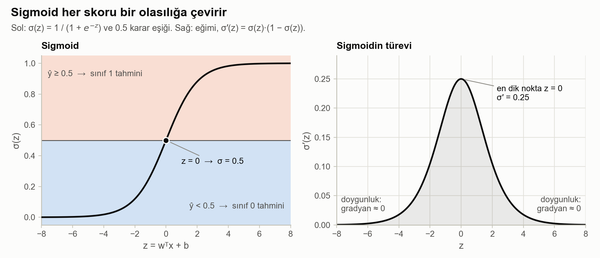

*Sol: sigmoid her z skorunu 0 ile 1 arasında bir olasılığa eşler. Sağ: türevi; z = 0 noktasında en büyük, eğrinin düzleştiği yerlerde neredeyse sıfır.*

### Model: sigmoidden geçirilen doğrusal bir skor

```math
z = w^{\top}x + b, \qquad \hat{y} = \sigma(z) = P(y = 1 \mid x)
```

- $`w`$ = öznitelik başına bir **ağırlık** (burada 30), $`b`$ = **yanlılık terimi (bias)**
- $`z`$ = herhangi bir gerçel sayı olabilen ham skor
- $`\hat{y}`$ = sınıf 1’in (kötü huylu) tahmin edilen olasılığı

**z ne anlama gelir?** Sigmoidi z için çözersen **log-odds** (olasılık oranının logaritması) elde edersin:

```math
\log\frac{\hat{y}}{1 - \hat{y}} = w^{\top}x + b
```

Yani lojistik regresyon *log-odds için doğrusal bir modeldir*. $`x_j`$ özniteliğini 1 artırmak log-odds değerine $`w_j`$ ekler; bu da odds değerini $`e^{w_j}`$ ile çarpar.

**Karar sınırı nerede?** $`\hat{y} \ge 0.5`$ tam olarak $`z \ge 0`$ olduğunda sağlanır; dolayısıyla sınır şu noktalar kümesidir:

```math
w^{\top}x + b = 0
```

Bu, 2 boyutta bir doğru, 30 boyutta düz bir hiperdüzlemdir. Lojistik regresyon **doğrusal bir sınıflandırıcıdır**: sigmoid yalnızca her iki tarafta ne kadar emin olduğunu belirler.

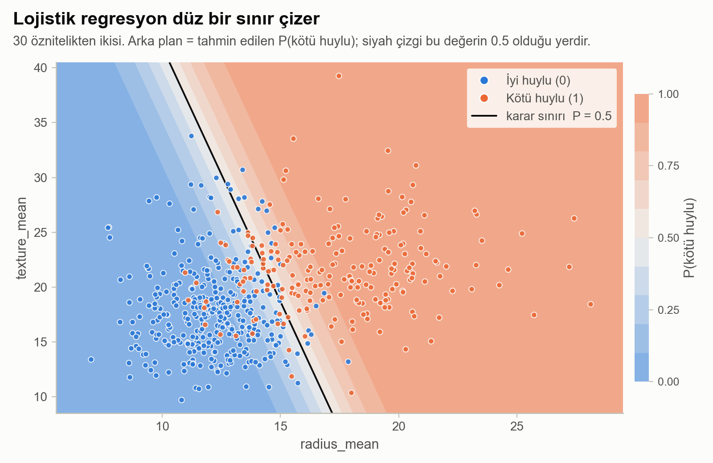

*İki öznitelikte lojistik regresyon. Arka plan rengi tahmin edilen kötü huylu olasılığıdır; siyah çizgi bu olasılığın 0.5 olduğu yerdir.*

### Hesaplama grafı (Computation Graph)

Hesaplama grafı, matematiksel işlemleri düğümlerden oluşan yönlü bir graf olarak ifade etmenin görsel bir yoludur. Her düğüm bir işlemi temsil eder; kenarlar değerleri taşır. Bu, **ileri geçişi** (çıktıyı hesaplama) ve **geri geçişi** (gradyanları hesaplama) düşünmeyi kolaylaştırır.

Lojistik regresyonda ileri geçişin tamamı şöyle görünür — girdiler öğrenilen ağırlıklarla çarpılır, bias ile toplanır, sigmoidden geçirilir ve gerçek etiketle karşılaştırılır:

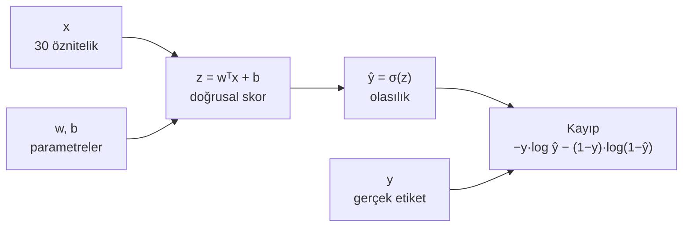
```mermaid
graph LR
    X["x<br>30 öznitelik"] --> Z["z = wᵀx + b<br>doğrusal skor"]
    W["w, b<br>parametreler"] --> Z
    Z --> S["ŷ = σ(z)<br>olasılık"]
    S --> L["Kayıp<br>−y·log ŷ − (1−y)·log(1−ŷ)"]
    Y["y<br>gerçek etiket"] --> L
```

Geri geçiş aynı grafı **sağdan sola** yürür; her parametre değiştiğinde kaybın nasıl değiştiğini bulmak için yerel türevleri çarpar (zincir kuralı).

### Kayıp ve Maliyet (Loss vs. Cost)

| Terim | Tanım |
|---|---|
| **Kayıp (loss)** | **Tek** bir eğitim örneği için hata |
| **Maliyet (cost)** | **Tüm** eğitim örnekleri üzerinden ortalama kayıp |

Eğitim sırasında **maliyeti** en küçük yaparız.

### İkili çapraz entropi kaybı (Binary Cross-Entropy)

```math
L(y, \hat{y}) = -\,y\log(\hat{y}) - (1 - y)\log(1 - \hat{y})
```

- $`y = 1`$ iken: kayıp = $`-\log(\hat{y})`$. Model $`\hat{y} = 1`$ tahmin ederse kayıp → 0. $`\hat{y} \to 0`$ ise kayıp → ∞.
- $`y = 0`$ iken: kayıp = $`-\log(1 - \hat{y})`$. Aynı mantığın simetriği.

Bu fonksiyon, emin ama yanlış tahminleri çok ağır cezalandırır.

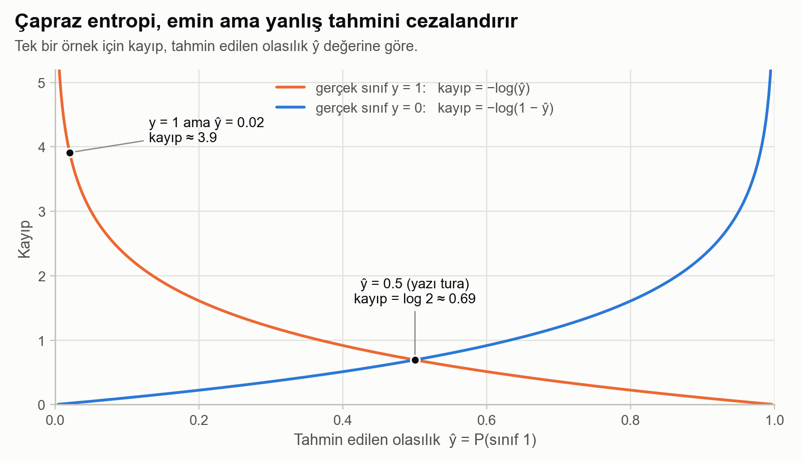

*Tek bir örnek için çapraz entropi. Emin olup yanılmak, kararsız olmaktan çok daha pahalıdır.*

Tüm $`m`$ eğitim örneği üzerinden maliyet:

```math
J(w, b) = \frac{1}{m}\sum_{i=1}^{m}\Big[-y_i\log(\hat{y}_i) - (1 - y_i)\log(1 - \hat{y}_i)\Big]
```

<details>
<summary><b>Daha derin: bu formül nereden geliyor? (en büyük olabilirlik)</b></summary>

Model, etiketin 1 gelme olasılığı $`\hat{y}`$ olan bir yazı tura olduğunu söyler. İki durum tek bir ifadeye sığar:

```math
P(y \mid x) = \hat{y}^{\,y}\,(1 - \hat{y})^{\,1 - y}
```

Kontrol et: $`y = 1`$ için $`\hat{y}`$, $`y = 0`$ için $`1 - \hat{y}`$ verir. Örneklerin bağımsız olduğunu varsayarsak tüm eğitim kümesinin olasılığı bir çarpımdır; logaritması da bir toplamdır:

```math
\log \mathcal{L}(w, b) = \sum_{i=1}^{m}\Big[y_i\log(\hat{y}_i) + (1 - y_i)\log(1 - \hat{y}_i)\Big]
```

Eğitim, gözlenen etiketleri olabildiğince olası kılmalıdır; yani bu ifadeyi **en büyük** yaparız. İşareti çevirip $`m`$ değerine bölersen tam olarak $`J`$ maliyetini elde edersin. Çapraz entropi keyfi bir seçim değildir: onu en küçük yapmak, en büyük olabilirlik (maximum likelihood) tahminidir.

</details>

<details>
<summary><b>Daha derin: neden regresyondaki gibi kare hata kullanmıyoruz?</b></summary>

İçinde sigmoid varken $`(y - \sigma(w^{\top}x + b))^2`$ ifadesi $`w`$ değişkenine göre **dışbükey değildir**: düz bölgeleri vardır ve gradyan inişini tuzağa düşürebilir. Gradyanı ayrıca $`\sigma'(z)`$ çarpanını içerir; bu çarpan model emin ama yanlışken neredeyse sıfırdır, yani öğrenme tam da en hızlı olması gereken yerde durur. Çapraz entropi bu model için dışbükeydir ve gradyanında böyle bir çarpan yoktur; sonraki bölüm bunu gösteriyor.

</details>

### Parametreleri başlatmak

```python
def initialize_weights_and_bias(dimension):
    w = np.full((dimension, 1), 0.01)  # küçük, sıfırdan farklı bir değer
    b = 0.0
    return w, b
```

- **Ağırlıklar 0 yerine küçük bir sabitle (0.01) başlatılır.** Gizli katmanları olan bir sinir ağında her ağırlığı aynı değerle başlatmak, her nöronun aynı çıktıyı hesaplamasına ve aynı gradyanı almasına yol açar; böylece hiçbir zaman farklı öznitelikler öğrenemezler (*simetri problemi*). Sade lojistik regresyon ise dışbükey maliyetli tek bir birimdir; sıfırdan da yakınsardı. Küçük ve sıfırdan farklı başlangıcı, sinir ağlarına taşınan bir alışkanlık olduğu için koruyorum.
- **Bias 0’dan başlar**; simetri sorunu yalnızca ağırlıklar için geçerli olduğundan bu sorun değildir.
- Ağırlıklar bu kadar küçükken her örnek için $`z \approx 0`$ ve $`\hat{y} \approx 0.5`$ olur; dolayısıyla ilk maliyet $`\log 2 \approx 0.693`$ çıkar: saf tahmin yürütmenin maliyeti. Bu, her uygulama için kullanışlı bir sağlama kontrolüdür.

### İleri ve geri yayılım (Forward & Backward Propagation)

**İleri yayılım** tahmini ve maliyeti hesaplar:

```math
z = w^{\top}X + b, \qquad \hat{y} = \sigma(z), \qquad J = \frac{1}{m}\sum_{i=1}^{m} L(y_i, \hat{y}_i)
```

**Geri yayılım**, maliyetin $`w`$ ve $`b`$ parametrelerine göre gradyanlarını hesaplar. Zincir kuralını hesaplama grafı boyunca, her seferinde tek bir halka olacak şekilde uygula:

```math
\frac{\partial L}{\partial w} = \frac{\partial L}{\partial \hat{y}}\cdot\frac{\partial \hat{y}}{\partial z}\cdot\frac{\partial z}{\partial w}
```

| Halka | Türev |
|---|---|
| Kaybın tahmine göre türevi | $`\dfrac{\partial L}{\partial \hat{y}} = -\dfrac{y}{\hat{y}} + \dfrac{1 - y}{1 - \hat{y}} = \dfrac{\hat{y} - y}{\hat{y}(1 - \hat{y})}`$ |
| Tahminin skora göre türevi | $`\dfrac{\partial \hat{y}}{\partial z} = \sigma(z)(1 - \sigma(z)) = \hat{y}(1 - \hat{y})`$ |
| Skorun parametrelere göre türevi | $`\dfrac{\partial z}{\partial w} = x, \qquad \dfrac{\partial z}{\partial b} = 1`$ |

İlk iki halkayı çarp; o hantal kesir tümüyle sadeleşir:

```math
dz = \frac{\partial L}{\partial z} = \frac{\hat{y} - y}{\hat{y}(1 - \hat{y})}\cdot\hat{y}(1 - \hat{y}) = \hat{y} - y
```

Skora göre gradyan yalnızca **tahmin eksi gerçek** değeridir. Tüm $`m`$ örnek üzerinden ortalama almak, notebook’ta kullanılan üç satırı verir:

```math
dz = \hat{y} - y, \qquad dw = \frac{1}{m}\,X\,dz^{\top}, \qquad db = \frac{1}{m}\sum_{i=1}^{m} dz_i
```

(Burada $`X`$ matrisinde her örnek bir **sütundur**, boyutu 30 × m; notebook’un veriyi ayırdıktan sonra transpoze etmesinin nedeni bu.)

Bu gradyanlar bize maliyetin hangi yönde (ve ne kadar dik) arttığını söyler — biz de parametreleri **ters** yönde hareket ettiririz.

### Gradyan inişi (ağırlıkları güncellemek)

```math
w \leftarrow w - \alpha \cdot dw, \qquad b \leftarrow b - \alpha \cdot db
```

$`\alpha`$ (alfa) **öğrenme oranıdır (learning rate)** — her iterasyonda ne kadar büyük adım attığımız. Güncelleme döngüsü, maliyet yakınsayana (kayda değer biçimde düşmeyi bırakana) dek sabit sayıda iterasyon boyunca yinelenir.

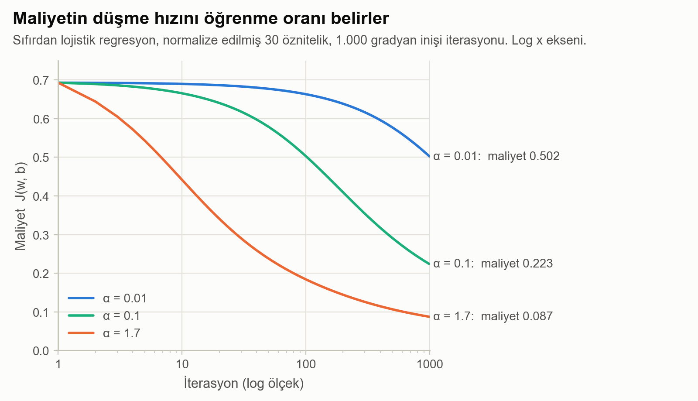

*Üç öğrenme oranı için eğitim boyunca maliyet. Üçü de log 2 = 0.693 değerinden başlar; büyük öğrenme oranı aynı 1000 iterasyonda çok daha ileri gider.*

| Öğrenme oranı α | 1000 iterasyon sonunda maliyet | Eğitim doğruluğu | Test doğruluğu |
|---|---|---|---|
| 0.01 | 0.502 | %89.9 | %91.2 |
| 0.1 | 0.223 | %94.3 | %95.6 |
| **1.7** (notebook’taki değer) | **0.087** | **%98.2** | **%97.4** |

> [!TIP]
> 1.7’lik bir öğrenme oranı kulağa çok büyük gelir; ama burada işe yarıyor, çünkü her öznitelik `[0, 1]` aralığına normalize edildi; bu da gradyanları küçük, maliyet yüzeyini düzgün tutuyor. Ölçeklenmemiş özniteliklerde aynı değer maliyeti patlatırdı. Doğru öğrenme oranı her zaman girdilerin ölçeğine bağlıdır.

### Neden sigmoid? Temel özellikler

1. **Olasılıksal çıktı** — sonuç her zaman `(0, 1)` aralığındadır; olasılık olarak yorumlanabilir.
2. **Türevlenebilir** — gradyan inişi için şarttır; türevi $`\sigma(z)(1 - \sigma(z))`$.
3. **Monoton** — daha büyük $`z`$ her zaman daha yüksek tahmin olasılığı demektir.

<details>
<summary><b>Daha derin: σ′(z) = σ(z)(1 − σ(z)) olduğunun kanıtı</b></summary>

$`\sigma(z) = (1 + e^{-z})^{-1}`$ yaz ve zincir kuralıyla türev al:

```math
\sigma'(z) = \frac{e^{-z}}{(1 + e^{-z})^2} = \frac{1}{1 + e^{-z}}\cdot\frac{e^{-z}}{1 + e^{-z}} = \sigma(z)\,\big(1 - \sigma(z)\big)
```

Son adım $`1 - \sigma(z) = \dfrac{e^{-z}}{1 + e^{-z}}`$ eşitliğini kullanır. Türev $`z = 0`$ noktasında 0.25 ile tepe yapar ve büyük pozitif ya da negatif z için sıfıra iner; sigmoid grafiğinin sağ panelinde görülen “doygunluk” budur.

</details>

### Bu notebook’taki uygulama

Notebook, lojistik regresyonu NumPy ile **sıfırdan** yazar, sonra sonucu **scikit-learn** kütüphanesinin `LogisticRegression` sınıfıyla karşılaştırır. Önce sıfırdan yazmak, sklearn’ün perde arkasında ne yaptığını anlamanın en iyi yoludur.

```python
import numpy as np
import pandas as pd
from sklearn.model_selection import train_test_split

data = pd.read_csv("../datasets/data.csv").drop(columns=["id", "Unnamed: 32"])
y = (data.diagnosis == "M").astype(int).values
x = data.drop(columns="diagnosis")
x = ((x - x.min()) / (x.max() - x.min())).values           # min-max normalizasyonu
x_train, x_test, y_train, y_test = train_test_split(x, y, test_size=0.2, random_state=42)

def sigmoid(z):
    return 1 / (1 + np.exp(-z))

def train(X, y, alpha=1.7, iterations=1000):
    m, n = X.shape                         # m örnek (satır), n öznitelik
    w, b = np.full(n, 0.01), 0.0
    for _ in range(iterations):
        y_hat = sigmoid(X @ w + b)         # ileri geçiş
        dz = y_hat - y                     # geri geçiş: tahmin eksi gerçek
        w -= alpha * (X.T @ dz) / m
        b -= alpha * dz.mean()
    return w, b

w, b = train(x_train, y_train)
y_pred = (sigmoid(x_test @ w + b) > 0.5).astype(int)
print((y_pred == y_test).mean())           # 0.9737  (sıfırdan)

from sklearn.linear_model import LogisticRegression
lr = LogisticRegression(max_iter=5000).fit(x_train, y_train)
print(lr.score(x_test, y_test))            # 0.9825  (scikit-learn)
```

Sıfırdan yazılan model **%97.4**, scikit-learn **%98.2** test doğruluğuna ulaşıyor: 114 tümörde bir tümörlük fark. scikit-learn daha akıllı bir optimizasyon yöntemi kullanır ve varsayılan olarak L2 düzenlileştirme ekler.

---

## 2. K-En Yakın Komşu (KNN)

KNN basit, **parametrik olmayan** bir algoritmadır — bütün eğitim kümesini ezberler ve tahmini sorgu anında en yakın noktalara bakarak yapar. Hiçbir eğitim adımı yoktur; bu yüzden ona **tembel öğrenici (lazy learner)** denir.

### Algoritma (adım adım)

1. **K seç** — dikkate alınacak komşu sayısı.
2. Sorgu noktasından her eğitim örneğine olan **uzaklıkları hesapla** (en yaygını Öklid uzaklığıdır).
3. **En yakın K** eğitim örneğini bul.
4. **Oyla** — bu K komşu arasındaki çoğunluk sınıfı tahmin olur.

Formülle yazarsak, $`N_K(x)`$ en yakın K eğitim noktasının kümesi olmak üzere, sınıf 1 için tahmin edilen olasılık komşuların o sınıfa ait olan payıdır:

```math
\hat{P}(y = 1 \mid x) = \frac{1}{K}\sum_{i \in N_K(x)} y_i, \qquad \hat{y} = \begin{cases} 1 & \hat{P} \gt 0.5 \text{ ise} \\ 0 & \text{aksi halde} \end{cases}
```

### Öklid uzaklığı

İki boyutta (Pisagor):

```math
d(p, q) = \sqrt{(p_1 - q_1)^2 + (p_2 - q_2)^2}
```

Daha yüksek boyutlarda şuna genellenir:

```math
d(p, q) = \sqrt{\sum_{j=1}^{n}(p_j - q_j)^2}
```

Öklid uzaklığı **Minkowski** ailesinin bir üyesidir. scikit-learn’ün varsayılanı `metric="minkowski"` ve `p=2` değeridir:

```math
d_r(p, q) = \Big(\sum_{j=1}^{n}\lvert p_j - q_j\rvert^{\,r}\Big)^{1/r} \qquad r = 1:\ \text{Manhattan}, \quad r = 2:\ \text{Öklid}
```

### K seçimi

- **Küçük K (ör. 1):** Gürültüye çok duyarlı — tek bir aykırı değer tahmini değiştirebilir. Düşük yanlılık, yüksek varyans → **aşırı öğrenme**.
- **Büyük K:** Daha pürüzsüz bir karar sınırı; ama ilgisiz komşuları da içerebilir. Yüksek yanlılık, düşük varyans → **eksik öğrenme**.
- **En iyi uygulama:** Doğruluğu K değerine karşı çiz ve doğruluğun artmayı bıraktığı noktayı seç.

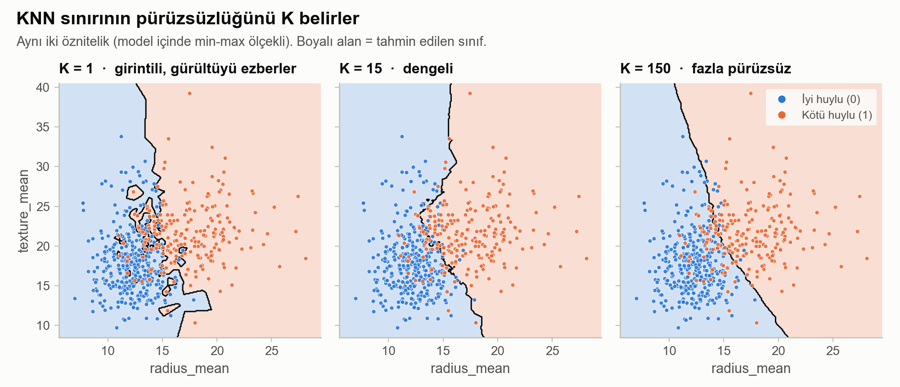

*Aynı veri K = 1, 15 ve 150 ile sınıflandırılmış. Küçük K tek tek noktaların çevresine adacıklar çizer; çok büyük K sınırı düzleştirir.*

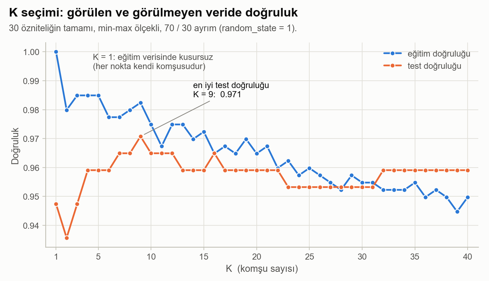

*K = 1 ile 40 arası için eğitim ve test doğruluğu, 30 özniteliğin tamamı. K = 1 eğitim verisinde kusursuz, test verisinde en kötüsü.*

Eğri benim ayrımımda (70 / 30, `random_state=1`, 171 test tümörü) şunu söylüyor:

- **K = 1** eğitim kümesinde %100 alır, çünkü her nokta kendi en yakın komşusudur; ama test kümesinde yalnızca %94.7. Aradaki fark aşırı öğrenmedir.
- Test doğruluğu **K = 9 için tepe yapar (%97.1, 171 tümörün 166’sı)**. 7 ile 12 arasındaki her K bunun bir tümör yakınındadır; yani eğri orada düzdür. Notebook’ta **K = 8** kullanıyorum.
- K ≈ 20 sonrasında iki eğri birlikte aşağı kayar: model fazla pürüzsüzleşmektedir.

> [!WARNING]
> **Edinmeye değer iki alışkanlık.**
>
> - K değerini **test** doğruluğuna bakarak seçmek, test kümesini sessizce modele sızdırır. Temiz yol, K değerini eğitim verisi üzerinde çapraz doğrulamayla seçmek ve test kümesine en sonda, bir kez dokunmaktır.
> - İki sınıf varken **tek sayı olan bir K** asla berabere biten bir oylama üretmez.

### KNN için normalizasyon kritiktir

KNN tümüyle uzaklığa dayanır. Büyük değerli bir öznitelik (ör. `area_mean`, 144 ile 2501 arası) uzaklık hesabında küçük değerli bir özniteliği (ör. `smoothness_mean`, 0.05 ile 0.16 arası) bastırır. **Min-Max normalizasyonu** her özniteliği `[0, 1]` aralığına ölçekler:

```math
x_{norm} = \frac{x - x_{min}}{x_{max} - x_{min}}
```

**Elle bir örnek.** Alanı neredeyse aynı olan, ama smoothness aralığının iki ucunda duran iki tümör al:

|   | area_mean farkı | smoothness_mean farkı | Öklid uzaklığı |
|---|---|---|---|
| **Ham değerler** | 20 | 0.10 | $`\sqrt{20^2 + 0.10^2} = 20.0002`$ |
| **Min-max sonrası** | 20 / 2357.5 = 0.008 | 0.10 / 0.11 = 0.909 | $`\sqrt{0.008^2 + 0.909^2} = 0.909`$ |

Ham değerlerde smoothness farkı, o özniteliğin neredeyse bütün aralığı olmasına rağmen, uzaklığa hiçbir şey katmıyor. Ölçeklemeden sonra, olması gerektiği gibi, baskın hâle geliyor.

| Model (aynı 70 / 30 ayrım) | Test doğruluğu, ham öznitelikler | Test doğruluğu, min-max ölçekli |
|---|---|---|
| KNN, K = 8 | %93.0 | **%96.5** |
| SVM, RBF çekirdeği | %91.8 | **%97.1** |
| Gaussian Naive Bayes | %94.7 | %94.7 (ölçek fark etmez) |

> [!TIP]
> $`x_{min}`$ ve $`x_{max}`$ değerlerini **yalnızca eğitim kümesinden** hesapla, sonra aynı sayıları test kümesine uygula. Aksi halde test verisi hakkındaki bilgi eğitime sızar. scikit-learn’ün `Pipeline` yapısı bunu senin yerine yapar.

### Tembelliğin bedeli

- **Eğitim bedava, tahmin pahalı.** `fit` yalnızca veriyi saklar. Her bir tahmin, $`n`$ eğitim noktasının tamamına $`d`$ özniteliğin hepsi üzerinden uzaklık hesaplar: sorgu başına $`O(n \cdot d)`$.
- **Boyut laneti (curse of dimensionality).** Öznitelik sayısı arttıkça bütün noktalar birbirine neredeyse eşit uzaklıkta olmaya başlar ve “en yakın” anlamını yitirir. Bilgi taşımayan öznitelikleri atmak ya da önce boyut indirgemek çok yardımcı olur.

### Python uygulaması

```python
from sklearn.neighbors import KNeighborsClassifier
from sklearn.preprocessing import MinMaxScaler
from sklearn.pipeline import make_pipeline

X = data.drop(columns="diagnosis").values                  # ham öznitelikler
x_train, x_test, y_train, y_test = train_test_split(X, y, test_size=0.3, random_state=1)

for k in range(1, 15):
    knn = make_pipeline(MinMaxScaler(), KNeighborsClassifier(n_neighbors=k))
    knn.fit(x_train, y_train)                              # ölçekleyici yalnızca eğitim kümesinde fit edilir
    print(k, round(knn.score(x_test, y_test), 4))          # k = 8: 0.9649, k = 9: 0.9708
```

---

## 3. Destek Vektör Makinesi (SVM)

SVM, iki sınıfı **en büyük marjla (maximum margin)** — her sınıfın en yakın veri noktaları arasındaki olabilecek en geniş boşlukla — ayıran **hiperdüzlemi** bulur. O en yakın noktalara **destek vektörleri (support vectors)** denir.

### Sezgi

İki nokta kümesi arasına bir doğru çizdiğini düşün. Onları doğru ayıran sonsuz sayıda doğru vardır. SVM, **iki kümeye de en uzak** olanı seçer — marjı en büyük yapmak sınıflandırıcıyı yeni veriye karşı daha dayanıklı kılar. Bunu iki sınıf arasına olabilecek en geniş caddeyi sığdırmak gibi düşün; karar sınırı caddenin orta çizgisidir.

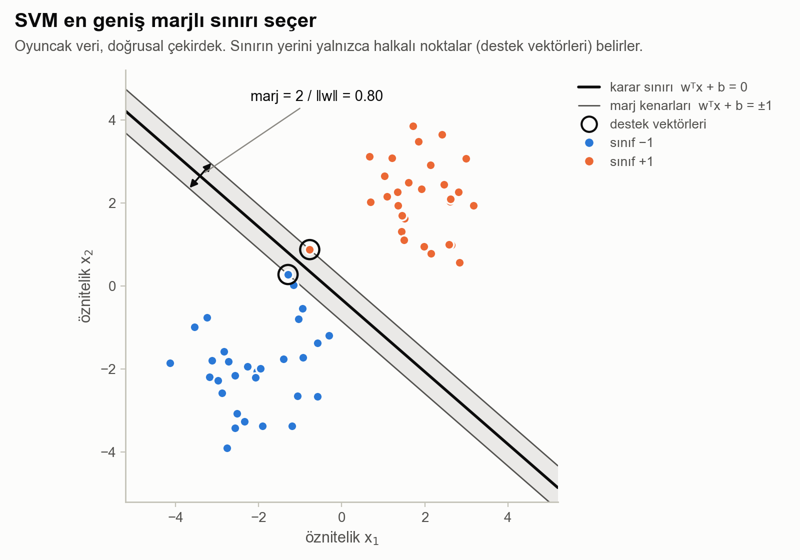

*Oyuncak veri üzerinde doğrusal bir SVM. Gri bant marjdır. Kenarlarına yalnızca halkalı iki nokta değer; diğer bütün noktalar yer değiştirse ya da kaybolsa bile sınır değişmezdi.*

### Matematik: marj formülü nereden gelir

SVM, 0 ve 1 yerine $`y_i \in \{-1, +1\}`$ etiketlerini kullanır. Sınır, $`w^{\top}x + b = 0`$ olan noktalar kümesidir ve herhangi bir $`x`$ noktasının ona uzaklığı:

```math
\text{uzaklık}(x) = \frac{\lvert w^{\top}x + b\rvert}{\lVert w\rVert}
```

$`w`$ ile $`b`$ değerlerini aynı sabitle çarpmak sınırı yerinden oynatmaz; dolayısıyla ölçeği sabitlemekte özgürüz. Ölçeği, her iki taraftaki en yakın noktalar $`w^{\top}x + b = \pm 1`$ sağlayacak şekilde seç. O noktalar $`1/\lVert w\rVert`$ uzaklıkta durur ve cadde bunun iki katı genişliktedir:

```math
\text{Marj} = \frac{2}{\lVert w\rVert}
```

Yukarıdaki grafikte $`w = (1.65,\ 1.90)`$; dolayısıyla $`\lVert w\rVert = 2.52`$ ve marj $`2 / 2.52 = 0.80`$.

Marjı en büyük yapmak, bütün noktaların doğru sınıflandırılıp caddenin dışında kalması kısıtı altında $`\lVert w\rVert^2 / 2`$ ifadesini en küçük yapmaya eşdeğerdir:

```math
\min_{w,\,b}\ \frac{1}{2}\lVert w\rVert^2 \qquad \text{öyle ki} \qquad y_i\,(w^{\top}x_i + b) \ge 1 \quad \text{(her } i \text{ için)}
```

### Sert ve yumuşak marj (Hard vs. Soft Margin)

| Tür | Açıklama |
|---|---|
| **Sert marj** | Hiçbir yanlış sınıflandırmaya izin yok. Yalnızca veri kusursuz biçimde doğrusal ayrılabilir olduğunda çalışır. |
| **Yumuşak marj** | Bir miktar yanlış sınıflandırmaya izin verir (`C` parametresiyle denetlenir). Gerçek dünyanın gürültülü verisi için daha kullanışlıdır. |

Yumuşak marj her noktaya, marjı ne kadar ihlal edebileceğini ölçen bir **gevşeklik (slack)** $`\xi_i \ge 0`$ verir ve toplam gevşekliği ücretlendirir:

```math
\min_{w,\,b,\,\xi}\ \frac{1}{2}\lVert w\rVert^2 + C\sum_{i=1}^{m}\xi_i \qquad \text{öyle ki} \qquad y_i\,(w^{\top}x_i + b) \ge 1 - \xi_i, \quad \xi_i \ge 0
```

**`C`**** (düzenlileştirme parametresi)** bir birim gevşekliğin fiyatıdır:

- Büyük `C` → yanlış sınıflandırmayı ağır cezalandırır → dar marj, aşırı öğrenme riski.
- Küçük `C` → daha fazla hataya göz yumar → geniş marj, daha iyi genelleme.

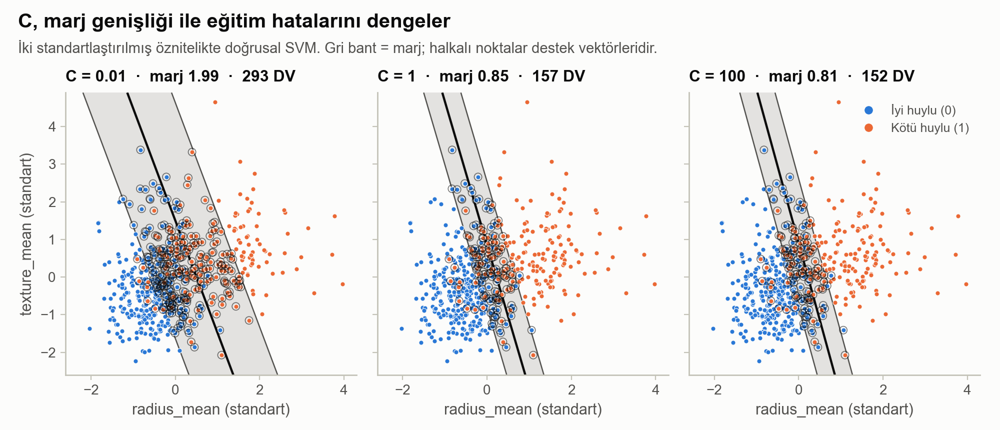

*Aynı iki öznitelik, üç farklı C değeriyle. Küçük C geniş bir cadde satın alır ve içinde çok sayıda nokta kalmasını kabul eder; büyük C ihlalleri azaltmak için caddeyi daraltır.*

| C | Marj genişliği | Destek vektörü sayısı (569 içinden) |
|---|---|---|
| 0.01 | 1.99 | 293 |
| 1 | 0.85 | 157 |
| 100 | 0.81 | 152 |

### SVM ile lojistik regresyon kuzendir

Optimumda her gevşeklik $`\xi_i = \max(0,\ 1 - y_i f(x_i))`$ değerine eşittir; burada $`f(x) = w^{\top}x + b`$. Bunu yerine koymak kısıtları ortadan kaldırır ve SVM’nin gerçekte neyi en küçük yaptığını gösterir:

```math
\min_{w,\,b}\ \frac{1}{2}\lVert w\rVert^2 + C\sum_{i=1}^{m}\max\big(0,\ 1 - y_i f(x_i)\big)
```

İkinci terim **hinge kaybıdır**. Lojistik regresyon bunun yerine **log kaybını**, $`\log(1 + e^{-y_i f(x_i)})`$, en küçük yapar. İkisi de doğruluğun saydığı 0–1 kaybının yumuşatılmış birer vekilidir:

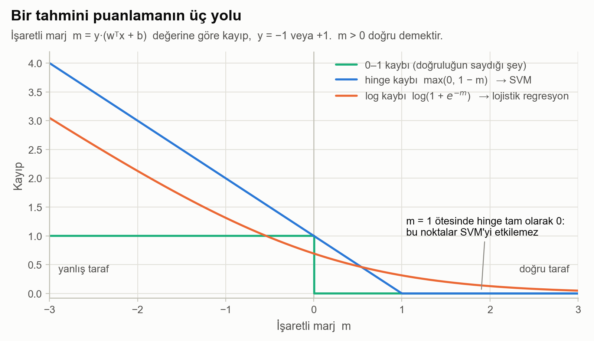

*İşaretli marja karşı üç kayıp fonksiyonu. Hinge kaybı, marjın güvenle ötesindeki noktalar için tam sıfırdır; log kaybı sıfıra hiçbir zaman tam ulaşmaz.*

Hinge kaybının sıfırda düz kalan kısmı, destek vektörlerinin matematiksel nedenidir: doğru sınıflanmış ve marjın ötesindeki noktalar hiçbir katkı yapmaz; çözüm yalnızca caddenin üstündeki ya da içindeki birkaç noktaya bağlıdır.

### Çekirdek hilesi (Kernel Trick)

Veri doğrusal ayrılamadığında SVM, veriyi ayırıcı bir hiperdüzlemin var olduğu **daha yüksek boyutlu bir uzaya** eşler. Yaygın çekirdekler:

- `linear` — dönüşüm yok (doğrusal ayrılabilir veri için)
- `rbf` (Radial Basis Function) — sonsuz boyuta eşler; doğrusal olmayan durumların çoğunu çözer
- `poly` — polinom dönüşümü

scikit-learn’ün `SVC` sınıfı varsayılan olarak `kernel='rbf'` kullanır.

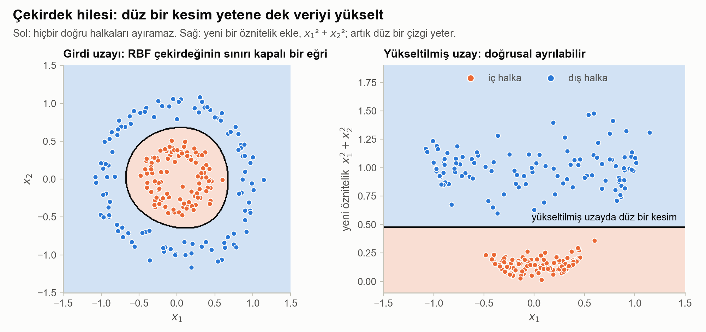

*Sol: hiçbir doğrunun ayıramayacağı iki halka. Sağ: yeni bir öznitelik, merkeze uzaklığın karesi eklendikten sonra düz bir kesim onları kusursuz ayırır.*

Bu halkalarda doğrusal bir SVM noktaların %62’sini doğru bilir; RBF çekirdeği %100’ünü.

**Neden “hile” deniyor?** SVM çözümü veri noktaları arasında yalnızca **iç çarpımlara** ihtiyaç duyar. Bir çekirdek, $`K(x, x') = \phi(x)^{\top}\phi(x')`$, yükseltilmiş uzaydaki iç çarpımı, yükseltilmiş koordinatları $`\phi(x)`$ **hiç hesaplamadan** verir. RBF çekirdeğinde o uzay sonsuz boyutludur; ama çekirdeğin kendisi tek satırdır:

```math
K(x, x') = \exp\big(-\gamma\,\lVert x - x'\rVert^2\big)
```

Bu bir benzerlik skorudur: aynı noktalar için 1, noktalar uzaklaştıkça 0’a doğru düşer. $`\gamma`$ ne kadar hızlı düşeceğini belirler. Büyük `gamma` → her destek vektörü yalnızca yakın çevresini etkiler → aşırı öğrenebilen kıvrımlı bir sınır. Küçük `gamma` → geniş etki → daha pürüzsüz bir sınır.

<details>
<summary><b>Daha derin: dual problem (iç çarpımların ortaya çıktığı yer)</b></summary>

Her eğitim noktası için bir Lagrange çarpanı $`\alpha_i \ge 0`$ tanımla. $`w`$ için çözmek $`w = \sum_i \alpha_i y_i x_i`$ verir ve optimizasyon şuna dönüşür:

```math
\max_{\alpha}\ \sum_{i=1}^{m}\alpha_i - \frac{1}{2}\sum_{i=1}^{m}\sum_{j=1}^{m}\alpha_i\alpha_j\,y_i y_j\,x_i^{\top}x_j \qquad \text{öyle ki} \qquad 0 \le \alpha_i \le C, \quad \sum_{i=1}^{m}\alpha_i y_i = 0
```

Veri yalnızca $`x_i^{\top}x_j`$ üzerinden girer. Bunu $`K(x_i, x_j)`$ ile değiştirirsen aynı algoritma yükseltilmiş uzayda çalışır. Yeni bir nokta için tahmin:

```math
f(x) = \sum_{i=1}^{m}\alpha_i\,y_i\,K(x_i, x) + b
```

$`\alpha_i`$ değerlerinin çoğu tam sıfır çıkar. $`\alpha_i \gt 0`$ olan noktalar destek vektörleridir ve tahmin anında gereken tek noktalar onlardır.

</details>

### Python uygulaması

```python
from sklearn.svm import SVC

svm = make_pipeline(MinMaxScaler(), SVC(kernel="rbf", C=1.0, gamma="scale", random_state=1))
svm.fit(x_train, y_train)
print(svm.score(x_test, y_test))           # 0.9708
print(svm[-1].n_support_)                  # [41 45] -> 398 eğitim noktasının 86'sı destek vektörü
```

KNN gibi SVM de uzaklık ölçer; dolayısıyla ölçeklenmiş özniteliklere ihtiyaç duyar: ham veride aynı model yalnızca %91.8 alır.

---

## 4. Naive Bayes

Naive Bayes, Bayes Teoremi’ne dayanan **olasılıksal bir sınıflandırıcıdır**. *Naive* (saf) denmesinin nedeni, sınıf etiketi verildiğinde bütün özniteliklerin **koşullu bağımsız** olduğunu varsaymasıdır — pratikte nadiren doğru olan ama şaşırtıcı derecede iyi çalışan bir sadeleştirme.

### Bayes Teoremi

```math
P(c \mid x) = \frac{P(x \mid c)\,P(c)}{P(x)}
```

| Terim | Ad | Anlam |
|---|---|---|
| $`P(c \mid x)`$ | **Sonsal (posterior)** | Gözlenen öznitelikler verildiğinde sınıfın olasılığı |
| $`P(x \mid c)`$ | **Olabilirlik (likelihood)** | Bu özniteliklerin bu sınıftan gözlenme olasılığı |
| $`P(c)`$ | **Önsel (prior)** | Bu sınıfın eğitim kümesinde ne kadar sık olduğu |
| $`P(x)`$ | **Kanıt (evidence)** | Sabit normalleştirici; sınıflandırmada yok sayılabilir |

Sınıflandırmak için her sınıfın sonsal olasılığını hesaplar, en yükseğini seçeriz. $`P(x)`$ her sınıf için aynı olduğundan payları karşılaştırmak yeterlidir:

```math
\hat{c} = \underset{c}{\arg\max}\ P(c)\,P(x \mid c)
```

### “Naive” bağımsızlık varsayımı

```math
P(x_1, x_2, \dots, x_n \mid c) = P(x_1 \mid c)\cdot P(x_2 \mid c)\cdots P(x_n \mid c) = \prod_{j=1}^{n} P(x_j \mid c)
```

Her öznitelik, sınıf olasılığına bağımsız katkı yapıyormuş gibi ele alınır. Bu, matematiği çözülebilir kılar, boyut lanetinden kaçınır ve hesabı çarpıcı biçimde hızlandırır.

**Ne kadar daha basit?** 30 özniteliği tam bir Gauss ile birlikte modellemek, sınıf başına 30 ortalama artı 465 varyans ve kovaryans gerektirir. Naive sürüm 30 ortalama ve 30 varyansa ihtiyaç duyar: sınıf başına 60 sayı; her biri basit bir ortalamadan tahmin edilir.

<details>
<summary><b>Daha derin: uygulamalar neden çarpmak yerine logaritmaları toplar</b></summary>

30 küçük olasılığı çarpmak, kayan noktalı sayılarda hızla sıfıra taşar (underflow). Logaritma monotondur; en büyük çarpıma sahip sınıf aynı zamanda en büyük log toplamına sahiptir:

```math
\hat{c} = \underset{c}{\arg\max}\ \Big[\log P(c) + \sum_{j=1}^{n}\log P(x_j \mid c)\Big]
```

scikit-learn dahil her Naive Bayes uygulaması bu log uzayında çalışır.

</details>

### Gaussian Naive Bayes

Öznitelikler **sürekli** olduğunda (meme kanseri veri setindeki 30 özniteliğin hepsi gibi) `GaussianNB`, her özniteliğin her sınıf içinde **normal (Gauss) dağılıma** uyduğunu varsayar:

```math
P(x_j \mid c) = \frac{1}{\sqrt{2\pi\sigma_{jc}^2}}\exp\!\left(-\frac{(x_j - \mu_{jc})^2}{2\sigma_{jc}^2}\right)
```

Model, her sınıftaki her öznitelik için $`\mu`$ (ortalama) ve $`\sigma^2`$ (varyans) değerlerini eğitim verisinden öğrenir. “Eğitim” bu ortalamaları hesaplamaktan ibarettir; ayarlanacak neredeyse hiçbir şey yoktur.

### Tek bir öznitelikte elle örnek

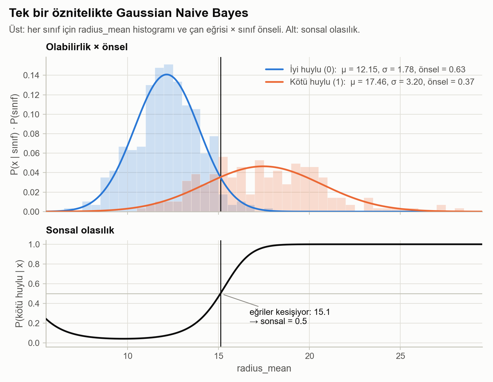

*Üst: her sınıfta radius_mean dağılımı ve sınıf önseliyle ölçeklenmiş çan eğrisi. Alt: bunun sonucunda kötü huylu olma olasılığı. Karar, iki eğrinin kesiştiği yerde değişir.*

Yalnızca bu özniteliği kullanarak **radius_mean = 15** olan bir tümörü sınıflandır:

|   | İyi huylu | Kötü huylu |
|---|---|---|
| Önsel $`P(c)`$ | 0.627 | 0.373 |
| Ortalama, standart sapma | 12.15, 1.78 | 17.46, 3.20 |
| Olabilirlik $`P(15 \mid c)`$ | 0.0619 | **0.0928** |
| Olabilirlik × önsel | **0.0388** | 0.0346 |
| Sonsal | **%52.9** | %47.1 |

> [!TIP]
> **Önsel, yanıtı değiştirir.** 15’lik bir yarıçap kötü huylu bir tümör için daha tipiktir (olabilirlik 0.093’e karşı 0.062). Ama iyi huylu tümörler veride düpedüz daha yaygın; önsellerle çarpınca iyi huylu taraf kıl payı kazanıyor. İki eğri **15.1** noktasında kesişiyor: bunun üstünde bu tek öznitelikli model kötü huylu diyor.

Alt panelin gösterdiği bir şey daha var: en solda kötü huylu olasılığı yeniden yükseliyor. Hiçbir tümör o kadar küçük değil. Bunun tek nedeni kötü huylu çan eğrisinin daha geniş olması; kuyruğu sonunda dar olan iyi huylu eğriyi geçiyor. Gauss varsayımının bir olgu değil, bir model olduğunu hatırlatan bir ayrıntı.

### Güçlü ve zayıf yanlar

| Güçlü yanlar | Zayıf yanlar |
|---|---|
| Eğitimi ve tahmini çok hızlıdır | Öznitelik bağımsızlığını varsayar (çoğu zaman ihlal edilir) |
| Az veriyle iyi çalışır | Olasılık tahminleri kötü kalibre olabilir |
| Yüksek boyutlu veriyi rahat kaldırır | Karmaşık korelasyonlu özniteliklerde zayıftır |
| Doğal olarak çok sınıflıdır | Bazı türevleri öznitelik ölçeğine duyarlıdır |

Bu veri setinde birçok öznitelik birbirinin neredeyse kopyası (radius, perimeter ve area hep büyüklüğü ölçüyor). Naive Bayes aynı kanıtı birkaç kez sayıyor; sondaki karşılaştırmada diğer modellerin altında kalmasının bir nedeni bu.

### Python uygulaması

```python
from sklearn.naive_bayes import GaussianNB

nb = GaussianNB().fit(x_train, y_train)
print(nb.score(x_test, y_test))            # 0.9474
print(nb.class_prior_)                     # eğitim kümesinde P(iyi huylu), P(kötü huylu)
print(nb.theta_[:, 0], nb.var_[:, 0])      # ilk özniteliğin sınıf bazında ortalaması ve varyansı
```

---

## 5. Karar Ağacı ile Sınıflandırma

**CART**, *Classification and Regression Trees* (sınıflandırma ve regresyon ağaçları) demektir: tek algoritma, iki iş. Regresyon sürümü [Regresyon](../Regression/Regression.tr.md) sayfasında anlatılıyor. Sınıflandırmada yalnızca iki şey değişir:

|   | Regresyon ağacı | Sınıflandırma ağacı |
|---|---|---|
| Yaprak neyi tahmin eder | Eğitim satırlarının **ortalamasını** | Eğitim satırlarının **çoğunluk sınıfını** |
| Bölme neyle puanlanır | Çocukların varyansı (MSE) | Çocukların **safsızlığı (impurity)**: entropi ya da Gini |

Geri kalan her şey aynıdır: her özniteliği ve her eşiği dene, en iyi bölmeyi tut, her çocuğun içinde yinele.

### Matematik: bir düğümün ne kadar karışık olduğunu ölçmek

Bir düğüm, bütün örnekleri tek bir sınıfa aitse **saf**, sınıflar karışıksa **saf değildir**. $`p_k`$, düğümdeki $`k`$ sınıfının payı olmak üzere:

```math
\text{Entropi:}\quad H = -\sum_{k} p_k\log_2 p_k \qquad\qquad \text{Gini:}\quad G = 1 - \sum_{k} p_k^2
```

$`p`$ = sınıf 1’in payı olan iki sınıflı durumda:

```math
H(p) = -p\log_2 p - (1 - p)\log_2(1 - p), \qquad G(p) = 2p(1 - p)
```

- **Entropi** bilgi kuramından gelir: düğümden rastgele seçilen bir örneğin sınıfını öğrenmek için gereken ortalama evet/hayır sorusu (bit) sayısı. Saf bir düğüm 0 soru ister; 50 / 50 bir düğüm 1 soru.
- **Gini**, düğümün kendi sınıf paylarına göre tahmin yürütürsen rastgele bir örneği yanlış etiketleme olasılığıdır.

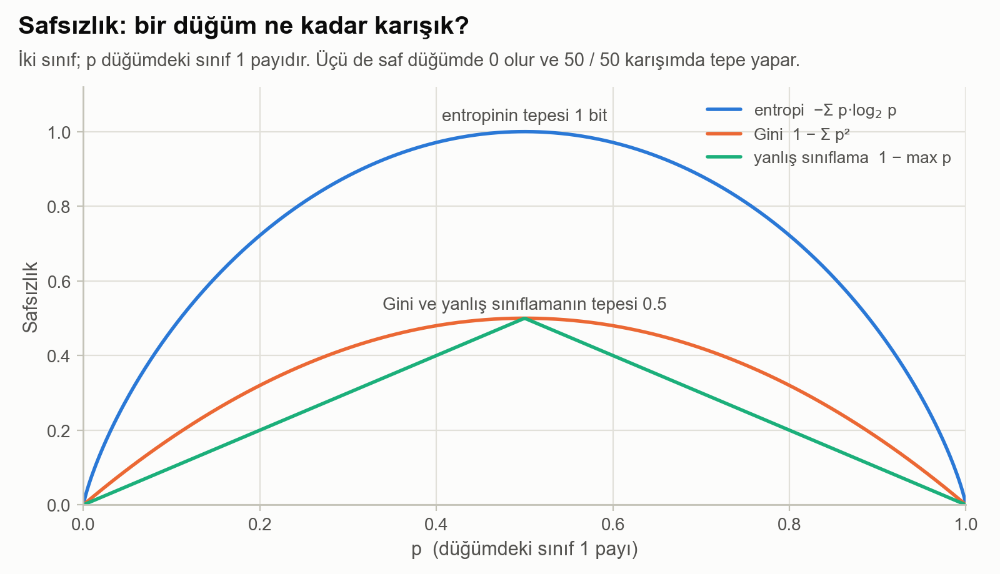

*İki sınıflı bir düğüm için entropi, Gini ve yanlış sınıflama oranı. Hepsi saf düğümde sıfır, 50 / 50 karışımda en büyüktür.*

### Matematik: entropiyi en küçük yapmak = bilgi kazancını en büyük yapmak

Bir bölme, düğümün $`n`$ örneğini bir sol çocuğa ($`n_L`$) ve bir sağ çocuğa ($`n_R`$) gönderir. **Bilgi kazancı (information gain)**, başlangıçtaki entropiden geriye kalan ağırlıklı entropinin çıkarılmasıdır:

```math
IG = H(\text{ebeveyn}) - \left[\frac{n_L}{n}H(L) + \frac{n_R}{n}H(R)\right]
```

Ağaç, **bilgi kazancı en büyük** olan bölmeyi seçer; bu, **ağırlıklı çocuk entropisi en düşük** olan bölmeyle aynıdır.

### Kök bölme, elle hesap

`radius_mean` ve `texture_mean` özniteliklerinde en iyi ilk soru “radius_mean ≤ 15.05 mi?” sorusudur.

| Düğüm | Örnek | İyi huylu | Kötü huylu | Kötü huylu payı | Entropi (bit) |
|---|---|---|---|---|---|
| Ebeveyn (tüm veri) | 569 | 357 | 212 | 0.373 | 0.953 |
| Sol: radius_mean ≤ 15.05 | 397 | 346 | 51 | 0.128 | 0.553 |
| Sağ: radius_mean 15.05 üstü | 172 | 11 | 161 | 0.936 | 0.343 |

```math
H(\text{ebeveyn}) = -0.373\log_2 0.373 - 0.627\log_2 0.627 = 0.953
```

```math
IG = 0.953 - \left[\frac{397}{569}\cdot 0.553 + \frac{172}{569}\cdot 0.343\right] = 0.953 - 0.490 = 0.463 \text{ bit}
```

Yarıçap hakkındaki tek bir soru, tanı hakkındaki belirsizliğin neredeyse yarısını ortadan kaldırıyor. Derinliği 2 olan ağacın tamamı (İ = iyi huylu, K = kötü huylu):

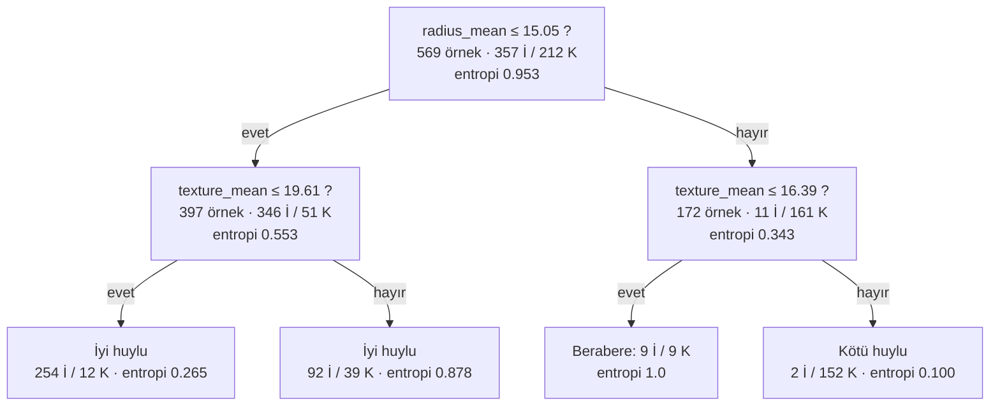
```mermaid
graph TD
    R["radius_mean ≤ 15.05 ?<br>569 örnek · 357 İ / 212 K<br>entropi 0.953"] -->|"evet"| L["texture_mean ≤ 19.61 ?<br>397 örnek · 346 İ / 51 K<br>entropi 0.553"]
    R -->|"hayır"| Q["texture_mean ≤ 16.39 ?<br>172 örnek · 11 İ / 161 K<br>entropi 0.343"]
    L -->|"evet"| L1["İyi huylu<br>254 İ / 12 K · entropi 0.265"]
    L -->|"hayır"| L2["İyi huylu<br>92 İ / 39 K · entropi 0.878"]
    Q -->|"evet"| R1["Berabere: 9 İ / 9 K<br>entropi 1.0"]
    Q -->|"hayır"| R2["Kötü huylu<br>2 İ / 152 K · entropi 0.100"]
```

9 iyi huylu ve 9 kötü huylu tümör içeren yaprağa dikkat: entropi tam 1, yani yazı tura. Daha derin bir ağaç orada bölmeyi sürdürürdü.

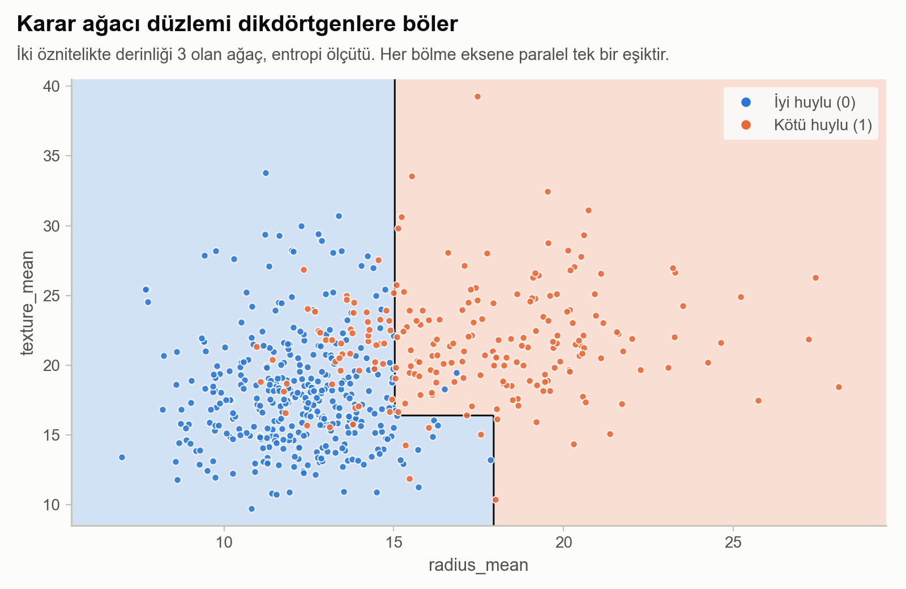

*İki öznitelikte derinliği 3 olan ağaç. Her bölme tek bir öznitelikteki tek bir eşiktir; bu yüzden bölgeler her zaman kenarları eksenlere paralel dikdörtgenlerdir.*

### Entropi mi, Gini mi?

Neredeyse her zaman aynı bölmeleri seçerler. Gini logaritma gerektirmez; bu yüzden biraz daha hızlıdır ve scikit-learn’ün varsayılanıdır (`criterion="gini"`). Yukarıda anlatılan bilgi kazancı sürümü için `criterion="entropy"` kullan.

### Artılar ve eksiler

- **Artılar:** Akış şeması gibi okunur; öznitelik ölçekleme gerekmez; doğrusal olmayan sınırları ve öznitelik etkileşimlerini yakalar.
- **Eksiler:** Sınırlar her zaman eksenlere paralel basamaklardır; derin bir ağaç eğitim kümesini ezberler; verideki küçük değişiklikler bütün ağacı değiştirebilir (yüksek varyans). Regresyon ağaçlarındaki aynı hiperparametreler onu dizginler: `max_depth`, `min_samples_split`, `min_samples_leaf`.

### Python uygulaması

```python
from sklearn.tree import DecisionTreeClassifier, export_text

tree = DecisionTreeClassifier(random_state=42).fit(x_train, y_train)      # 30 özniteliğin tamamı
print(tree.score(x_test, y_test))          # 0.9591

# yukarıda çizilen iki öznitelikli küçük ağaç
X2 = data[["radius_mean", "texture_mean"]].values
small = DecisionTreeClassifier(criterion="entropy", max_depth=2, random_state=42).fit(X2, y)
print(export_text(small, feature_names=["radius_mean", "texture_mean"]))
```

---

## 6. Rastgele Orman ile Sınıflandırma

**Topluluk öğrenmesi (ensemble learning):** tek bir modele güvenmek yerine birçok model eğit ve yanıtlarını birleştir. Rastgele orman, karar ağaçlarından oluşan bir topluluktur.

### Algoritma (adım adım)

1. $`n`$ eğitim satırından **yerine koyarak** rastgele $`n`$ satır seç. Seçilen satırlara **alt örneklem (sub-sample)** ya da bootstrap örneklemi denir. Bazı satırlar birkaç kez gelir, yaklaşık üçte biri hiç gelmez.
2. Bu alt örneklemde bir karar ağacı büyüt. Her bölmede özniteliklerin yalnızca **rastgele bir alt kümesini** dikkate al (varsayılan olarak 30 özniteliğin $`\sqrt{30} \approx 5`$ tanesi).

3.

    1. ve 2. adımları $`B`$ ağaç için yinele (`n_estimators`).
4. Yeni bir örneği sınıflandırmak için **her ağaç oy versin**, çoğunluğu al. (scikit-learn ağaçların sınıf olasılıklarının ortalamasını alır; buna “yumuşak” oylama denir.)

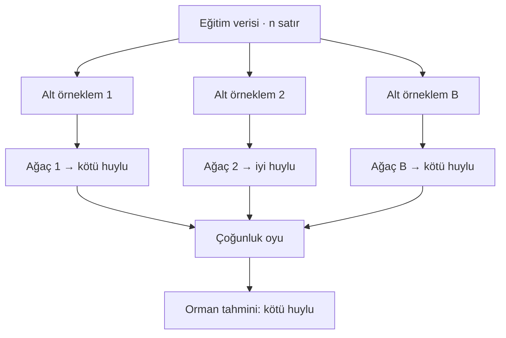
```mermaid
graph TD
    D["Eğitim verisi · n satır"] --> S1["Alt örneklem 1"]
    D --> S2["Alt örneklem 2"]
    D --> S3["Alt örneklem B"]
    S1 --> T1["Ağaç 1 → kötü huylu"]
    S2 --> T2["Ağaç 2 → iyi huylu"]
    S3 --> T3["Ağaç B → kötü huylu"]
    T1 --> V["Çoğunluk oyu"]
    T2 --> V
    T3 --> V
    V --> P["Orman tahmini: kötü huylu"]
```

### Matematik: oylama neden tek seçmenden iyidir

Her ağacın $`p \gt 0.5`$ olasılıkla doğru bildiğini ve ağaçların hatalarını **birbirinden bağımsız** yaptığını varsay. $`B`$ ağacın çoğunluğunun doğru bilme olasılığı:

```math
P(\text{çoğunluk doğru}) = \sum_{k \gt B/2}\binom{B}{k}\,p^{k}(1 - p)^{B - k}
```

| Ağaç sayısı B (her biri %70 doğru) | Çoğunluk oyunun doğruluğu |
|---|---|
| 1 | %70.0 |
| 11 | %92.2 |
| 101 | %99.999 |

> [!WARNING]
> **İşin püf noktası “bağımsız” sözcüğünde.** Gerçek ağaçlar örtüşen verilerle eğitilir ve aynı hataların çoğunu yapar; bu yüzden kazanç bu tablonun vaat ettiğinden çok daha küçüktür. Ormanın rastgelelik eklemesinin (alt örneklemler ve rastgele öznitelik alt kümeleri) nedeni tam da budur: ağaçlar birbirine ne kadar az benzerse oylama o kadar işe yarar. Regresyon sayfası aynı fikri bir ortalamanın varyansı formülü olarak türetiyor: $`\rho\sigma^2 + \tfrac{1-\rho}{B}\sigma^2`$.

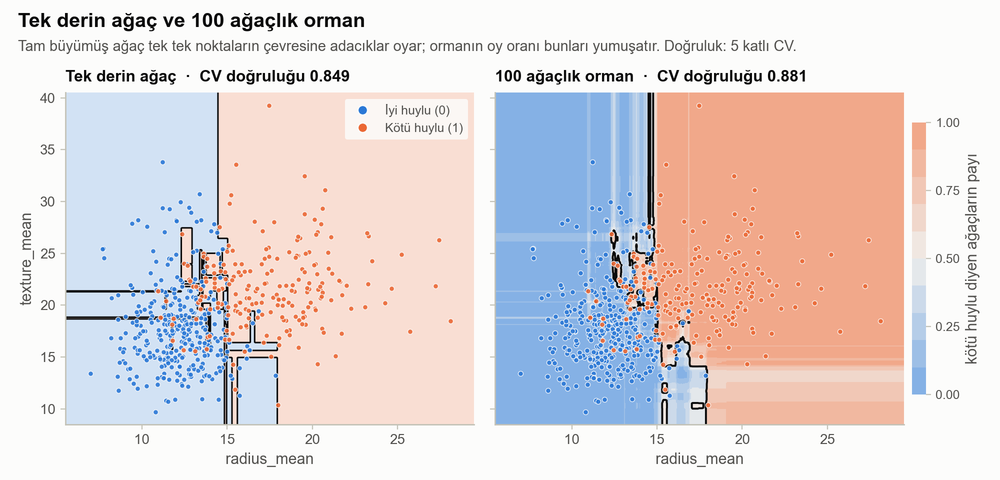

*Sol: tam büyümüş tek bir ağaç tek tek tümörlerin çevresine küçük adacıklar çizer. Sağ: 100 ağaçtan kötü huylu diyenlerin payı yumuşak biçimde değişir ve adacıklar erir.*

| Çapraz doğrulama doğruluğu | Tek ağaç | 100 ağaçlık orman |
|---|---|---|
| İki öznitelik (5 katlı) | %84.9 | **%88.1** |
| 30 özniteliğin tamamı (10 katlı) | %92.6 | **%95.6** |

### İki bedava ek

- **Torba dışı (out-of-bag) puanı.** Her ağaç, kendi alt örnekleminin dışında kalan satırlarda sınanabilir. Orman üzerinden ortalaması alındığında bu, test kümesine dokunmadan bir doğruluk tahmini verir: burada %95.7; gerçek test kümesindeki %95.9 değerinin hemen yanında.
- **Öznitelik önemi (feature importance).** Her özniteliğin bütün ağaçlarda safsızlığı ne kadar azalttığını toplamak öznitelikleri sıralar. Bu veri setindeki ilk beş: `concave points_worst` (0.150), `area_worst` (0.131), `concave points_mean` (0.094), `perimeter_worst` (0.092), `radius_worst` (0.083).

### Python uygulaması

```python
from sklearn.ensemble import RandomForestClassifier

rf = RandomForestClassifier(n_estimators=100, random_state=42, oob_score=True)
rf.fit(x_train, y_train)
print(rf.score(x_test, y_test))            # 0.9591
print(rf.oob_score_)                       # 0.9573  (test kümesi kullanılmadan tahmin edildi)
print(rf.feature_importances_)             # öznitelik başına bir değer, toplamları 1
```

---

## 7. Karmaşıklık Matrisi ve Değerlendirme Metrikleri

Doğruluk, tahminlerin **kaçının** doğru olduğunu söyler. **Karmaşıklık matrisi (confusion matrix)** ise **ne tür** hatalar yapıldığını söyler; bir kanser testinde bu iki tür hata eşit derecede kötü değildir.

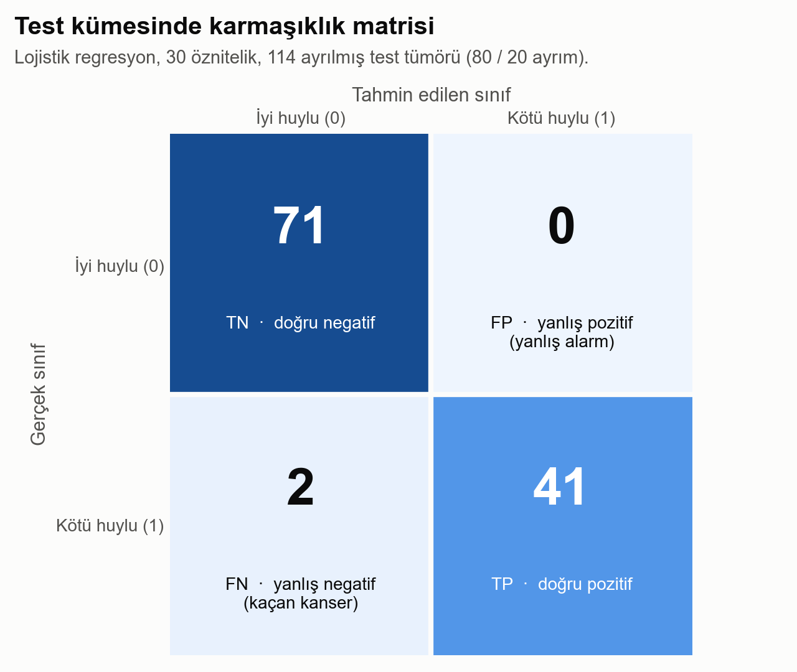

*Bölüm 1’deki lojistik regresyon modelinin 114 test tümörü üzerindeki karmaşıklık matrisi.*

|   | Tahmin: iyi huylu (0) | Tahmin: kötü huylu (1) |
|---|---|---|
| Gerçekte iyi huylu (0) | **TN = 71** doğru negatif: sağlıklı ve model de öyle diyor | **FP = 0** yanlış pozitif: yanlış alarm |
| Gerçekte kötü huylu (1) | **FN = 2** yanlış negatif: kaçan kanser | **TP = 41** doğru pozitif: kanser ve model buluyor |

### Bu dört sayıdan kurulan metrikler

| Metrik | Formül | Bu model | Yanıtladığı soru |
|---|---|---|---|
| **Doğruluk (accuracy)** | $`\dfrac{TP + TN}{TP + TN + FP + FN}`$ | 112 / 114 = 0.982 | Model genelde ne sıklıkla haklı? |
| **Kesinlik (precision)** | $`\dfrac{TP}{TP + FP}`$ | 41 / 41 = 1.000 | Kötü huylu dediğinde ne sıklıkla doğru? |
| **Duyarlılık (recall, sensitivity)** | $`\dfrac{TP}{TP + FN}`$ | 41 / 43 = 0.953 | Bütün kötü huylu tümörlerin kaçını buldu? |
| **Özgüllük (specificity)** | $`\dfrac{TN}{TN + FP}`$ | 71 / 71 = 1.000 | Bütün iyi huylu tümörlerin kaçını temize çıkardı? |
| **F1 skoru** | $`2\cdot\dfrac{\text{precision}\cdot\text{recall}}{\text{precision} + \text{recall}}`$ | 0.976 | Precision ile recall değerlerini dengeleyen tek sayı |

> [!WARNING]
> **Doğruluk tek başına neden yanıltabilir.** Her tümöre iyi huylu diyen bir “model” bu veri setinde %62.7 oranında haklıdır, çünkü iyi huylu vakaların payı budur; ve tam olarak sıfır kanser bulur (recall = 0). Taramada kaçan bir kanser (FN), yanlış alarmdan (FP) çok daha pahalıdır; bu yüzden izlenecek sayı **recall** değeridir. Burada %95.3: iki kötü huylu tümör gözden kaçtı.

### Eşik bir ayar düğmesidir

$`\hat{y} \ge 0.5`$ olduğunda sınıf 1 tahmin etmek yalnızca bir gelenektir. Eşiği düşürmek daha çok kanser yakalar ve daha çok yanlış alarm verir; yükseltmek tersini yapar.

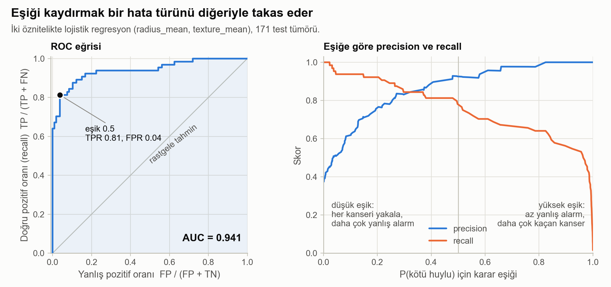

*Sol: olası her eşiğin izini süren ROC eğrisi. Sağ: eşik 0 ile 1 arasında değişirken precision ve recall.*

Grafikteki iki öznitelikli lojistik regresyon için (hataları, bu takası açıkça gösterecek kadar sık):

| Eşik | Precision | Recall |
|---|---|---|
| 0.2 | 0.77 | 0.92 |
| 0.5 | 0.92 | 0.77 |
| 0.8 | 1.00 | 0.64 |

- **ROC eğrisi**, her eşik için doğru pozitif oranını (recall) yanlış pozitif oranına, $`FP / (FP + TN)`$, karşı çizer. Kusursuz bir model sol üst köşeye yapışır; rastgele tahmin köşegeni izler.
- **AUC**, o eğrinin altındaki alan, bunu tek sayıda özetler: rastgele seçilmiş kötü huylu bir tümörün, rastgele seçilmiş iyi huylu bir tümörden daha yüksek skor alma olasılığı. 0.5 tahmin yürütmektir, 1.0 kusursuzdur; bu iki öznitelikli model **0.941** değerine ulaşıyor.

### Python uygulaması

```python
from sklearn.metrics import confusion_matrix, classification_report, roc_auc_score

# lr, x_test ve y_test bölüm 1'deki model ve 80 / 20 ayrımıdır
y_pred = lr.predict(x_test)
print(confusion_matrix(y_test, y_pred))
# [[71  0]
#  [ 2 41]]
print(classification_report(y_test, y_pred, target_names=["iyi huylu", "kötü huylu"]))
print(roc_auc_score(y_test, lr.predict_proba(x_test)[:, 1]))
```

---

## Algoritma Karşılaştırması

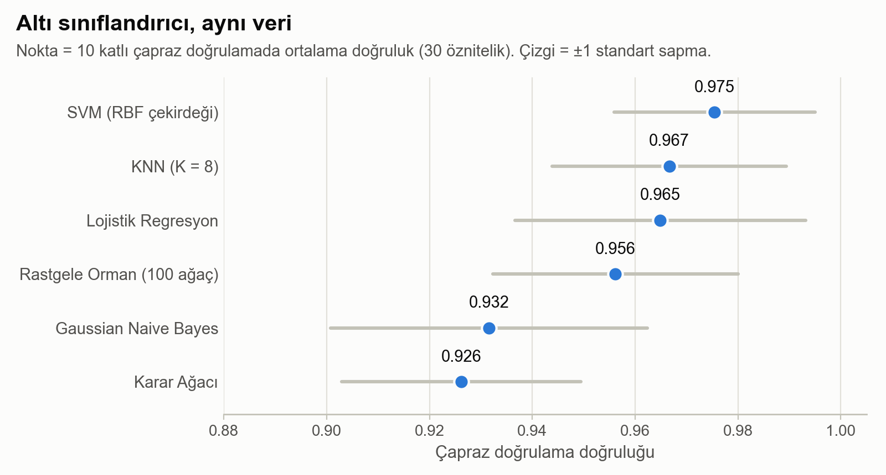

*Altı sınıflandırıcının 30 özniteliğin tamamında 10 katlı çapraz doğrulamadaki ortalama doğruluğu. Her noktadan geçen yatay çizgi, skorun kattan kata ne kadar değiştiğini gösterir.*

| Algoritma | 10 katlı CV doğruluğu | Katlar arası standart sapma |
|---|---|---|
| SVM (RBF çekirdeği) | **0.975** | 0.020 |
| KNN (K = 8) | 0.967 | 0.023 |
| Lojistik Regresyon | 0.965 | 0.028 |
| Rastgele Orman (100 ağaç) | 0.956 | 0.024 |
| Gaussian Naive Bayes | 0.932 | 0.031 |
| Karar Ağacı | 0.926 | 0.023 |

> [!TIP]
> **Sıralamayı dikkatle oku.** İlk dört model arasındaki fark, kendi kattan kata yayılımlarından küçük; yani bu veri setinde fiilen berabereler. Gerçek olan farklar: tek bir karar ağacı ile Naive Bayes diğerlerinin açıkça altında, orman ise kendisini oluşturan tek ağacı açıkça geçiyor.

| Algoritma | Tür | Ana hiperparametre | Yorumlanabilir mi? | İyi ölçeklenir mi? | Öznitelik ölçekleme gerekir mi? |
|---|---|---|---|---|---|
| Lojistik Regresyon | Olasılıksal (doğrusal) | Öğrenme oranı, iterasyon sayısı | ✅ Evet | ✅ Evet | Evet (gradyan inişi) |
| KNN | Örnek tabanlı | K (komşu sayısı) | ✅ Evet | ❌ Büyük N için yavaş | Evet (uzaklık) |
| SVM | Geometrik marj | C, kernel, gamma | ⚠️ Kısmen | ✅ Çekirdeğe bağlı | Evet (uzaklık) |
| Naive Bayes | Olasılıksal | — | ✅ Evet | ✅ Evet | Hayır |
| Karar Ağacı | Kural tabanlı | max_depth | ✅ Evet | ✅ Evet | Hayır |
| Rastgele Orman | Ağaç topluluğu | n_estimators, max_features | ⚠️ Kısmen | ✅ Evet | Hayır |

## Kendini sına

<details>
<summary>1. Bir lojistik regresyon modeli bir tümör için z = 0 hesaplıyor. Ne tahmin eder?</summary>

$`\sigma(0) = 0.5`$: tümör tam karar sınırının, $`w^{\top}x + b = 0`$, üstündedir ve model olabilecek en kararsız durumdadır.

</details>

<details>
<summary>2. Eğitimin ilk iterasyonunda maliyet neden neredeyse tam 0.693?</summary>

Başlangıç ağırlıkları çok küçükken her tahmin yaklaşık 0.5 olur; 0.5’lik bir tahminin çapraz entropisi, gerçek etiket ne olursa olsun, $`-\log(0.5) = \log 2 \approx 0.693`$ eder.

</details>

<details>
<summary>3. K = 1 olan KNN eğitim kümesinde %100 alıyor. En iyi K bu mu?</summary>

Hayır. Her eğitim noktası kendi en yakın komşusudur; yani %100 garantidir ve hiçbir şey söylemez. Test kümesinde K = 1 en kötü seçeneklerden biridir (%94.7; K = 9 için %97.1).

</details>

<details>
<summary>4. Bir SVM’nin sınırından uzakta duran bir eğitim noktasını siliyorsun. Sınır yerinden oynar mı?</summary>

Hayır. O noktanın hinge kaybı sıfır, çarpanı $`\alpha_i`$ sıfırdır; yani destek vektörü değildir. Çözümü yalnızca marjın üstündeki ya da içindeki noktalar belirler.

</details>

<details>
<summary>5. radius_mean = 15 için olabilirlik kötü huylu tarafında daha yüksek; ama Naive Bayes iyi huylu diyor. Nasıl?</summary>

Sonsal, olabilirlik × önseldir. İyi huylu tümörler daha yaygın (önsel 0.627’ye karşı 0.373) ve $`0.0619 \cdot 0.627 = 0.0388`$, $`0.0928 \cdot 0.373 = 0.0346`$ değerini geçer.

</details>

<details>
<summary>6. 9 iyi huylu ve 9 kötü huylu tümör içeren bir yaprağın entropisi nedir? Peki yalnızca 20 iyi huylu içeren bir yaprağın?</summary>

50 / 50 yaprak için 1 bit (iki sınıf için en büyük değer), saf yaprak için 0.

</details>

<details>
<summary>7. Bir modelin precision değeri 1.000, recall değeri 0.953. Ne tür bir hata yapmış?</summary>

Precision 1, hiç yanlış pozitif yok demektir: her “kötü huylu” kararı doğruydu. Recall değerinin 1’in altında olması yanlış negatif demektir: bazı kötü huylu tümörleri kaçırdı (burada 43 tümörün 2’si).

</details>
