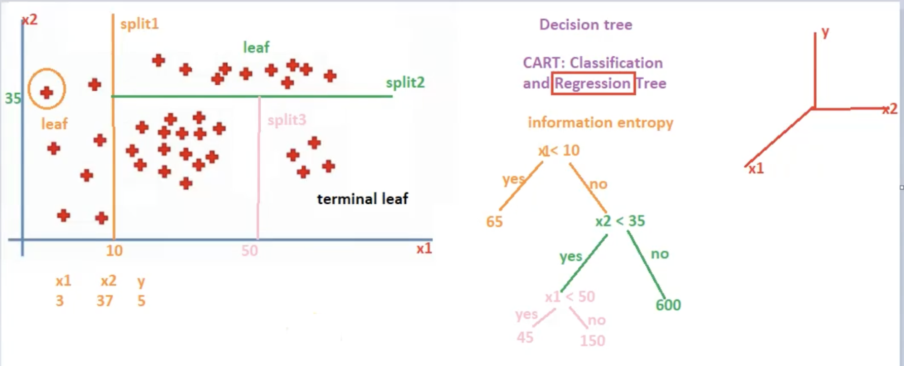
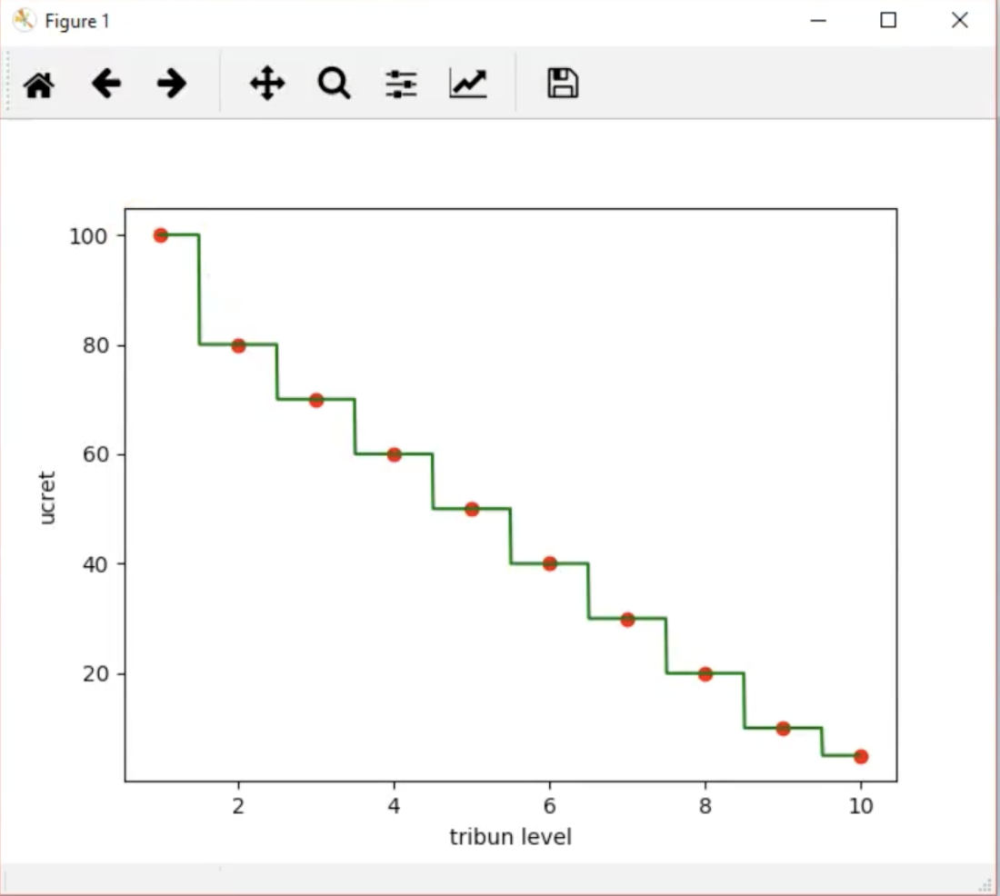
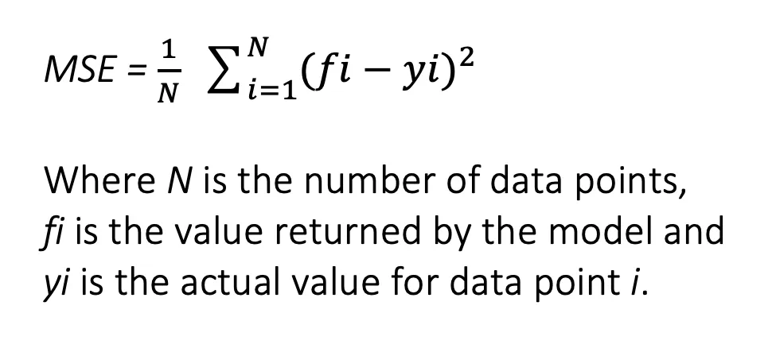

# Machine Learning Regression Algorithms

> **Note:** Cleaned up the overall structure and added scikit-learn Python snippets for each algorithm so the concepts are easier to test and apply practically. 

# Regressions

<aside>
🎯

**Goal:** Explain linear regression and core regression models in a clear, beginner-friendly way with practical code implementations.
</aside>

### Key terms

- **Data point:** One example in your dataset (one row).
- **Feature / input (x):** A variable used to predict something (for example, *experience*).
- **Target / output (y):** The value you want to predict (for example, *salary*).
- **Model:** A mathematical rule that maps inputs to an output.
- **Parameter / coefficient (b):** Numbers the model learns from data.
- **Prediction (ŷ):** The model’s predicted output.
- **Residual (error):** The difference between the true value and the predicted value.

---

## 1) Simple Linear Regression (one input)

**Idea:** Find the best straight line that describes the relationship between one input **x** and one output **y**.

### Equation

$$
\hat{y} = b_0 + b_1 x
$$

- $\hat{y}$ (“y-hat”) = the model’s **prediction**
- $b_0$ (**intercept**) = where the line crosses the y-axis (when $x = 0$)
- $b_1$ (**slope / coefficient**) = how much $\hat{y}$ changes when $x$ increases by 1
    - If $b_1 > 0$, the line goes up.
    - If $b_1 < 0$, the line goes down.

<aside>
🧠

**Example:** If $b_1 = 2000$, increasing experience by 1 year increases the predicted salary by about 2000 (in salary units).
</aside>

### Prediction error: residual

For each data point:

$$
\text{residual} = y - \hat{y}
$$

- residual **positive** → predicted **too low**
- residual **negative** → predicted **too high**

### How do we choose the “best” line?

Choose $b_0$ and $b_1$ to make the total error as small as possible.

A common error measure is **Mean Squared Error (MSE)**:

$$
\text{MSE} = \frac{1}{n} \sum_{i=1}^{n} (y_i - \hat{y}_i)^2
$$

- $n$ = number of samples
- Squaring prevents positive and negative errors from canceling.
- Squaring penalizes large errors more.

### Python Implementation

```python
import numpy as np
from sklearn.linear_model import LinearRegression

# Sample Data: x (Experience), y (Salary)
X = np.array([[1], [2], [3], [4], [5]])
y = np.array([3000, 5000, 7000, 9000, 11000])

model = LinearRegression()
model.fit(X, y)

print(f"Intercept (b0): {model.intercept_}")
print(f"Slope (b1): {model.coef_[0]}")
print(f"Prediction for 6 years: {model.predict([[6]])[0]}")
```

---

## 2) Multiple Linear Regression (two or more inputs)

**Idea:** Predict one output using multiple input features.

### Form

Simple:

$$
\hat{y} = b_0 + b_1 x
$$

Multiple:

$$
\hat{y} = b_0 + b_1 x_1 + b_2 x_2 + \dots + b_p x_p
$$

### Example

- $y$ = **salary**
- $x_1$ = **experience**
- $x_2$ = **age**

$$
\widehat{salary} = b_0 + b_1 \cdot experience + b_2 \cdot age
$$

<aside>
⚠️

**Important:** “Multiple” means multiple **inputs**. The model still predicts **one** output variable.
</aside>

### Python Implementation

```python
# x1: Experience, x2: Age
X_multi = np.array([[1, 22], [2, 25], [3, 28], [4, 30], [5, 35]])
y_multi = np.array([3000, 4500, 7000, 8500, 11000])

model_multi = LinearRegression()
model_multi.fit(X_multi, y_multi)

print(f"Coefficients (b1, b2): {model_multi.coef_}")
```

---

## 3) Polynomial Regression

**Why?** If the relationship is curved, a straight line can underfit.

### Model

$$
\hat{y} = b_0 + b_1 x + b_2 x^2 + \dots + b_n x^n
$$

### What “linear” means here

The model is linear **in the coefficients** ($b_0, b_1, \dots$), even though it uses $x^2, x^3, \dots$. 

### When it helps

- Smooth curved trends (U-shape, S-like parts, accelerating or decelerating growth)

### Risk

- Higher degree → higher overfitting risk.
- Degree is typically selected using train/test split and cross-validation.

### Python Implementation

```python
from sklearn.preprocessing import PolynomialFeatures

# Transform data to 2nd degree polynomial (x -> x, x^2)
poly = PolynomialFeatures(degree=2)
X_poly = poly.fit_transform(X)

poly_model = LinearRegression()
poly_model.fit(X_poly, y)
```

---

## 4) Decision Tree Regression

**Idea:** Repeatedly split the feature space; each final region (leaf) predicts a constant value.

### Core concepts

- **Node:** A point where a split is made.
- **Split:** A rule like “is $x_j \le t$?” that divides the data.
- **Leaf / terminal node:** Final node. The prediction is produced here.
- **CART:** *Classification and Regression Trees*.

### Split criterion (regression)

Goal: reduce error inside leaves.
Common criteria:
- **MSE**
- **Variance reduction**

> Note: **Entropy / Information Gain** is mainly used for classification trees. For regression trees, MSE/variance is the standard focus.





### Pros and cons

- **Pros:** Captures non-linear patterns; no need for feature scaling.
- **Cons:** A single deep tree overfits easily.

### Python Implementation

```python
from sklearn.tree import DecisionTreeRegressor

# min_samples_split and max_depth help prevent overfitting
tree_model = DecisionTreeRegressor(max_depth=3, random_state=42)
tree_model.fit(X, y)
```

---

## 5) Random Forest Regression (Ensemble Learning)

**Idea:** Train many decision trees and combine their predictions.

For regression, the most common combination is:
- **Average** of predictions

### Why it works

A single decision tree has high variance. Random Forest reduces variance by adding randomness in two ways:

1) **Bootstrap sampling:** each tree is trained on a different sampled dataset (with replacement).
2) **Random feature selection:** each split considers only a random subset of features.

Averaging many diverse trees tends to produce more stable predictions.

**Regression example**


**Same ensemble idea (classification example)**


### Python Implementation

```python
from sklearn.ensemble import RandomForestRegressor

# n_estimators: number of trees
rf_model = RandomForestRegressor(n_estimators=100, random_state=42)
rf_model.fit(X, y)
```

---

## Regression Model Evaluation

### 1) Residual and squared error

- **Residual:** $residual_i = y_i - \hat{y}_i$
- **Squared residual:** $(residual_i)^2$

### 2) SSR (Sum of Squared Residuals)

Error the model did not explain:

$$
SSR = \sum_{i=1}^{n} (y_i - \hat{y}_i)^2
$$

### 3) SST (Total Sum of Squares)

Total variation around the mean ($\bar{y}$ = mean of the target):

$$
SST = \sum_{i=1}^{n} (y_i - \bar{y})^2
$$

### 4) R² (Coefficient of Determination)

How much of the variance in $y$ is explained by the model:

$$
R^2 = 1 - \frac{SSR}{SST}
$$

- **R² = 1** → perfect predictions
- **R² ≈ 0** → not better than predicting the mean
- **R² < 0** → worse than predicting the mean

### Python Implementation

```python
from sklearn.metrics import mean_squared_error, r2_score

y_pred = rf_model.predict(X)

print(f"MSE: {mean_squared_error(y, y_pred)}")
print(f"R² Score: {r2_score(y, y_pred)}")
```

---

### Quick recap

- **Linear / Multiple Linear Regression:** learns coefficients by minimizing MSE.
- **Polynomial Regression:** adds powers of x to model curved relationships.
- **Decision Tree Regression:** splits data; predicts a constant value in each leaf.
- **Random Forest Regression:** averages many randomized trees for more stable predictions.
- **R²:** summarizes explained variance as $1 - SSR/SST$.