# Regression

🇹🇷 Türkçe sürüm: [Regresyon](Regression.tr.md)

> [!NOTE]
> **Goal:** Explain linear regression and the core regression models in a clear, beginner-friendly way: first the intuition, then the math behind it, then the code. Every figure and number on this page comes from the small datasets in my Machine Learning repo, so everything here can be reproduced.

**Contents**

- [The big picture](#the-big-picture)
- [1) Simple Linear Regression (one input)](#1-simple-linear-regression-one-input)
- [2) Multiple Linear Regression (two or more inputs)](#2-multiple-linear-regression-two-or-more-inputs)
- [3) Polynomial Regression](#3-polynomial-regression)
- [4) Decision Tree Regression](#4-decision-tree-regression)
- [5) Random Forest Regression (Ensemble Learning)](#5-random-forest-regression-ensemble-learning)
- [6) Regression Model Evaluation](#6-regression-model-evaluation)
- [Quick recap](#quick-recap)
- [Check yourself](#check-yourself)

---

## The big picture

**Regression** means predicting a **number** (a salary, a price, a speed) from input features. Predicting a category instead is classification, which has its own page.

Every model below answers the same question in a different way: which function $`f`$ should turn the inputs $`x`$ into the prediction $`\hat{y} = f(x)`$? The recipe is always the same three steps:

1. **Pick a family of functions** (lines, curves, staircases).
2. **Pick a way to score a candidate** (a loss function, almost always squared error).
3. **Search for the member of the family with the best score** (calculus, gradient descent, or a greedy search).

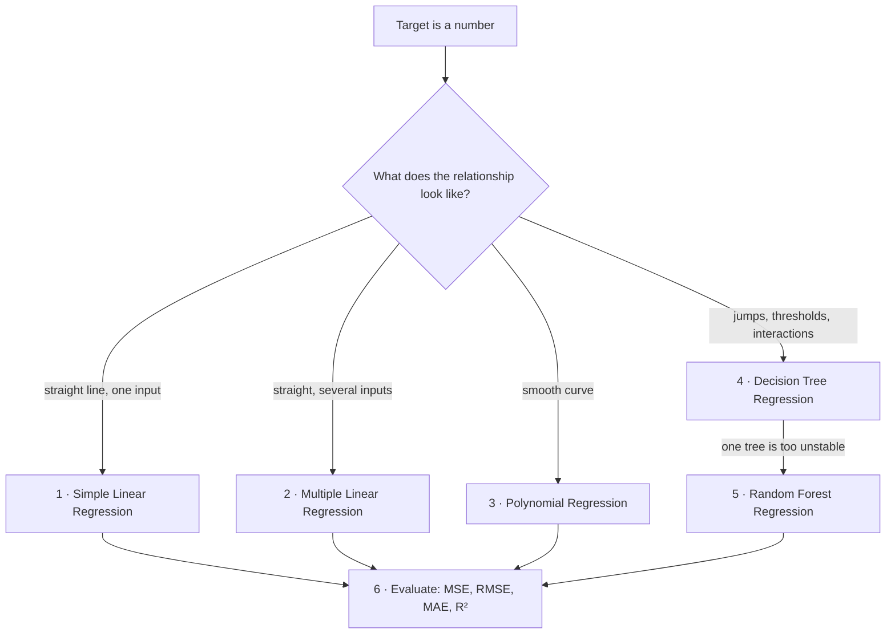
```mermaid
graph TD
    A["Target is a number"] --> B{"What does the relationship look like?"}
    B -->|"straight line, one input"| C["1 · Simple Linear Regression"]
    B -->|"straight, several inputs"| D["2 · Multiple Linear Regression"]
    B -->|"smooth curve"| E["3 · Polynomial Regression"]
    B -->|"jumps, thresholds, interactions"| F["4 · Decision Tree Regression"]
    F -->|"one tree is too unstable"| G["5 · Random Forest Regression"]
    C --> H["6 · Evaluate: MSE, RMSE, MAE, R²"]
    D --> H
    E --> H
    G --> H
```

| Model | Shape of the prediction | What it learns | Main risk |
|---|---|---|---|
| **Simple linear** | Straight line | 2 numbers: intercept and slope | Underfits anything curved |
| **Multiple linear** | Plane / hyperplane | One coefficient per feature | Correlated features make coefficients unstable |
| **Polynomial** | Smooth curve | One coefficient per power of x | Overfits when the degree is too high |
| **Decision tree** | Staircase (flat pieces) | Split thresholds and leaf averages | A deep tree memorises the training data |
| **Random forest** | Average of many staircases | Hundreds of randomized trees | Slower and harder to interpret |

### Key terms

- **Data point:** One example in your dataset (one row).
- **Feature / input (x):** A variable used to predict something (for example, *experience*).
- **Target / output (y):** The value you want to predict (for example, *salary*).
- **Model:** A mathematical rule that maps inputs to an output.
- **Parameter / coefficient (b):** Numbers the model learns from data.
- **Hyperparameter:** A setting you choose before training (polynomial degree, tree depth, number of trees).
- **Prediction (ŷ):** The model’s predicted output.
- **Residual (error):** The difference between the true value and the predicted value.
- **Loss / cost function:** One number that says how wrong the model is on the whole dataset. Training means making it small.
- **Underfitting / overfitting:** Too simple to capture the pattern / so flexible that it memorises noise.

---

## 1) Simple Linear Regression (one input)

**Idea:** Find the best straight line that describes the relationship between one input **x** and one output **y**.

### Equation

```math
\hat{y} = b_0 + b_1 x
```

- $`\hat{y}`$ (“y-hat”) = the model’s **prediction**
- $`b_0`$ (**intercept**) = where the line crosses the y-axis (when $`x = 0`$)
- $`b_1`$ (**slope / coefficient**) = how much $`\hat{y}`$ changes when $`x`$ increases by 1
    - If $`b_1 \gt 0`$, the line goes up.
    - If $`b_1 \lt 0`$, the line goes down.

> [!NOTE]
> **Example from my dataset (14 employees):** the fitted line is $`\hat{y} = 1663.9 + 1138.3\,x`$. Each extra year of experience adds about **1,138** to the predicted salary, and someone with 0 years starts at about **1,664**. For 6 years: $`1663.9 + 1138.3 \cdot 6 \approx 8494`$.

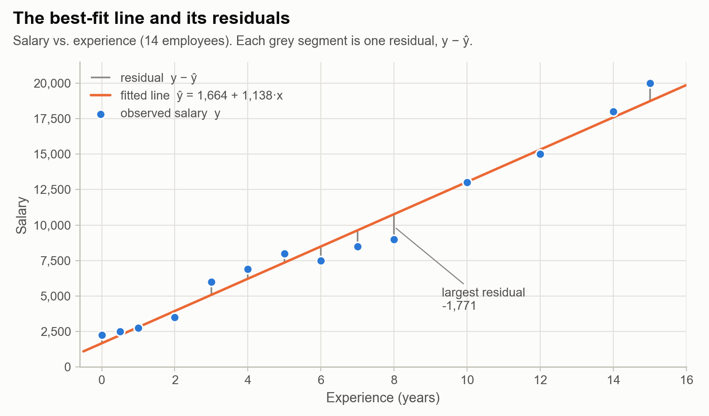

*The fitted line through my salary data. Blue dots are real salaries, the orange line is the model, and each grey segment is one residual.*

### Prediction error: residual

For each data point:

```math
e_i = y_i - \hat{y}_i
```

- residual **positive** → predicted **too low** (the dot is above the line)
- residual **negative** → predicted **too high** (the dot is below the line)

### How do we choose the “best” line?

Choose $`b_0`$ and $`b_1`$ to make the total error as small as possible. The standard error measure is **Mean Squared Error (MSE)**:

```math
\text{MSE} = \frac{1}{n} \sum_{i=1}^{n} (y_i - \hat{y}_i)^2
```

- $`n`$ = number of samples
- Squaring prevents positive and negative errors from canceling.
- Squaring penalizes large errors more: an error of 10 costs 100, an error of 1 costs 1.
- The squared function is smooth, so we can use calculus to find its minimum exactly.

<details>
<summary><b>Deeper: why squares and not absolute values? The probabilistic reason</b></summary>

Assume each observation is the line plus random noise, and that the noise is Gaussian:

```math
y_i = b_0 + b_1 x_i + \varepsilon_i, \qquad \varepsilon_i \sim \mathcal{N}(0, \sigma^2)
```

Then the probability (likelihood) of seeing our whole dataset is a product of bell curves, and its logarithm is:

```math
\log L(b_0, b_1) = -\frac{n}{2}\log(2\pi\sigma^2) \;-\; \frac{1}{2\sigma^2}\sum_{i=1}^{n}(y_i - b_0 - b_1 x_i)^2
```

The first term does not depend on the line. So **maximizing the likelihood is exactly the same as minimizing the sum of squared residuals**. Least squares is not an arbitrary choice: it is the maximum-likelihood estimate when the noise is Gaussian. If the noise had heavy tails (many outliers), absolute error (MAE) would be the better match.

</details>

### The math: solving for the best line

Write the cost as a function of the two unknowns:

```math
J(b_0, b_1) = \frac{1}{n}\sum_{i=1}^{n}\left(y_i - b_0 - b_1 x_i\right)^2
```

$`J`$ is a bowl (a convex quadratic), so it has exactly one minimum, at the point where both partial derivatives are zero.

**Step 1: derivative with respect to the intercept.**

```math
\frac{\partial J}{\partial b_0} = -\frac{2}{n}\sum_{i=1}^{n}\left(y_i - b_0 - b_1 x_i\right) = 0 \quad\Longrightarrow\quad b_0 = \bar{y} - b_1\bar{x}
```

This already tells us something nice: the best line always passes through the point of averages $`(\bar{x}, \bar{y})`$, and the residuals sum to zero.

**Step 2: derivative with respect to the slope.**

```math
\frac{\partial J}{\partial b_1} = -\frac{2}{n}\sum_{i=1}^{n} x_i\left(y_i - b_0 - b_1 x_i\right) = 0
```

**Step 3: substitute** $`b_0`$ **from step 1 and solve for** $`b_1`$**.**

```math
b_1 = \frac{\sum_{i=1}^{n}(x_i - \bar{x})(y_i - \bar{y})}{\sum_{i=1}^{n}(x_i - \bar{x})^2} = \frac{\mathrm{Cov}(x, y)}{\mathrm{Var}(x)}
```

> [!TIP]
> **Read the formula in words:** slope = (how much x and y move *together*) ÷ (how much x moves *at all*). An equivalent form is $`b_1 = r \cdot \dfrac{s_y}{s_x}`$: the correlation, rescaled from “standard deviations of x” to “standard deviations of y”.

**Worked on my salary data:**

| Quantity | Value |
|---|---|
| $`n`$ | 14 |
| $`\bar{x}`$ (mean experience) | 6.25 |
| $`\bar{y}`$ (mean salary) | 8,778.57 |
| $`\mathrm{Cov}(x,y)`$ | 26,212.5 |
| $`\mathrm{Var}(x)`$ | 23.03 |
| $`b_1 = 26212.5 / 23.03`$ | **1,138.35** |
| $`b_0 = 8778.57 - 1138.35 \cdot 6.25`$ | **1,663.90** |

These are exactly the numbers scikit-learn returns in `intercept_` and `coef_`.

### Another route to the same answer: gradient descent

The closed-form solution is perfect for a line, but most models (logistic regression, neural networks) have no such formula. **Gradient descent** is the general-purpose alternative, and linear regression is the easiest place to understand it.

The gradient is the vector of partial derivatives. It points in the direction where the cost **increases** fastest, so we repeatedly step the opposite way:

```math
b_0 \leftarrow b_0 - \alpha\,\frac{\partial J}{\partial b_0}, \qquad b_1 \leftarrow b_1 - \alpha\,\frac{\partial J}{\partial b_1}
```

$`\alpha`$ is the **learning rate**: the size of each step.


```mermaid
graph LR
    A["Start with any b0, b1"] --> B["Predict: ŷ = b0 + b1·x"]
    B --> C["Score: compute MSE"]
    C --> D["Gradient: which way is uphill?"]
    D --> E["Update: take a small step downhill"]
    E --> B
```

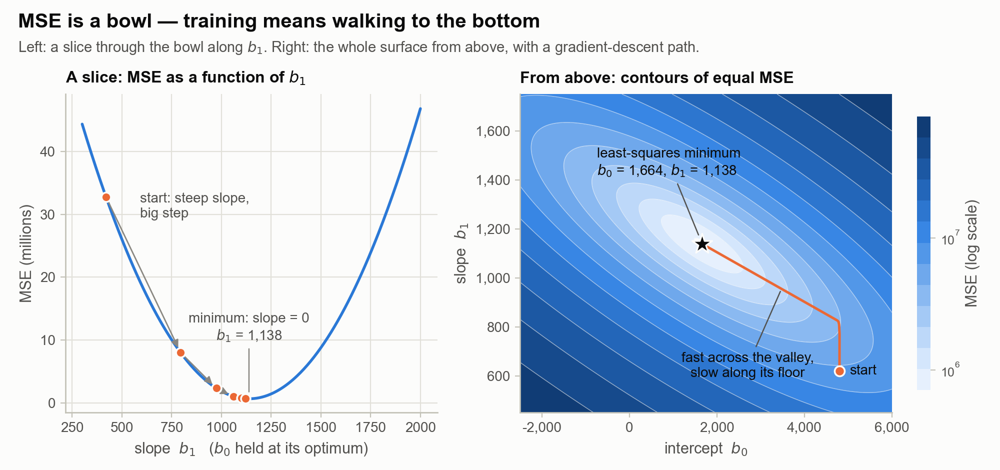

*Left: MSE along the slope direction is a parabola; steps are big where the curve is steep and shrink near the bottom. Right: the full MSE surface seen from above, with the path gradient descent takes from a bad starting guess to the least-squares minimum.*

The path in the right panel, starting from $`b_0 = 4800,\ b_1 = 620`$ with $`\alpha = 0.006`$:

| Step | $`b_0`$ | $`b_1`$ |
|---|---|---|
| 0 | 4,800 | 620 |
| 10 | 4,684 | 833 |
| 100 | 3,694 | 933 |
| 1,000 | 1,702 | 1,134 |
| 4,000 | **1,664** | **1,138** |

> [!WARNING]
> **Two practical lessons hide in that path.**
>
> - **Learning rate:** too small and training crawls; too large and the steps overshoot the valley and the cost blows up. On this data anything above about $`\alpha = 0.016`$ diverges.
> - **Feature scaling:** the bowl is a long, narrow valley (about 170 times steeper in one direction than the other), so the path drops into the valley within 10 steps and then needs thousands more to walk along its floor. Rescaling x (normalization or standardization) makes the bowl round and gradient descent converges in a handful of steps. This is why scaling matters for every gradient-based model.

### What linear regression quietly assumes

- **Linearity:** the true relationship is roughly a straight line.
- **Independent errors:** one row’s error tells you nothing about another’s.
- **Constant spread:** residuals are about equally large everywhere along x.
- **No extreme outliers:** squared error lets one wild point pull the whole line.

> [!CAUTION]
> **Do not extrapolate.** My model has only seen 0 to 15 years of experience. Ask it about 100 years and it happily answers `115,499`, because a line never stops. A prediction far outside the training range is arithmetic, not knowledge.

### Python implementation

```python
import numpy as np
import pandas as pd

df = pd.read_csv("linear-regression-dataset.csv", sep=";")
x, y = df.experience.values, df.salary.values

# 1) Closed form:  b1 = Cov(x, y) / Var(x),   b0 = mean(y) - b1 * mean(x)
b1 = np.sum((x - x.mean()) * (y - y.mean())) / np.sum((x - x.mean()) ** 2)
b0 = y.mean() - b1 * x.mean()
print(b0, b1)                      # 1663.895...  1138.348...

# 2) Gradient descent reaches the same numbers
g0, g1, alpha = 0.0, 0.0, 0.006
for _ in range(5000):
    residual = y - (g0 + g1 * x)
    g0 += alpha * 2 * residual.mean()          # minus the gradient w.r.t. b0
    g1 += alpha * 2 * (residual * x).mean()    # minus the gradient w.r.t. b1
print(g0, g1)                      # ~1663.9  ~1138.3

# 3) scikit-learn
from sklearn.linear_model import LinearRegression

X = x.reshape(-1, 1)               # sklearn expects a 2-D feature matrix
model = LinearRegression().fit(X, y)
print(model.intercept_, model.coef_[0])
print(model.predict([[6]]))        # [8493.98]
```

---

## 2) Multiple Linear Regression (two or more inputs)

**Idea:** Predict one output using multiple input features.

### Form

Simple:

```math
\hat{y} = b_0 + b_1 x
```

Multiple:

```math
\hat{y} = b_0 + b_1 x_1 + b_2 x_2 + \dots + b_p x_p
```

With one input the model is a line. With two it is a **plane**, and with more it is a hyperplane that we can no longer draw but that works the same way.

### Example

- $`y`$ = **salary**
- $`x_1`$ = **experience**
- $`x_2`$ = **age**

```math
\widehat{salary} = b_0 + b_1 \cdot experience + b_2 \cdot age
```

> [!WARNING]
> **Important:** “Multiple” means multiple **inputs**. The model still predicts **one** output variable.

**How to read a coefficient:** $`b_1`$ is the change in the prediction when experience goes up by 1 **while every other feature is held fixed**. That last part is what makes multiple regression different from running several simple regressions.

### The math: the normal equation

Stack the data into a matrix. Each row is one employee; the first column is all ones so that $`b_0`$ is handled like any other coefficient:

```math
X = \begin{bmatrix} 1 & x_{11} & x_{12} \\ 1 & x_{21} & x_{22} \\ \vdots & \vdots & \vdots \\ 1 & x_{n1} & x_{n2} \end{bmatrix}, \qquad \boldsymbol{\beta} = \begin{bmatrix} b_0 \\ b_1 \\ b_2 \end{bmatrix}, \qquad \hat{\mathbf{y}} = X\boldsymbol{\beta}
```

The cost is the same MSE, written with a vector norm:

```math
J(\boldsymbol{\beta}) = \frac{1}{n}\,\lVert \mathbf{y} - X\boldsymbol{\beta} \rVert^2
```

Take the gradient and set it to zero:

```math
\nabla J = -\frac{2}{n}\,X^{\top}(\mathbf{y} - X\boldsymbol{\beta}) = 0 \quad\Longrightarrow\quad X^{\top}X\,\boldsymbol{\beta} = X^{\top}\mathbf{y}
```

```math
\boxed{\;\boldsymbol{\beta} = (X^{\top}X)^{-1}X^{\top}\mathbf{y}\;}
```

This is the **normal equation**. The three steps from section 1 are just this formula written out for the two-parameter case.

<details>
<summary><b>Deeper: the geometric picture (why it is called “normal”)</b></summary>

Think of $`\mathbf{y}`$ as one point in n-dimensional space (one axis per employee). Every possible prediction vector $`X\boldsymbol{\beta}`$ lies in a flat subspace: the **column space** of $`X`$. We usually cannot reach $`\mathbf{y}`$ exactly, so the best we can do is the point of that subspace **closest** to $`\mathbf{y}`$, which is its orthogonal projection.

At the closest point the residual vector is perpendicular (“normal”) to every column of $`X`$:

```math
X^{\top}(\mathbf{y} - X\boldsymbol{\beta}) = \mathbf{0}
```

That is the same equation as above. The fitted values are $`\hat{\mathbf{y}} = H\mathbf{y}`$ with $`H = X(X^{\top}X)^{-1}X^{\top}`$, the “hat matrix”, because it puts the hat on y.

</details>

### What my dataset says

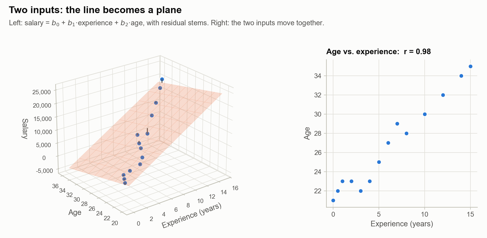

*Left: the fitted plane through the 14 employees, with residual stems. Right: experience and age rise together almost perfectly.*

```math
\widehat{salary} = 10376.6 + 1525.5 \cdot experience - 416.7 \cdot age
```

| Employee | Calculation | Predicted salary |
|---|---|---|
| 5 years, age 35 | $`10376.6 + 1525.5 \cdot 5 - 416.7 \cdot 35`$ | 3,419 |
| 10 years, age 35 | $`10376.6 + 1525.5 \cdot 10 - 416.7 \cdot 35`$ | 11,046 |
| 20 years, age 30 | $`10376.6 + 1525.5 \cdot 20 - 416.7 \cdot 30`$ | 28,385 |

### The trap in this dataset: multicollinearity

The age coefficient is **negative**. Does getting older really cost you 417 per year? Look at the right panel above: age and experience have a correlation of **r = 0.98**. They carry almost the same information.

- The data only pins the plane down **along one line** (the diagonal where the points sit). Tilt the plane around that line and the fit barely changes, so many very different pairs $`(b_1, b_2)`$ are almost equally good.
- Mathematically, $`X^{\top}X`$ becomes nearly singular, so inverting it amplifies noise. A standard diagnostic is the **variance inflation factor**:

```math
\text{VIF}_j = \frac{1}{1 - R_j^2}
```

where $`R_j^2`$ is how well feature j is predicted by the other features. Here $`\text{VIF} = 1/(1 - 0.98^2) \approx 27`$. A common rule of thumb says anything above 5 to 10 is a warning.

- Adding age lifted R² only from **0.9775 to 0.9818**, so it contributes almost nothing new.

> [!TIP]
> **Takeaway:** with strongly correlated features the **predictions** are still fine (inside the range of the data), but individual **coefficients** stop being trustworthy as explanations. Fixes: drop one of the twins, combine them, or use regularization (Ridge).

### Python implementation

```python
df = pd.read_csv("multiple-linear-regression-dataset.csv", sep=";")
X = df[["experience", "age"]].values
y = df.salary.values

# Normal equation: add a column of ones for the intercept
Xd = np.c_[np.ones(len(X)), X]
beta = np.linalg.solve(Xd.T @ Xd, Xd.T @ y)
print(beta)                                    # [10376.63  1525.50  -416.72]

# scikit-learn gives the same coefficients
model = LinearRegression().fit(X, y)
print(model.intercept_, model.coef_)
print(model.predict([[5, 35], [10, 35], [20, 30]]))   # [ 3418.85 11046.36 28384.98]
```

---

## 3) Polynomial Regression

**Why?** If the relationship is curved, a straight line can underfit. In my car dataset, top speed climbs quickly with price and then flattens out. A straight line misses that completely: it predicts a top speed of **872 km/h** for a car priced at 10,000.

### Model

```math
\hat{y} = b_0 + b_1 x + b_2 x^2 + \dots + b_d x^d
```

### What “linear” means here

The model is linear **in the coefficients** ($`b_0, b_1, \dots`$), even though it uses $`x^2, x^3, \dots`$. The trick is to treat each power as a brand-new feature:

```math
X = \begin{bmatrix} 1 & x_1 & x_1^2 & \cdots & x_1^d \\ 1 & x_2 & x_2^2 & \cdots & x_2^d \\ \vdots & \vdots & \vdots & & \vdots \\ 1 & x_n & x_n^2 & \cdots & x_n^d \end{bmatrix}
```

After this transformation it is ordinary multiple linear regression, solved by the same normal equation $`\boldsymbol{\beta} = (X^{\top}X)^{-1}X^{\top}\mathbf{y}`$. That is exactly what `PolynomialFeatures` followed by `LinearRegression` does.

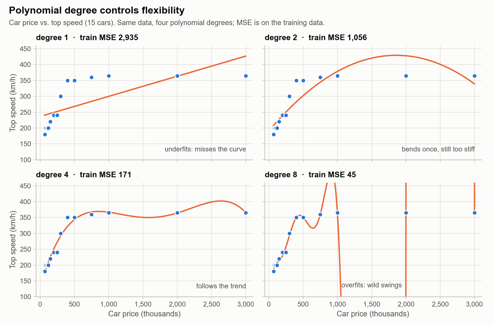

*The same 15 cars fitted with four different degrees. Degree 1 underfits, degree 4 follows the trend, degree 8 passes close to every point and swings wildly in between.*

### When it helps

- Smooth curved trends (U-shape, S-like parts, accelerating or decelerating growth)

### Risk: the bias–variance trade-off

- Higher degree → higher overfitting risk.
- Training error **always** goes down when you raise the degree (2,935 → 1,056 → 171 → 45 above), so training error cannot be used to pick the degree.

The expected error of any model on new data splits into three parts:

```math
\mathbb{E}\big[(y - \hat{f}(x))^2\big] = \underbrace{\big(\mathbb{E}[\hat{f}(x)] - f(x)\big)^2}_{\text{bias}^2} + \underbrace{\mathrm{Var}\big(\hat{f}(x)\big)}_{\text{variance}} + \underbrace{\sigma^2}_{\text{noise}}
```

- **Bias:** error from being too simple (a line trying to follow a curve). Falls as the degree rises.
- **Variance:** error from being too sensitive to the particular training sample. Rises as the degree rises.
- **Noise:** randomness in the data itself. No model can go below it.

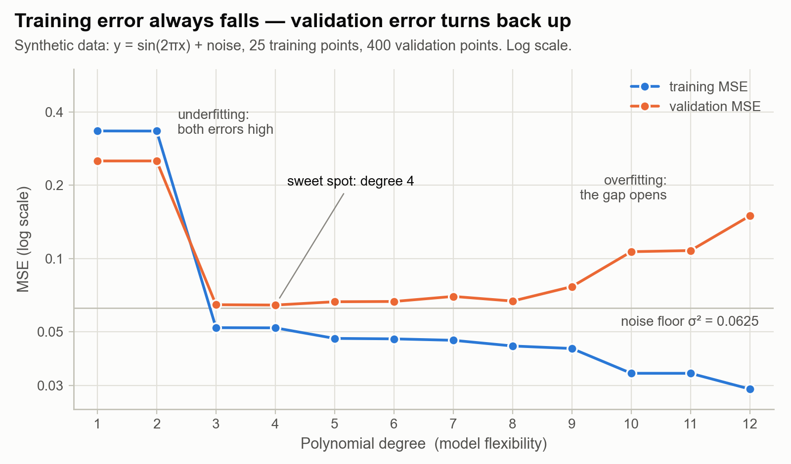

*Training error keeps falling as the polynomial degree grows, but validation error bottoms out and then climbs again. The best model sits at the bottom of the validation curve.*

> [!NOTE]
> The figure uses a synthetic dataset where I know the truth (a sine wave plus noise with variance 0.0625). Validation error bottoms out at degree 4, almost exactly at the noise floor, then more than doubles by degree 12 while training error keeps improving. That widening gap **is** overfitting.

### Choosing the degree

- Degree is typically selected using a train/test split or **cross-validation**: fit each candidate degree on one part of the data, score it on the part it has not seen, and keep the degree with the lowest validation error.
- Scale x before raising it to high powers. A price of 3,000 to the 4th power is about $`8 \times 10^{13}`$, which is hard on the numerics.
- If you need high flexibility, add regularization (Ridge) so the coefficients cannot explode.

### Python implementation

```python
from sklearn.preprocessing import PolynomialFeatures
from sklearn.pipeline import make_pipeline

df = pd.read_csv("polynomial-regression.csv", sep=";")
X, y = df[["car_price"]].values, df.max_speed.values

# x  ->  [1, x, x^2, x^3, x^4]  ->  ordinary linear regression
model = make_pipeline(PolynomialFeatures(degree=4), LinearRegression())
model.fit(X, y)
y_pred = model.predict(X)
```

---

## 4) Decision Tree Regression

**Idea:** Repeatedly split the feature space; each final region (leaf) predicts a constant value.

A tree does not fit a formula. It asks a sequence of yes/no questions about the features and answers with the **average target of the training rows that gave the same answers**.

### Core concepts

- **Node:** A point where a split is made.
- **Split:** A rule like “is $`x_j \le t`$?” that divides the data.
- **Leaf / terminal node:** Final node. The prediction is produced here.
- **Depth:** The number of questions on the longest path from the top (root) to a leaf.
- **CART:** *Classification and Regression Trees*, the algorithm scikit-learn implements.

### A real tree, read from top to bottom

My dataset has 10 rows: tribune level (1 to 10) and ticket price. This is the depth-2 tree scikit-learn grows on it:

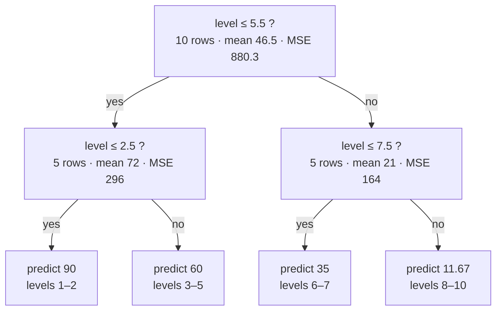
```mermaid
graph TD
    R["level ≤ 5.5 ?<br>10 rows · mean 46.5 · MSE 880.3"] -->|"yes"| L["level ≤ 2.5 ?<br>5 rows · mean 72 · MSE 296"]
    R -->|"no"| Q["level ≤ 7.5 ?<br>5 rows · mean 21 · MSE 164"]
    L -->|"yes"| L1["predict 90<br>levels 1–2"]
    L -->|"no"| L2["predict 60<br>levels 3–5"]
    Q -->|"yes"| R1["predict 35<br>levels 6–7"]
    Q -->|"no"| R2["predict 11.67<br>levels 8–10"]
```

### How prediction works

To predict for a new sample:

- Start at the root
- Follow split rules
- Arrive at a leaf
- Output the leaf’s prediction (the **mean** of y values in that leaf)

**Example, level 5.7:** is 5.7 ≤ 5.5? No → go right. Is 5.7 ≤ 7.5? Yes → the leaf holds levels 6 and 7 with prices 40 and 30 → predict **35**.

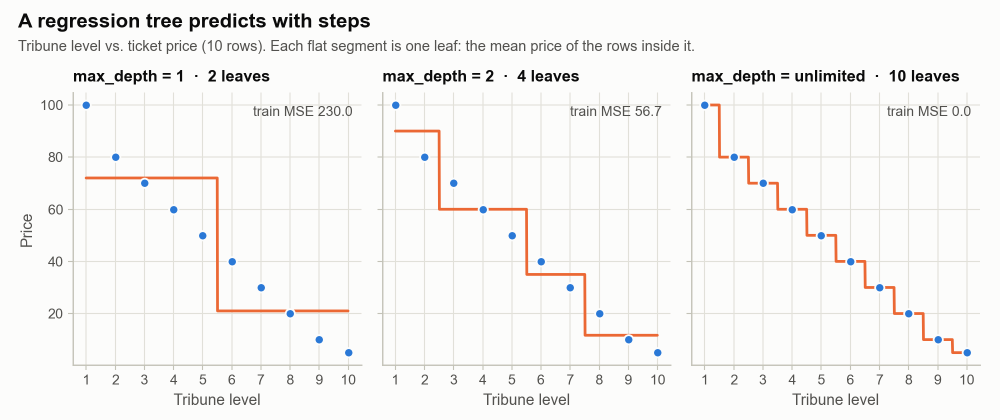

*The same data fitted with three depths. Each flat segment is one leaf. Unlimited depth gives every row its own leaf and a training error of exactly zero.*

### The math: why a leaf predicts the mean

Inside one leaf we must pick a single constant $`c`$ for all its rows. Under squared error the best constant solves:

```math
\frac{d}{dc}\sum_{i \in \text{leaf}}(y_i - c)^2 = -2\sum_{i \in \text{leaf}}(y_i - c) = 0 \quad\Longrightarrow\quad c = \bar{y}_{\text{leaf}}
```

So the optimal prediction is the leaf mean, and the leaf’s MSE is then simply the **variance** of y inside it. That is why “minimize MSE” and “variance reduction” are two names for one criterion.

### The math: how a split is chosen

Goal: reduce error inside leaves. A split on feature $`j`$ at threshold $`t`$ sends rows to a left group $`L`$ and a right group $`R`$. Its score is the size-weighted error of the two children:

```math
\text{score}(j, t) = \frac{n_L}{n}\,\text{MSE}(L) + \frac{n_R}{n}\,\text{MSE}(R)
```

The tree tries **every feature and every threshold between two neighbouring values**, keeps the pair with the lowest score, and then repeats the same search inside each child:

```math
(j^{*}, t^{*}) = \underset{j,\,t}{\arg\min}\;\text{score}(j, t), \qquad \text{variance reduction} = \text{MSE}(\text{parent}) - \text{score}(j^{*}, t^{*})
```

**The root split of my tree, computed by hand.** Before splitting, all 10 prices have mean 46.5 and MSE 880.25.

| Threshold t | Left: rows (mean) | Right: rows (mean) | Weighted MSE |
|---|---|---|---|
| 1.5 | 1 (100.0) | 9 (40.6) | 562.2 |
| 2.5 | 2 (90.0) | 8 (35.6) | 407.2 |
| 3.5 | 3 (83.3) | 7 (30.7) | 298.8 |
| 4.5 | 4 (77.5) | 6 (25.8) | 239.6 |
| **5.5** | **5 (72.0)** | **5 (21.0)** | **230.0 ← best** |
| 6.5 | 6 (66.7) | 4 (16.3) | 270.2 |
| 7.5 | 7 (61.4) | 3 (11.7) | 360.2 |
| 8.5 | 8 (56.3) | 2 (7.5) | 500.0 |
| 9.5 | 9 (51.1) | 1 (5.0) | 688.9 |

For the winner: $`\tfrac{5}{10}\cdot 296 + \tfrac{5}{10}\cdot 164 = 230`$. One question removes $`880.25 - 230 = 650.25`$ of the error, about 74%.

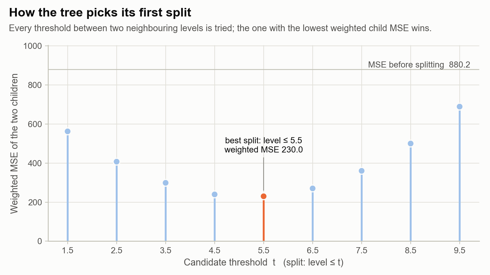

*The nine candidate thresholds for the first split and their weighted child MSE. The tree simply takes the lowest one.*

> [!TIP]
> **The search is greedy.** The tree takes the best split *right now* and never goes back to revise it. That makes training fast, but it does not guarantee the best possible tree overall (finding that is computationally intractable).

> Note: **Entropy / Information Gain** is mainly used for classification trees. For regression trees, MSE/variance is the standard focus.

### Pros and cons

- **Pros:** Captures non-linear patterns and interactions; no need for feature scaling (only the *order* of values matters); easy to read as a flowchart.
- **Cons:** A single deep tree overfits easily; predictions are a staircase, never a smooth curve; it cannot extrapolate (beyond level 10 it keeps predicting the last leaf); small changes in the data can produce a very different tree (**high variance**).

### Common hyperparameters

| Hyperparameter | What it limits | Effect of making it stricter |
|---|---|---|
| `max_depth` | Number of questions from root to leaf | Fewer, larger leaves → smoother, less overfitting |
| `min_samples_split` | Rows a node needs before it may split | Stops splitting tiny groups |
| `min_samples_leaf` | Rows every leaf must keep | No leaf can be built around one odd row |

> [!WARNING]
> With no limits, `DecisionTreeRegressor()` keeps splitting until every leaf holds one row: 10 leaves and a training MSE of 0 on my data. A perfect score on the training set is a sign of memorisation, not of a good model.

### Python implementation

```python
from sklearn.tree import DecisionTreeRegressor

df = pd.read_csv("decision-tree-regression-dataset.csv", sep=";", header=None)
X, y = df[[0]].values, df[1].values

tree = DecisionTreeRegressor(max_depth=2, random_state=42).fit(X, y)
print(tree.predict([[5.7]]))       # [35.]

# a dense grid shows the staircase shape of the prediction
x_grid = np.arange(X.min(), X.max(), 0.01).reshape(-1, 1)
y_grid = tree.predict(x_grid)
```

### From my course notes

The sketch and the plot I saved while first learning this topic:


---

## 5) Random Forest Regression (Ensemble Learning)

**Idea:** Train many decision trees and combine their predictions.

For regression, the most common combination is:

- **Average** of predictions

```math
\hat{y}_{\text{forest}}(x) = \frac{1}{B}\sum_{b=1}^{B} T_b(x)
```

where $`T_b`$ is the b-th tree and $`B`$ is the number of trees (`n_estimators`).

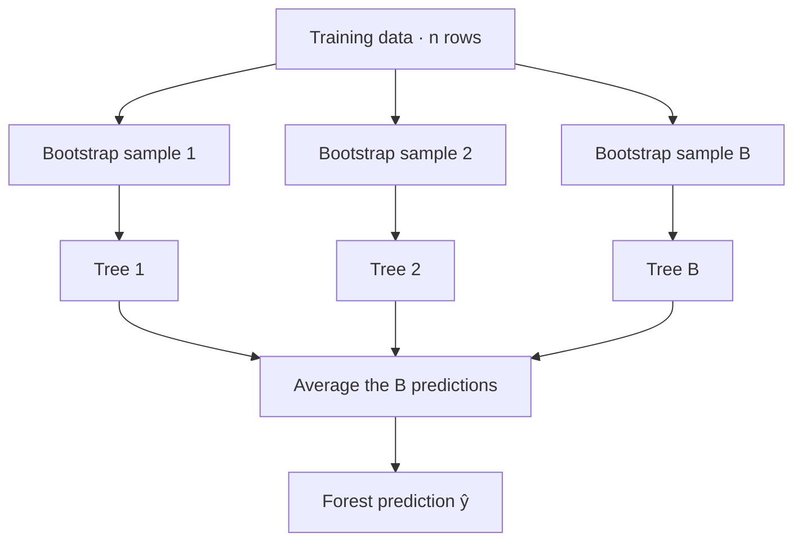
```mermaid
graph TD
    D["Training data · n rows"] --> S1["Bootstrap sample 1"]
    D --> S2["Bootstrap sample 2"]
    D --> S3["Bootstrap sample B"]
    S1 --> T1["Tree 1"]
    S2 --> T2["Tree 2"]
    S3 --> T3["Tree B"]
    T1 --> A["Average the B predictions"]
    T2 --> A
    T3 --> A
    A --> P["Forest prediction ŷ"]
```

### Why it works

A single decision tree has high variance.

Random Forest reduces variance by adding randomness in two ways:

1. **Bootstrap sampling:** each tree is trained on a different sampled dataset (with replacement). From n rows we draw n rows *with replacement*, so some rows appear twice and others not at all.
2. **Random feature selection:** each split considers only a random subset of features (`max_features`), so the trees cannot all lean on the same strongest feature.

Averaging many diverse trees tends to produce more stable predictions.

<details>
<summary><b>Deeper: how much data does one tree actually see? (the 63% rule)</b></summary>

The chance that a given row is **not** picked in one draw is $`1 - \tfrac{1}{n}`$. A bootstrap sample makes n independent draws, so the chance a row is never picked is:

```math
\left(1 - \frac{1}{n}\right)^{n} \;\xrightarrow{\;n \to \infty\;}\; e^{-1} \approx 0.368
```

Each tree therefore sees about **63.2%** of the distinct rows. The remaining 36.8% are that tree’s **out-of-bag (OOB)** rows. Because the tree never saw them, they work as a free validation set: set `oob_score=True` and scikit-learn reports the forest’s score on them.

</details>

### The math: why averaging lowers the error

Suppose every tree’s prediction at some point x has variance $`\sigma^2`$, and any two trees are correlated with correlation $`\rho`$. The variance of their average is:

```math
\mathrm{Var}\!\left(\frac{1}{B}\sum_{b=1}^{B}T_b\right) = \frac{1}{B^2}\Big[\,B\sigma^2 + B(B-1)\,\rho\,\sigma^2\Big] = \rho\,\sigma^2 + \frac{1-\rho}{B}\,\sigma^2
```

- The **second term** shrinks to zero as we add trees. More trees never hurt; they just stop helping.
- The **first term** does not depend on B at all. It is a floor set by how similar the trees are.
- So the real lever is $`\rho`$. Bootstrap samples and random feature subsets exist to make the trees **less alike**, which lowers that floor.
- Averaging does not change the bias. That is why forests use **deep, low-bias trees** and let the averaging remove their variance.

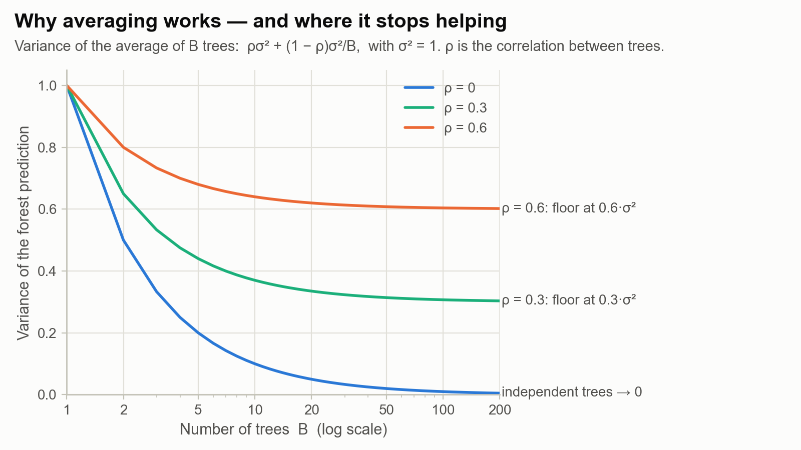

*Variance of the forest prediction against the number of trees for three levels of correlation between trees. Each curve flattens at its own floor.*

### Seeing it on my data

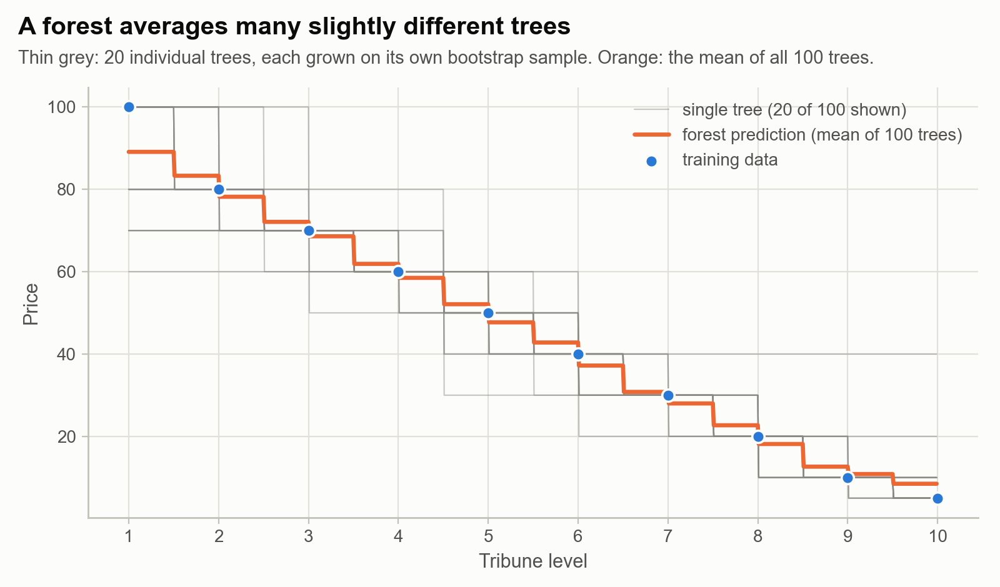

*Twenty of the 100 individual trees in grey, each a slightly different staircase, and their average in orange.*

For tribune level **5.7**, the first eight trees predict 60, 40, 40, 40, 30, 40, 40 and 40. Across all 100 trees the predictions have a standard deviation of about 6.8, and their mean, the forest’s answer, is **42.8**. A single fully grown tree would answer 40.

> [!TIP]
> This dataset has only one feature, so random feature selection has nothing to choose from. All of the diversity here comes from bootstrap sampling. On wide datasets the second kind of randomness matters much more.

### Key hyperparameters

| Hyperparameter | Meaning | Rule of thumb |
|---|---|---|
| `n_estimators` | Number of trees (B) | More is safer but slower; 100 to 500 is typical |
| `max_features` | Features considered at each split | Smaller → less correlated trees (lower ρ), each tree a bit weaker |
| `max_depth`, `min_samples_leaf` | Size of each tree | Usually left deep; limit them to save time or memory |
| `random_state = 42` | Fixed seed | Makes the random sampling reproducible |
| `oob_score = True` | Score on out-of-bag rows | A free validation estimate |

### Example use cases

- Feature-based scoring and prediction tasks (including some recommender-system pipelines)
- Medical measurement prediction from signals or images
- Finance and business forecasting (use caution: distribution shift is common)

### Visualization note

To plot a smooth prediction curve, sample x densely:

- `np.arange(min(x), max(x), 0.01).reshape(-1, 1)`

### Python implementation

```python
from sklearn.ensemble import RandomForestRegressor

df = pd.read_csv("random-forest-regression-dataset.csv", sep=";", header=None)
X, y = df[[0]].values, df[1].values

rf = RandomForestRegressor(n_estimators=100, random_state=42).fit(X, y)
print(rf.predict([[5.7]]))                               # [42.8]

# the forest is literally the mean of its trees
print(np.mean([t.predict([[5.7]])[0] for t in rf.estimators_]))   # 42.8
```

### From my course notes

Two reference images I saved while studying: the first for the regression case, the second showing the same ensemble idea for classification.


---

## 6) Regression Model Evaluation

A model is only as good as its measured error. All regression metrics are built from the same raw material: the residuals.

### 1) Residual and squared error

- **Residual:**

```math
residual_i = y_i - \hat{y}_i
```

- **Squared residual:**

```math
(residual_i)^2
```

### 2) SSR (Sum of Squared Residuals)

Error the model did not explain:

```math
SSR = \sum_{i=1}^{n} (y_i - \hat{y}_i)^2
```

### 3) SST (Total Sum of Squares)

Total variation around the mean:

- $`\bar{y}`$ = mean of the target

```math
SST = \sum_{i=1}^{n} (y_i - \bar{y})^2
```

SST is the SSR of the laziest possible model: one that ignores x and always predicts the average.

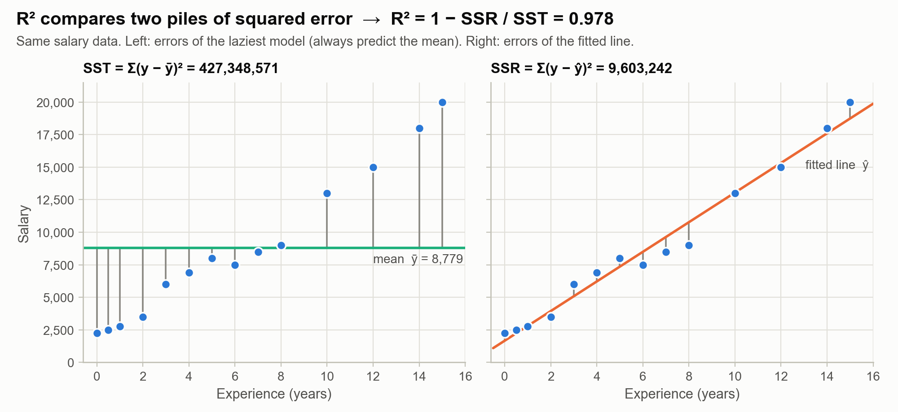

*Left: distances from each salary to the mean line (SST). Right: distances to the fitted line (SSR). R² measures how much shorter the right-hand segments are.*

### 4) R² (Coefficient of Determination)

How much of the variance in $`y`$ is explained by the model:

```math
R^2 = 1 - \frac{SSR}{SST}
```

On my salary data:

```math
R^2 = 1 - \frac{9{,}603{,}242}{427{,}348{,}571} = 0.9775
```

The line removes 97.75% of the squared error that the “always predict the mean” model makes.

- **R² = 1** → perfect predictions
- **R² ≈ 0** → not better than predicting the mean
- **R² below 0** → worse than predicting the mean (possible on data the model was not trained on)

<details>
<summary><b>Deeper: why “explained variance”? The decomposition SST = SSR + ESS</b></summary>

Add and subtract $`\hat{y}_i`$ inside the total sum of squares:

```math
\sum_i (y_i - \bar{y})^2 = \underbrace{\sum_i (y_i - \hat{y}_i)^2}_{SSR} + \underbrace{\sum_i (\hat{y}_i - \bar{y})^2}_{ESS} + 2\sum_i (y_i - \hat{y}_i)(\hat{y}_i - \bar{y})
```

For least squares with an intercept, the last term is exactly zero: the normal equations say the residuals sum to zero and are orthogonal to the fitted values. So the total variation splits cleanly into an unexplained part (SSR) and an explained part (ESS, the explained sum of squares), and:

```math
R^2 = 1 - \frac{SSR}{SST} = \frac{ESS}{SST}
```

For simple linear regression R² is also the squared correlation between x and y: $`r = \sqrt{0.9775} \approx 0.989`$. Careful with names: some books swap the abbreviations and call the residual sum SSE and the explained sum SSR.

</details>

### 5) Adjusted R²

R² can never go down when you add a feature, even a useless one. Adjusted R² charges a price for each extra feature ($`p`$ = number of features):

```math
R^2_{adj} = 1 - (1 - R^2)\,\frac{n - 1}{n - p - 1}
```

| Model | R² | Adjusted R² |
|---|---|---|
| Salary from experience (p = 1) | 0.9775 | 0.9757 |
| Salary from experience + age (p = 2) | 0.9818 | 0.9785 |

The gain from adding age almost disappears once the extra parameter is paid for, which matches what the multicollinearity check said in section 2.

### 6) MSE, RMSE and MAE

| Metric | Formula | My linear model | How to read it |
|---|---|---|---|
| **MSE** | $`\frac{1}{n}\sum (y_i - \hat{y}_i)^2`$ | 685,946 | What training minimizes; units are squared, so hard to interpret |
| **RMSE** | $`\sqrt{\text{MSE}}`$ | 828.2 | Typical error in salary units; large misses weigh more |
| **MAE** | $`\frac{1}{n}\sum \lvert y_i - \hat{y}_i \rvert`$ | 680.2 | Average miss in salary units; robust to outliers |
| **R²** | $`1 - SSR/SST`$ | 0.9775 | Unit-free share of variance explained |

RMSE is always at least as large as MAE. A big gap between them means a few large errors dominate.

> [!WARNING]
> **Measure on data the model has not seen.** Every number above is a *training* score on a tiny dataset, which is fine for learning the formulas. To judge a real model, hold out a test set or use cross-validation. The unlimited-depth tree from section 4 scores a perfect R² = 1 on its own training data and would still be the worst choice.

### scikit-learn

```python
from sklearn.metrics import mean_squared_error, mean_absolute_error, r2_score

y_pred = model.predict(X)

mse  = mean_squared_error(y, y_pred)      # 685945.85
rmse = mse ** 0.5                         # 828.22
mae  = mean_absolute_error(y, y_pred)     # 680.18
r2   = r2_score(y, y_pred)                # 0.9775
```

---

## Quick recap

- **Linear / Multiple Linear Regression:** learns coefficients by minimizing MSE. Closed form: $`\boldsymbol{\beta} = (X^{\top}X)^{-1}X^{\top}\mathbf{y}`$.
- **Polynomial Regression:** adds powers of x to model curved relationships; still linear in the coefficients.
- **Decision Tree Regression:** splits data; predicts a constant value (the mean) in each leaf.
- **Random Forest Regression:** averages many randomized trees for more stable predictions.
- **R²:** summarizes explained variance as $`1 - SSR/SST`$.

| Model | Key formula | Main hyperparameter | Needs feature scaling? |
|---|---|---|---|
| Simple linear | $`b_1 = \mathrm{Cov}(x,y)/\mathrm{Var}(x)`$ | none | Only for gradient descent |
| Multiple linear | $`\boldsymbol{\beta} = (X^{\top}X)^{-1}X^{\top}\mathbf{y}`$ | none | Only for gradient descent |
| Polynomial | Same, on $`1, x, x^2, \dots, x^d`$ | degree d | Recommended (large powers) |
| Decision tree | $`\min \tfrac{n_L}{n}\text{MSE}_L + \tfrac{n_R}{n}\text{MSE}_R`$ | max_depth | No |
| Random forest | $`\mathrm{Var} = \rho\sigma^2 + \tfrac{1-\rho}{B}\sigma^2`$ | n_estimators, max_features | No |

## Check yourself

<details>
<summary>1. Why does the least-squares line always pass through the point of averages?</summary>

Setting the derivative with respect to the intercept to zero gives $`b_0 = \bar{y} - b_1\bar{x}`$. Plug $`x = \bar{x}`$ into the line: $`\hat{y} = b_0 + b_1\bar{x} = \bar{y}`$.

</details>

<details>
<summary>2. A degree-8 polynomial has training MSE 45; degree 4 has 171. Is degree 8 the better model?</summary>

Not on that evidence. Training error always falls as flexibility grows. The degree-8 curve swings wildly between the data points, so its error on new cars would be far larger. Compare validation error instead.

</details>

<details>
<summary>3. What does the depth-2 tribune tree predict for level 3?</summary>

Is 3 ≤ 5.5? Yes → left. Is 3 ≤ 2.5? No → the leaf for levels 3 to 5, whose mean price is (70 + 60 + 50) / 3 = **60**.

</details>

<details>
<summary>4. Going from 100 to 200 trees barely changes the forest’s error. Why?</summary>

The part of the variance that depends on the number of trees, $`\tfrac{1-\rho}{B}\sigma^2`$, is already tiny at B = 100. What remains is the floor $`\rho\sigma^2`$, which only drops if the trees become less correlated.

</details>

<details>
<summary>5. Can R² be negative?</summary>

Yes. $`R^2 = 1 - SSR/SST`$ goes below zero whenever the model’s squared error is larger than that of simply predicting the mean. On the training data of a least-squares fit this cannot happen, but on test data it can.

</details>
