# Regresyon

🇬🇧 English version: [Regression](Regression.md)

> [!NOTE]
> **Amaç:** Doğrusal regresyonu ve temel regresyon modellerini açık, yeni başlayanların da izleyebileceği bir dille anlatmak: önce sezgi, sonra arkasındaki matematik, sonra kod. Bu sayfadaki her grafik ve her sayı Machine Learning repomdaki küçük veri setlerinden üretildi; yani hepsi yeniden üretilebilir.

**İçindekiler**

- [Büyük resim](#büyük-resim)
- [1) Basit Doğrusal Regresyon (tek girdi)](#1-basit-doğrusal-regresyon-tek-girdi)
- [2) Çoklu Doğrusal Regresyon (iki veya daha fazla girdi)](#2-çoklu-doğrusal-regresyon-iki-veya-daha-fazla-girdi)
- [3) Polinom Regresyon](#3-polinom-regresyon)
- [4) Karar Ağacı Regresyonu](#4-karar-ağacı-regresyonu)
- [5) Rastgele Orman Regresyonu (Topluluk Öğrenmesi)](#5-rastgele-orman-regresyonu-topluluk-öğrenmesi)
- [6) Regresyon Modeli Değerlendirme](#6-regresyon-modeli-değerlendirme)
- [Hızlı özet](#hızlı-özet)
- [Kendini sına](#kendini-sına)

---

## Büyük resim

**Regresyon**, girdi özniteliklerinden bir **sayı** (maaş, fiyat, hız) tahmin etmek demektir. Sayı yerine kategori tahmin etmek sınıflandırmadır; onun ayrı bir sayfası var.

Aşağıdaki her model aynı soruya farklı bir yanıt verir: girdileri $`x`$ tahmine $`\hat{y} = f(x)`$ dönüştüren fonksiyon $`f`$ ne olmalı? Tarif hep aynı üç adımdır:

1. **Bir fonksiyon ailesi seç** (doğrular, eğriler, basamaklar).
2. **Bir adayı puanlamanın yolunu seç** (kayıp fonksiyonu; neredeyse her zaman kare hata).
3. **Ailenin en iyi puanı alan üyesini ara** (türev, gradyan inişi ya da açgözlü arama).

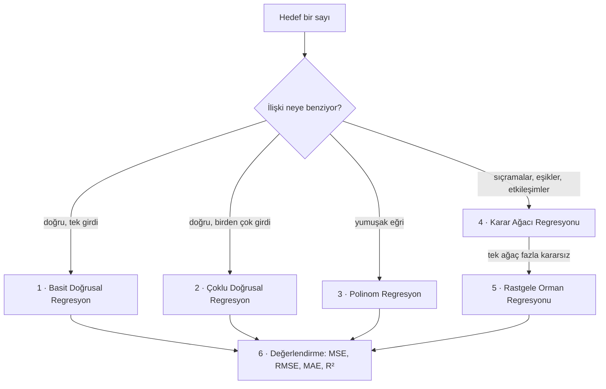

| Model | Tahminin şekli | Ne öğrenir | Ana risk |
|---|---|---|---|
| **Basit doğrusal** | Doğru | 2 sayı: sabit terim ve eğim | Eğri olan her şeyde eksik öğrenir |
| **Çoklu doğrusal** | Düzlem / hiperdüzlem | Öznitelik başına bir katsayı | İlişkili öznitelikler katsayıları kararsız yapar |
| **Polinom** | Yumuşak eğri | x’in her kuvveti için bir katsayı | Derece çok yüksekse aşırı öğrenir |
| **Karar ağacı** | Basamak (düz parçalar) | Bölme eşikleri ve yaprak ortalamaları | Derin bir ağaç eğitim verisini ezberler |
| **Rastgele orman** | Birçok basamağın ortalaması | Yüzlerce rastgeleleştirilmiş ağaç | Daha yavaş, yorumlaması daha zor |

### Temel terimler

- **Veri noktası (data point):** Veri setindeki bir örnek (bir satır).
- **Öznitelik / girdi (feature, x):** Tahmin için kullanılan değişken (örneğin *deneyim*).
- **Hedef / çıktı (target, y):** Tahmin etmek istediğin değer (örneğin *maaş*).
- **Model:** Girdileri çıktıya eşleyen matematiksel kural.
- **Parametre / katsayı (b):** Modelin veriden öğrendiği sayılar.
- **Hiperparametre:** Eğitimden önce senin seçtiğin ayar (polinom derecesi, ağaç derinliği, ağaç sayısı).
- **Tahmin (ŷ):** Modelin ürettiği çıktı.
- **Artık (residual, hata):** Gerçek değer ile tahmin arasındaki fark.
- **Kayıp / maliyet fonksiyonu (loss / cost):** Modelin tüm veri setinde ne kadar yanıldığını söyleyen tek sayı. Eğitim, bu sayıyı küçültmektir.
- **Eksik öğrenme / aşırı öğrenme (underfitting / overfitting):** Örüntüyü yakalayamayacak kadar basit / gürültüyü ezberleyecek kadar esnek.

---

## 1) Basit Doğrusal Regresyon (tek girdi)

**Fikir:** Bir girdi **x** ile bir çıktı **y** arasındaki ilişkiyi en iyi anlatan doğruyu bul.

### Denklem

```math
\hat{y} = b_0 + b_1 x
```

- $`\hat{y}`$ (“y şapka”) = modelin **tahmini**
- $`b_0`$ (**sabit terim / intercept**) = doğrunun y eksenini kestiği yer ($`x = 0`$ iken)
- $`b_1`$ (**eğim / katsayı**) = $`x`$ 1 arttığında $`\hat{y}`$ ne kadar değişir
    - $`b_1 \gt 0`$ ise doğru yukarı gider.
    - $`b_1 \lt 0`$ ise doğru aşağı gider.

> [!NOTE]
> **Veri setimden örnek (14 çalışan):** bulunan doğru $`\hat{y} = 1663.9 + 1138.3\,x`$. Her ek deneyim yılı tahmini maaşa yaklaşık **1138** ekler; 0 yıl deneyimli biri yaklaşık **1664** ile başlar. 6 yıl için: $`1663.9 + 1138.3 \cdot 6 \approx 8494`$.

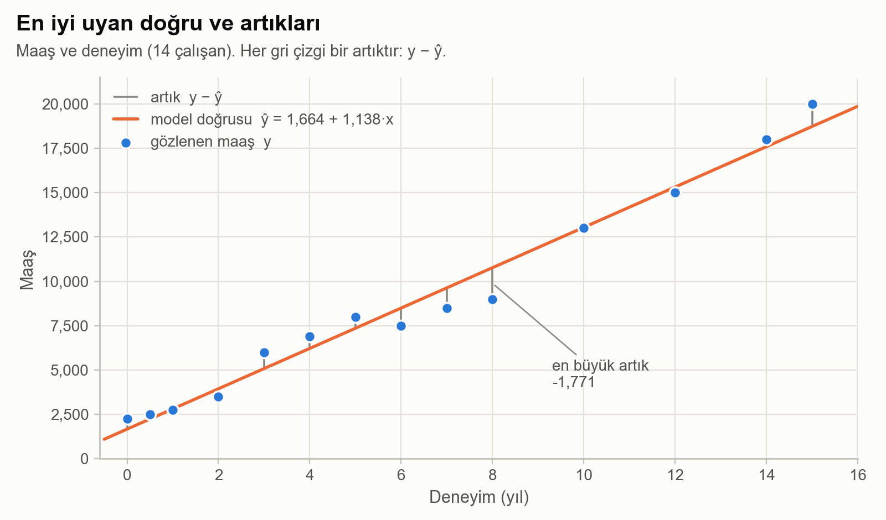

*Maaş verimden geçen model doğrusu. Mavi noktalar gerçek maaşlar, turuncu çizgi model, her gri çizgi ise bir artıktır.*

### Tahmin hatası: artık

Her veri noktası için:

```math
e_i = y_i - \hat{y}_i
```

- artık **pozitif** → tahmin **düşük kalmış** (nokta doğrunun üstünde)
- artık **negatif** → tahmin **yüksek kalmış** (nokta doğrunun altında)

### “En iyi” doğruyu nasıl seçeriz?

$`b_0`$ ve $`b_1`$ değerlerini toplam hatayı olabildiğince küçültecek şekilde seç. Standart hata ölçüsü **Ortalama Kare Hata (Mean Squared Error, MSE)**:

```math
\text{MSE} = \frac{1}{n} \sum_{i=1}^{n} (y_i - \hat{y}_i)^2
```

- $`n`$ = örnek sayısı
- Kare almak pozitif ve negatif hataların birbirini götürmesini engeller.
- Kare almak büyük hataları daha çok cezalandırır: 10’luk bir hata 100’e, 1’lik bir hata 1’e mal olur.
- Kare fonksiyonu pürüzsüzdür; minimumunu türevle tam olarak bulabiliriz.

<details>
<summary><b>Daha derin: neden mutlak değer değil de kare? Olasılıksal gerekçe</b></summary>

Her gözlemin doğru artı rastgele gürültü olduğunu ve gürültünün Gauss dağıldığını varsay:

```math
y_i = b_0 + b_1 x_i + \varepsilon_i, \qquad \varepsilon_i \sim \mathcal{N}(0, \sigma^2)
```

O zaman tüm veri setini görme olasılığı (olabilirlik, likelihood) çan eğrilerinin çarpımıdır ve logaritması şudur:

```math
\log L(b_0, b_1) = -\frac{n}{2}\log(2\pi\sigma^2) \;-\; \frac{1}{2\sigma^2}\sum_{i=1}^{n}(y_i - b_0 - b_1 x_i)^2
```

İlk terim doğruya bağlı değildir. Yani **olabilirliği en büyük yapmak, artık kareler toplamını en küçük yapmakla tamamen aynı şeydir**. En küçük kareler keyfi bir seçim değildir: gürültü Gauss ise en büyük olabilirlik (maximum likelihood) tahminidir. Gürültü kalın kuyruklu olsaydı (çok sayıda aykırı değer), mutlak hata (MAE) daha uygun olurdu.

</details>

### Matematik: en iyi doğruyu çözmek

Maliyeti iki bilinmeyenin fonksiyonu olarak yaz:

```math
J(b_0, b_1) = \frac{1}{n}\sum_{i=1}^{n}\left(y_i - b_0 - b_1 x_i\right)^2
```

$`J`$ bir çanaktır (dışbükey bir karesel fonksiyon); bu yüzden tek bir minimumu vardır ve o nokta iki kısmi türevin de sıfır olduğu yerdir.

**Adım 1: sabit terime göre türev.**

```math
\frac{\partial J}{\partial b_0} = -\frac{2}{n}\sum_{i=1}^{n}\left(y_i - b_0 - b_1 x_i\right) = 0 \quad\Longrightarrow\quad b_0 = \bar{y} - b_1\bar{x}
```

Bu bile güzel bir şey söylüyor: en iyi doğru her zaman ortalamalar noktasından $`(\bar{x}, \bar{y})`$ geçer ve artıkların toplamı sıfırdır.

**Adım 2: eğime göre türev.**

```math
\frac{\partial J}{\partial b_1} = -\frac{2}{n}\sum_{i=1}^{n} x_i\left(y_i - b_0 - b_1 x_i\right) = 0
```

**Adım 3: adım 1’deki** $`b_0`$ **ifadesini yerine koy ve** $`b_1`$ **için çöz.**

```math
b_1 = \frac{\sum_{i=1}^{n}(x_i - \bar{x})(y_i - \bar{y})}{\sum_{i=1}^{n}(x_i - \bar{x})^2} = \frac{\mathrm{Cov}(x, y)}{\mathrm{Var}(x)}
```

> [!TIP]
> **Formülü sözle oku:** eğim = (x ile y’nin *birlikte* ne kadar hareket ettiği) ÷ (x’in *tek başına* ne kadar hareket ettiği). Eşdeğer bir biçim $`b_1 = r \cdot \dfrac{s_y}{s_x}`$: korelasyonun, “x’in standart sapması” biriminden “y’nin standart sapması” birimine çevrilmiş hâli.

**Maaş verimde hesap:**

| Büyüklük | Değer |
|---|---|
| $`n`$ | 14 |
| $`\bar{x}`$ (ortalama deneyim) | 6.25 |
| $`\bar{y}`$ (ortalama maaş) | 8778.57 |
| $`\mathrm{Cov}(x,y)`$ | 26212.5 |
| $`\mathrm{Var}(x)`$ | 23.03 |
| $`b_1 = 26212.5 / 23.03`$ | **1138.35** |
| $`b_0 = 8778.57 - 1138.35 \cdot 6.25`$ | **1663.90** |

Bunlar, scikit-learn’ün `intercept_` ve `coef_` içinde döndürdüğü sayıların aynısıdır.

### Aynı sonuca başka bir yol: gradyan inişi

Kapalı form çözüm bir doğru için kusursuzdur; ama çoğu modelin (lojistik regresyon, sinir ağları) böyle bir formülü yoktur. **Gradyan inişi (gradient descent)** genel amaçlı alternatiftir ve onu anlamanın en kolay yeri doğrusal regresyondur.

Gradyan, kısmi türevlerden oluşan vektördür. Maliyetin en hızlı **arttığı** yönü gösterir; biz de tekrar tekrar ters yöne adım atarız:

```math
b_0 \leftarrow b_0 - \alpha\,\frac{\partial J}{\partial b_0}, \qquad b_1 \leftarrow b_1 - \alpha\,\frac{\partial J}{\partial b_1}
```

$`\alpha`$ **öğrenme oranıdır (learning rate)**: her adımın büyüklüğü.


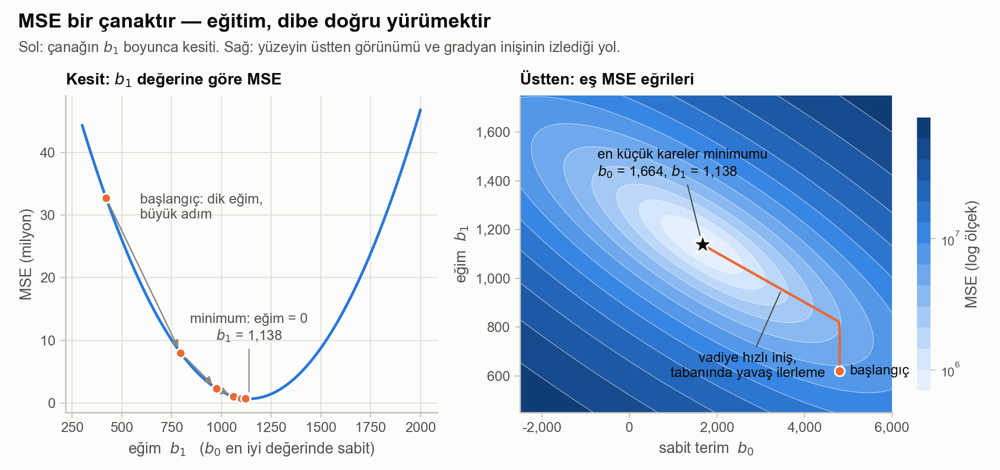

*Sol: eğim yönünde MSE bir paraboldür; eğri dikken adımlar büyüktür, dibe yaklaştıkça küçülür. Sağ: MSE yüzeyinin üstten görünümü ve gradyan inişinin kötü bir başlangıç tahmininden en küçük kareler minimumuna izlediği yol.*

Sağ paneldeki yol, $`b_0 = 4800,\ b_1 = 620`$ başlangıcı ve $`\alpha = 0.006`$ ile:

| Adım | $`b_0`$ | $`b_1`$ |
|---|---|---|
| 0 | 4800 | 620 |
| 10 | 4684 | 833 |
| 100 | 3694 | 933 |
| 1000 | 1702 | 1134 |
| 4000 | **1664** | **1138** |

> [!WARNING]
> **Bu yolda iki pratik ders saklı.**
>
> - **Öğrenme oranı:** çok küçükse eğitim sürünür; çok büyükse adımlar vadiyi aşar ve maliyet patlar. Bu veride yaklaşık $`\alpha = 0.016`$ üstündeki her değer ıraksar.
> - **Öznitelik ölçekleme:** çanak uzun ve dar bir vadidir (bir yönde diğerine göre yaklaşık 170 kat daha dik); bu yüzden yol 10 adımda vadiye iner, sonra tabanı boyunca yürümek için binlerce adıma ihtiyaç duyar. x’i yeniden ölçeklemek (normalizasyon ya da standardizasyon) çanağı yuvarlak yapar ve gradyan inişi birkaç adımda yakınsar. Ölçeklemenin gradyan tabanlı her modelde önemli olmasının nedeni budur.

### Doğrusal regresyonun sessizce varsaydıkları

- **Doğrusallık:** gerçek ilişki kabaca bir doğrudur.
- **Bağımsız hatalar:** bir satırın hatası başka bir satırınki hakkında bir şey söylemez.
- **Sabit yayılım:** artıklar x boyunca her yerde aşağı yukarı aynı büyüklüktedir.
- **Aşırı aykırı değer yok:** kare hata, tek bir uç noktanın bütün doğruyu çekmesine izin verir.

> [!CAUTION]
> **Ekstrapolasyon yapma.** Modelim yalnızca 0 ile 15 yıl arası deneyim gördü. 100 yılı sorarsan rahatça `115499` der; çünkü bir doğru hiç bitmez. Eğitim aralığının çok dışındaki bir tahmin bilgi değil, aritmetiktir.

### Python uygulaması

```python
import numpy as np
import pandas as pd

df = pd.read_csv("linear-regression-dataset.csv", sep=";")
x, y = df.experience.values, df.salary.values

# 1) Kapalı form:  b1 = Cov(x, y) / Var(x),   b0 = ort(y) - b1 * ort(x)
b1 = np.sum((x - x.mean()) * (y - y.mean())) / np.sum((x - x.mean()) ** 2)
b0 = y.mean() - b1 * x.mean()
print(b0, b1)                      # 1663.895...  1138.348...

# 2) Gradyan inişi aynı sayılara ulaşır
g0, g1, alpha = 0.0, 0.0, 0.006
for _ in range(5000):
    residual = y - (g0 + g1 * x)
    g0 += alpha * 2 * residual.mean()          # b0'a göre gradyanın ters yönü
    g1 += alpha * 2 * (residual * x).mean()    # b1'e göre gradyanın ters yönü
print(g0, g1)                      # ~1663.9  ~1138.3

# 3) scikit-learn
from sklearn.linear_model import LinearRegression

X = x.reshape(-1, 1)               # sklearn 2 boyutlu bir öznitelik matrisi bekler
model = LinearRegression().fit(X, y)
print(model.intercept_, model.coef_[0])
print(model.predict([[6]]))        # [8493.98]
```

---

## 2) Çoklu Doğrusal Regresyon (iki veya daha fazla girdi)

**Fikir:** Tek bir çıktıyı birden çok girdi özniteliği kullanarak tahmin et.

### Biçim

Basit:

```math
\hat{y} = b_0 + b_1 x
```

Çoklu:

```math
\hat{y} = b_0 + b_1 x_1 + b_2 x_2 + \dots + b_p x_p
```

Tek girdiyle model bir doğrudur. İki girdiyle bir **düzlem**, daha fazlasıyla artık çizemediğimiz ama aynı şekilde çalışan bir hiperdüzlemdir.

### Örnek

- $`y`$ = **maaş**
- $`x_1`$ = **deneyim**
- $`x_2`$ = **yaş**

```math
\widehat{\text{maaş}} = b_0 + b_1 \cdot \text{deneyim} + b_2 \cdot \text{yaş}
```

> [!WARNING]
> **Önemli:** “Çoklu”, birden çok **girdi** demektir. Model yine **tek** bir çıktı değişkeni tahmin eder.

**Bir katsayı nasıl okunur:** $`b_1`$, **diğer bütün öznitelikler sabit tutulurken** deneyim 1 arttığında tahmindeki değişimdir. Çoklu regresyonu birkaç ayrı basit regresyon çalıştırmaktan farklı kılan da bu son kısımdır.

### Matematik: normal denklem

Veriyi bir matrise diz. Her satır bir çalışandır; ilk sütun tümüyle birlerden oluşur, böylece $`b_0`$ da diğer katsayılar gibi ele alınır:

```math
X = \begin{bmatrix} 1 & x_{11} & x_{12} \\ 1 & x_{21} & x_{22} \\ \vdots & \vdots & \vdots \\ 1 & x_{n1} & x_{n2} \end{bmatrix}, \qquad \boldsymbol{\beta} = \begin{bmatrix} b_0 \\ b_1 \\ b_2 \end{bmatrix}, \qquad \hat{\mathbf{y}} = X\boldsymbol{\beta}
```

Maliyet aynı MSE’dir; vektör normuyla yazılmış hâli:

```math
J(\boldsymbol{\beta}) = \frac{1}{n}\,\lVert \mathbf{y} - X\boldsymbol{\beta} \rVert^2
```

Gradyanı al ve sıfıra eşitle:

```math
\nabla J = -\frac{2}{n}\,X^{\top}(\mathbf{y} - X\boldsymbol{\beta}) = 0 \quad\Longrightarrow\quad X^{\top}X\,\boldsymbol{\beta} = X^{\top}\mathbf{y}
```

```math
\boxed{\;\boldsymbol{\beta} = (X^{\top}X)^{-1}X^{\top}\mathbf{y}\;}
```

Bu **normal denklemdir**. Bölüm 1’deki üç adım, bu formülün iki parametreli durum için açık yazılmış hâlinden ibarettir.

<details>
<summary><b>Daha derin: geometrik resim (neden “normal” deniyor?)</b></summary>

$`\mathbf{y}`$ vektörünü n boyutlu uzayda tek bir nokta olarak düşün (her çalışan için bir eksen). Olası her tahmin vektörü $`X\boldsymbol{\beta}`$ düz bir alt uzayda yatar: $`X`$ matrisinin **sütun uzayı**. Çoğu zaman $`\mathbf{y}`$ noktasına tam ulaşamayız; yapabileceğimiz en iyi şey o alt uzayın $`\mathbf{y}`$ noktasına **en yakın** noktasını almaktır, bu da onun dik izdüşümüdür.

En yakın noktada artık vektörü $`X`$ matrisinin her sütununa diktir (“normal”):

```math
X^{\top}(\mathbf{y} - X\boldsymbol{\beta}) = \mathbf{0}
```

Bu, yukarıdaki denklemin aynısıdır. Uydurulan değerler $`\hat{\mathbf{y}} = H\mathbf{y}`$ olur; $`H = X(X^{\top}X)^{-1}X^{\top}`$ “şapka matrisi”dir, çünkü y’ye şapkasını takar.

</details>

### Veri setim ne diyor

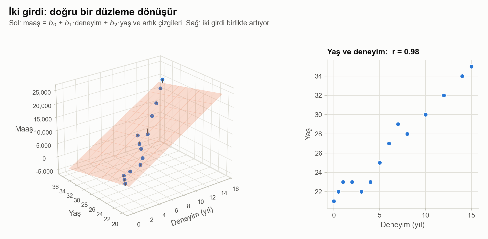

*Sol: 14 çalışandan geçen düzlem ve artık çizgileri. Sağ: deneyim ile yaş neredeyse kusursuz biçimde birlikte artıyor.*

```math
\widehat{\text{maaş}} = 10376.6 + 1525.5 \cdot \text{deneyim} - 416.7 \cdot \text{yaş}
```

| Çalışan | Hesap | Tahmini maaş |
|---|---|---|
| 5 yıl deneyim, 35 yaş | $`10376.6 + 1525.5 \cdot 5 - 416.7 \cdot 35`$ | 3419 |
| 10 yıl deneyim, 35 yaş | $`10376.6 + 1525.5 \cdot 10 - 416.7 \cdot 35`$ | 11046 |
| 20 yıl deneyim, 30 yaş | $`10376.6 + 1525.5 \cdot 20 - 416.7 \cdot 30`$ | 28385 |

### Bu veri setindeki tuzak: çoklu doğrusal bağlantı (multicollinearity)

Yaş katsayısı **negatif**. Yaşlanmak gerçekten yılda 417’ye mi mal oluyor? Yukarıdaki sağ panele bak: yaş ile deneyim arasındaki korelasyon **r = 0.98**. Neredeyse aynı bilgiyi taşıyorlar.

- Veri, düzlemi yalnızca **tek bir doğru boyunca** (noktaların dizildiği köşegen) sabitliyor. Düzlemi o doğru etrafında eğersen uyum neredeyse değişmez; yani birbirinden çok farklı $`(b_1, b_2)`$ çiftleri neredeyse eşit derecede iyidir.
- Matematiksel olarak $`X^{\top}X`$ tekil olmaya yaklaşır; tersini almak gürültüyü büyütür. Standart teşhis ölçüsü **varyans şişirme faktörüdür (VIF)**:

```math
\text{VIF}_j = \frac{1}{1 - R_j^2}
```

Burada $`R_j^2`$, j özniteliğinin diğer özniteliklerle ne kadar iyi tahmin edildiğidir. Bu veride $`\text{VIF} = 1/(1 - 0.98^2) \approx 27`$. Yaygın bir pratik kural, 5 ile 10’un üstünü uyarı sayar.

- Yaşı eklemek R² değerini yalnızca **0.9775’ten 0.9818’e** çıkardı; yani neredeyse hiç yeni bilgi katmıyor.

> [!TIP]
> **Çıkarılacak ders:** güçlü ilişkili özniteliklerde **tahminler** (veri aralığı içinde) hâlâ iyidir; ama tek tek **katsayılar** açıklama olarak güvenilir olmaktan çıkar. Çözümler: ikizlerden birini at, ikisini birleştir ya da düzenlileştirme (Ridge) kullan.

### Python uygulaması

```python
df = pd.read_csv("multiple-linear-regression-dataset.csv", sep=";")
X = df[["experience", "age"]].values
y = df.salary.values

# Normal denklem: sabit terim için birlerden oluşan bir sütun ekle
Xd = np.c_[np.ones(len(X)), X]
beta = np.linalg.solve(Xd.T @ Xd, Xd.T @ y)
print(beta)                                    # [10376.63  1525.50  -416.72]

# scikit-learn aynı katsayıları verir
model = LinearRegression().fit(X, y)
print(model.intercept_, model.coef_)
print(model.predict([[5, 35], [10, 35], [20, 30]]))   # [ 3418.85 11046.36 28384.98]
```

---

## 3) Polinom Regresyon

**Neden?** İlişki eğriyse bir doğru eksik öğrenir. Araba veri setimde azami hız fiyatla birlikte hızla tırmanıyor, sonra düzleşiyor. Bir doğru bunu tümüyle kaçırıyor: fiyatı 10000 olan bir araba için **872 km/sa** azami hız tahmin ediyor.

### Model

```math
\hat{y} = b_0 + b_1 x + b_2 x^2 + \dots + b_d x^d
```

### Burada “doğrusal” ne demek

Model, $`x^2, x^3, \dots`$ kullansa bile **katsayılarda** ($`b_0, b_1, \dots`$) doğrusaldır. İşin püf noktası her kuvveti yepyeni bir öznitelik gibi ele almaktır:

```math
X = \begin{bmatrix} 1 & x_1 & x_1^2 & \cdots & x_1^d \\ 1 & x_2 & x_2^2 & \cdots & x_2^d \\ \vdots & \vdots & \vdots & & \vdots \\ 1 & x_n & x_n^2 & \cdots & x_n^d \end{bmatrix}
```

Bu dönüşümden sonra elimizdeki sıradan çoklu doğrusal regresyondur ve aynı normal denklemle, $`\boldsymbol{\beta} = (X^{\top}X)^{-1}X^{\top}\mathbf{y}`$, çözülür. `PolynomialFeatures` ardından `LinearRegression` tam olarak bunu yapar.

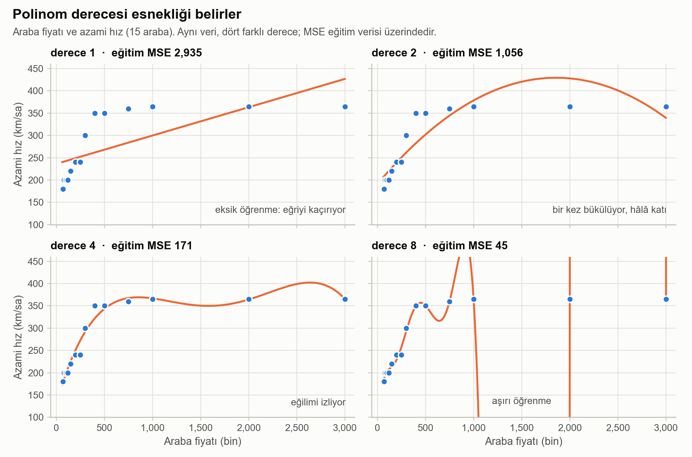

*Aynı 15 araba, dört farklı dereceyle. Derece 1 eksik öğreniyor, derece 4 eğilimi izliyor, derece 8 her noktanın yakınından geçip aralarda sert salınıyor.*

### Ne zaman işe yarar

- Yumuşak eğri eğilimler (U biçimi, S benzeri kısımlar, hızlanan ya da yavaşlayan büyüme)

### Risk: yanlılık–varyans dengesi (bias–variance trade-off)

- Derece yükseldikçe aşırı öğrenme riski artar.
- Dereceyi artırdığında eğitim hatası **her zaman** düşer (yukarıda 2935 → 1056 → 171 → 45); bu yüzden derece seçmek için eğitim hatası kullanılamaz.

Herhangi bir modelin yeni verideki beklenen hatası üç parçaya ayrılır:

```math
\mathbb{E}\big[(y - \hat{f}(x))^2\big] = \underbrace{\big(\mathbb{E}[\hat{f}(x)] - f(x)\big)^2}_{\text{yanlılık}^2} + \underbrace{\mathrm{Var}\big(\hat{f}(x)\big)}_{\text{varyans}} + \underbrace{\sigma^2}_{\text{gürültü}}
```

- **Yanlılık (bias):** fazla basit olmaktan gelen hata (bir eğriyi izlemeye çalışan bir doğru). Derece arttıkça düşer.
- **Varyans:** belirli bir eğitim örneklemine fazla duyarlı olmaktan gelen hata. Derece arttıkça yükselir.
- **Gürültü:** verinin kendi rastgeleliği. Hiçbir model bunun altına inemez.

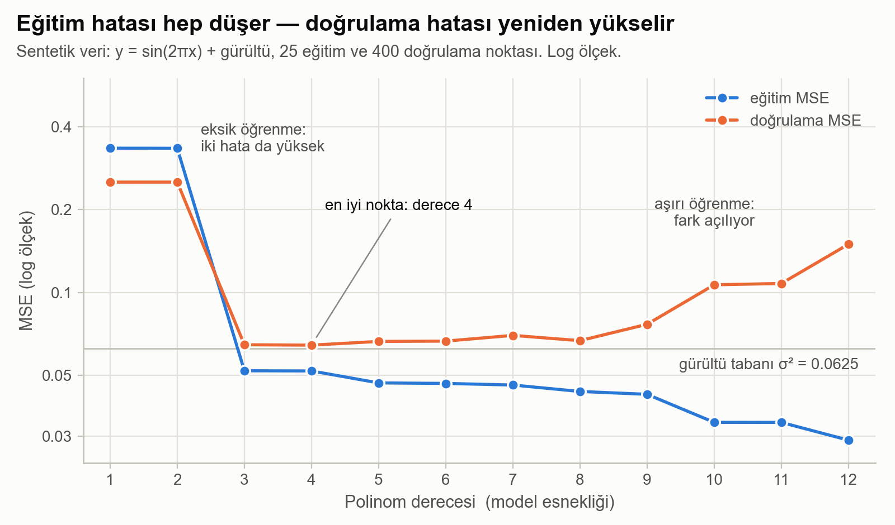

*Polinom derecesi büyüdükçe eğitim hatası düşmeye devam eder; doğrulama hatası ise dibe vurup yeniden tırmanır. En iyi model doğrulama eğrisinin dibindedir.*

> [!NOTE]
> Grafik, gerçeğini bildiğim sentetik bir veri seti kullanıyor (sinüs dalgası artı varyansı 0.0625 olan gürültü). Doğrulama hatası derece 4’te, neredeyse tam gürültü tabanında dibe vuruyor; sonra derece 12’ye gelindiğinde iki katından fazlasına çıkıyor, eğitim hatası ise iyileşmeyi sürdürüyor. O açılan fark aşırı öğrenmenin **ta kendisidir**.

### Dereceyi seçmek

- Derece genellikle eğitim/test ayrımı ya da **çapraz doğrulama (cross-validation)** ile seçilir: her aday dereceyi verinin bir kısmında eğit, görmediği kısımda puanla ve doğrulama hatası en düşük olan dereceyi tut.
- x’i yüksek kuvvetlere çıkarmadan önce ölçekle. 3000’lik bir fiyatın 4. kuvveti yaklaşık $`8 \times 10^{13}`$ eder; bu, sayısal hesap için zorlayıcıdır.
- Yüksek esneklik gerekiyorsa katsayıların patlamaması için düzenlileştirme (Ridge) ekle.

### Python uygulaması

```python
from sklearn.preprocessing import PolynomialFeatures
from sklearn.pipeline import make_pipeline

df = pd.read_csv("polynomial-regression.csv", sep=";")
X, y = df[["car_price"]].values, df.max_speed.values

# x  ->  [1, x, x^2, x^3, x^4]  ->  sıradan doğrusal regresyon
model = make_pipeline(PolynomialFeatures(degree=4), LinearRegression())
model.fit(X, y)
y_pred = model.predict(X)
```

---

## 4) Karar Ağacı Regresyonu

**Fikir:** Öznitelik uzayını tekrar tekrar böl; her son bölge (yaprak) sabit bir değer tahmin eder.

Bir ağaç formül uydurmaz. Öznitelikler hakkında art arda evet/hayır soruları sorar ve **aynı yanıtları vermiş eğitim satırlarının hedef ortalamasıyla** cevap verir.

### Temel kavramlar

- **Düğüm (node):** Bir bölmenin yapıldığı nokta.
- **Bölme (split):** “$`x_j \le t`$ mi?” gibi, veriyi ikiye ayıran kural.
- **Yaprak / uç düğüm (leaf):** Son düğüm. Tahmin burada üretilir.
- **Derinlik (depth):** Kökten bir yaprağa giden en uzun yoldaki soru sayısı.
- **CART:** *Classification and Regression Trees* (sınıflandırma ve regresyon ağaçları); scikit-learn’ün uyguladığı algoritma.

### Gerçek bir ağaç, yukarıdan aşağıya

Veri setimde 10 satır var: tribün seviyesi (1’den 10’a) ve bilet fiyatı. scikit-learn’ün bu veride büyüttüğü, derinliği 2 olan ağaç:

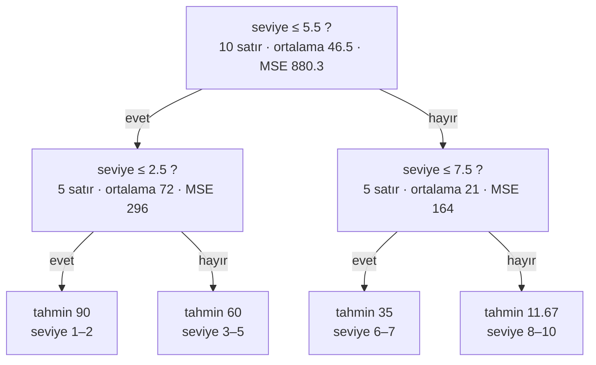

### Tahmin nasıl yapılır

Yeni bir örnek için:

- Kökten başla
- Bölme kurallarını izle
- Bir yaprağa var
- Yaprağın tahminini ver (o yapraktaki y değerlerinin **ortalaması**)

**Örnek, seviye 5.7:** 5.7 ≤ 5.5 mi? Hayır → sağa git. 5.7 ≤ 7.5 mi? Evet → bu yaprakta fiyatları 40 ve 30 olan 6. ve 7. seviyeler var → tahmin **35**.

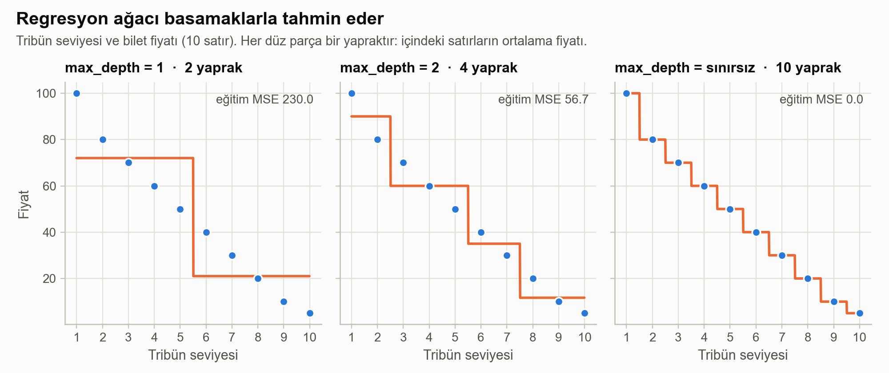

*Aynı veri, üç farklı derinlikle. Her düz parça bir yapraktır. Sınırsız derinlikte her satır kendi yaprağını alır ve eğitim hatası tam sıfır olur.*

### Matematik: yaprak neden ortalamayı tahmin eder

Bir yaprağın içinde bütün satırlar için tek bir sabit $`c`$ seçmek zorundayız. Kare hata altında en iyi sabit şunu sağlar:

```math
\frac{d}{dc}\sum_{i \in \text{yaprak}}(y_i - c)^2 = -2\sum_{i \in \text{yaprak}}(y_i - c) = 0 \quad\Longrightarrow\quad c = \bar{y}_{\text{yaprak}}
```

Yani en iyi tahmin yaprak ortalamasıdır ve yaprağın MSE değeri de içindeki y’lerin **varyansından** ibarettir. “MSE’yi küçült” ile “varyans azaltma”nın aynı ölçütün iki adı olmasının nedeni budur.

### Matematik: bölme nasıl seçilir

Amaç: yaprakların içindeki hatayı azaltmak. $`j`$ özniteliğinde $`t`$ eşiğiyle yapılan bir bölme, satırları sol grup $`L`$ ve sağ grup $`R`$ olarak ayırır. Puanı, iki çocuğun boyutla ağırlıklandırılmış hatasıdır:

```math
\text{puan}(j, t) = \frac{n_L}{n}\,\text{MSE}(L) + \frac{n_R}{n}\,\text{MSE}(R)
```

Ağaç **her özniteliği ve komşu iki değer arasındaki her eşiği** dener, en düşük puanlı çifti tutar ve aynı aramayı her çocuğun içinde yineler:

```math
(j^{*}, t^{*}) = \underset{j,\,t}{\arg\min}\;\text{puan}(j, t), \qquad \text{varyans azalması} = \text{MSE}(\text{ebeveyn}) - \text{puan}(j^{*}, t^{*})
```

**Ağacımın kök bölmesi, elle hesap.** Bölmeden önce 10 fiyatın ortalaması 46.5, MSE değeri 880.25.

| Eşik t | Sol: satır (ortalama) | Sağ: satır (ortalama) | Ağırlıklı MSE |
|---|---|---|---|
| 1.5 | 1 (100.0) | 9 (40.6) | 562.2 |
| 2.5 | 2 (90.0) | 8 (35.6) | 407.2 |
| 3.5 | 3 (83.3) | 7 (30.7) | 298.8 |
| 4.5 | 4 (77.5) | 6 (25.8) | 239.6 |
| **5.5** | **5 (72.0)** | **5 (21.0)** | **230.0 ← en iyi** |
| 6.5 | 6 (66.7) | 4 (16.3) | 270.2 |
| 7.5 | 7 (61.4) | 3 (11.7) | 360.2 |
| 8.5 | 8 (56.3) | 2 (7.5) | 500.0 |
| 9.5 | 9 (51.1) | 1 (5.0) | 688.9 |

Kazanan için: $`\tfrac{5}{10}\cdot 296 + \tfrac{5}{10}\cdot 164 = 230`$. Tek bir soru, hatanın $`880.25 - 230 = 650.25`$ kadarını, yani yaklaşık %74’ünü siliyor.

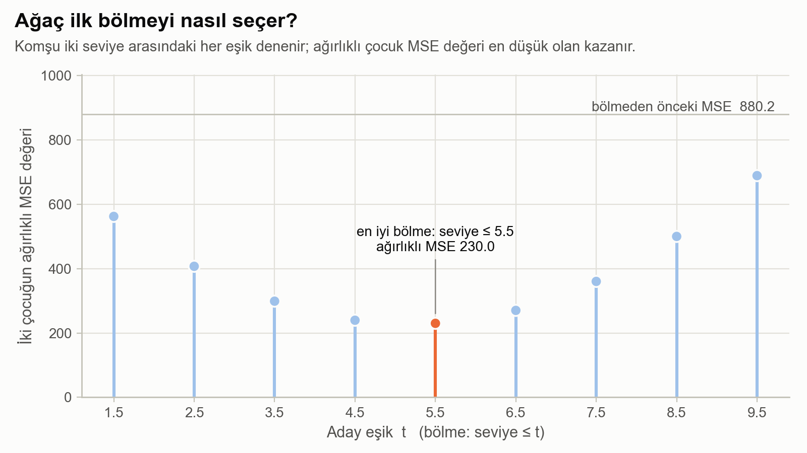

*İlk bölme için dokuz aday eşik ve ağırlıklı çocuk MSE değerleri. Ağaç yalnızca en düşük olanı alır.*

> [!TIP]
> **Arama açgözlüdür (greedy).** Ağaç *o an* en iyi olan bölmeyi alır ve geri dönüp onu bir daha gözden geçirmez. Bu, eğitimi hızlı yapar; ama genel olarak en iyi ağacı garanti etmez (onu bulmak hesaplama açısından içinden çıkılamayacak kadar pahalıdır).

> Not: **Entropi / Bilgi Kazancı (Information Gain)** esas olarak sınıflandırma ağaçlarında kullanılır. Regresyon ağaçlarında standart odak MSE/varyanstır.

### Artılar ve eksiler

- **Artılar:** Doğrusal olmayan örüntüleri ve etkileşimleri yakalar; öznitelik ölçeklemeye gerek yoktur (yalnızca değerlerin *sırası* önemlidir); akış şeması gibi okunur.
- **Eksiler:** Tek bir derin ağaç kolayca aşırı öğrenir; tahminler basamaklıdır, asla pürüzsüz bir eğri olmaz; ekstrapolasyon yapamaz (10. seviyenin ötesinde son yaprağı tahmin etmeyi sürdürür); verideki küçük değişiklikler çok farklı bir ağaç üretebilir (**yüksek varyans**).

### Sık kullanılan hiperparametreler

| Hiperparametre | Neyi sınırlar | Sıkılaştırmanın etkisi |
|---|---|---|
| `max_depth` | Kökten yaprağa kadar sorulan soru sayısı | Daha az ve daha büyük yaprak → daha pürüzsüz, daha az aşırı öğrenme |
| `min_samples_split` | Bir düğümün bölünebilmesi için gereken satır sayısı | Küçücük grupların bölünmesini durdurur |
| `min_samples_leaf` | Her yaprağın tutması gereken satır sayısı | Hiçbir yaprak tek bir tuhaf satırın etrafına kurulamaz |

> [!WARNING]
> Hiçbir sınır olmadan `DecisionTreeRegressor()`, her yaprakta tek satır kalana dek bölmeyi sürdürür: verimde 10 yaprak ve 0 eğitim MSE. Eğitim kümesinde kusursuz bir puan iyi bir modelin değil, ezberin işaretidir.

### Python uygulaması

```python
from sklearn.tree import DecisionTreeRegressor

df = pd.read_csv("decision-tree-regression-dataset.csv", sep=";", header=None)
X, y = df[[0]].values, df[1].values

tree = DecisionTreeRegressor(max_depth=2, random_state=42).fit(X, y)
print(tree.predict([[5.7]]))       # [35.]

# sık bir ızgara, tahminin basamak biçimini gösterir
x_grid = np.arange(X.min(), X.max(), 0.01).reshape(-1, 1)
y_grid = tree.predict(x_grid)
```

### Kurs notlarımdan

Bu konuyu ilk öğrenirken kaydettiğim çizim ve grafik:

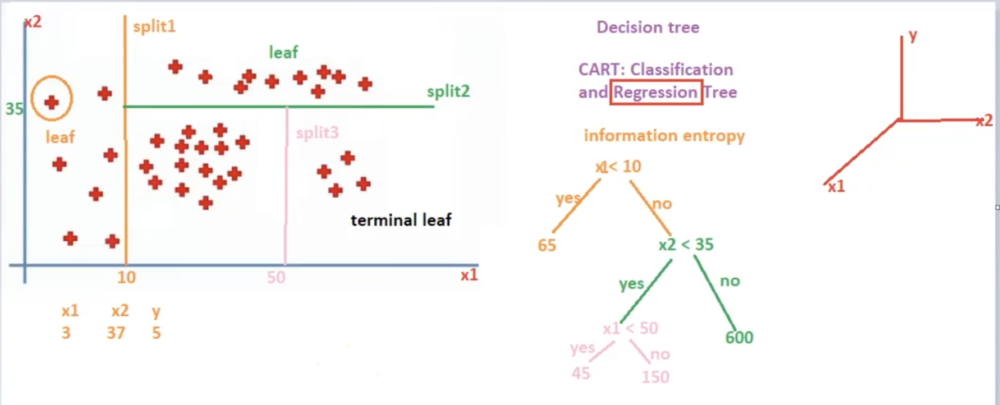

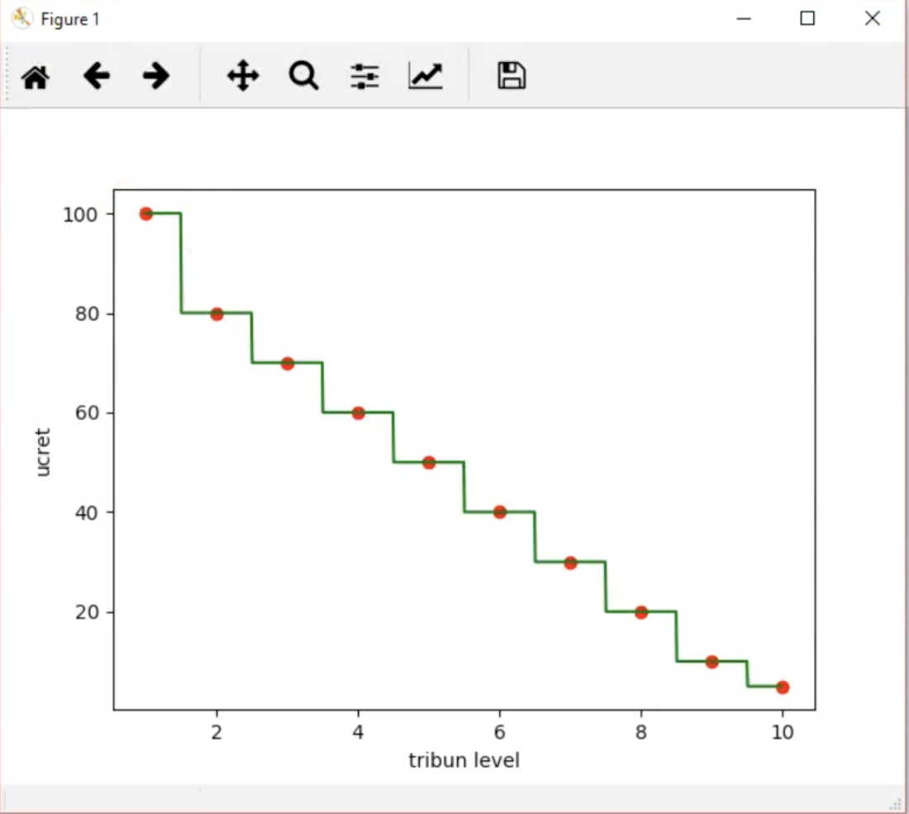

---

## 5) Rastgele Orman Regresyonu (Topluluk Öğrenmesi)

**Fikir:** Çok sayıda karar ağacı eğit ve tahminlerini birleştir.

Regresyonda en yaygın birleştirme yolu:

- Tahminlerin **ortalaması**

```math
\hat{y}_{\text{orman}}(x) = \frac{1}{B}\sum_{b=1}^{B} T_b(x)
```

Burada $`T_b`$ b’inci ağaç, $`B`$ ise ağaç sayısıdır (`n_estimators`).

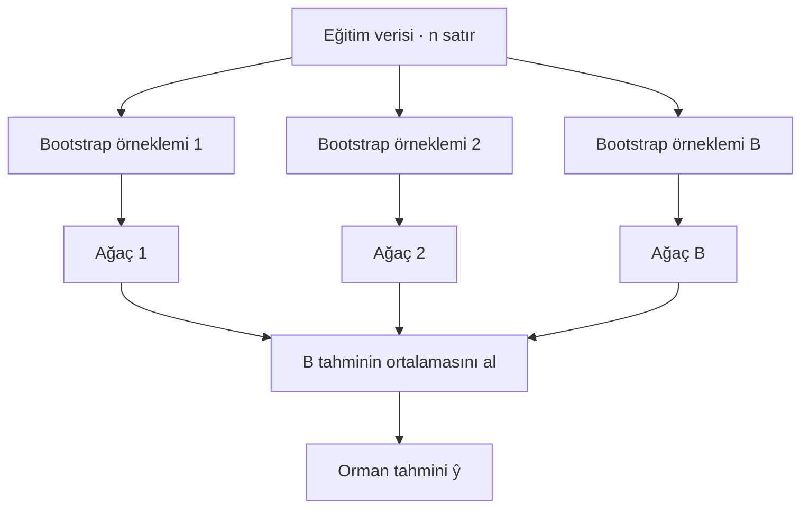

### Neden işe yarar

Tek bir karar ağacının varyansı yüksektir.

Rastgele Orman, varyansı iki tür rastgelelik ekleyerek düşürür:

1. **Bootstrap örnekleme:** her ağaç farklı bir örneklenmiş veri setinde eğitilir (yerine koyarak). n satırdan *yerine koyarak* n satır çekeriz; bazı satırlar iki kez gelir, bazıları hiç gelmez.
2. **Rastgele öznitelik seçimi:** her bölme, özniteliklerin yalnızca rastgele bir alt kümesini dikkate alır (`max_features`); böylece ağaçların hepsi aynı en güçlü özniteliğe yaslanamaz.

Birbirinden farklı çok sayıda ağacın ortalaması daha kararlı tahminler üretir.

<details>
<summary><b>Daha derin: bir ağaç verinin ne kadarını gerçekten görür? (%63 kuralı)</b></summary>

Belirli bir satırın tek bir çekilişte **seçilmeme** olasılığı $`1 - \tfrac{1}{n}`$ olur. Bir bootstrap örneklemi n bağımsız çekiliş yapar; satırın hiç seçilmeme olasılığı:

```math
\left(1 - \frac{1}{n}\right)^{n} \;\xrightarrow{\;n \to \infty\;}\; e^{-1} \approx 0.368
```

Dolayısıyla her ağaç farklı satırların yaklaşık **%63.2**’sini görür. Kalan %36.8, o ağacın **torba dışı (out-of-bag, OOB)** satırlarıdır. Ağaç onları hiç görmediği için bedava bir doğrulama kümesi işlevi görürler: `oob_score=True` yaparsan scikit-learn ormanın bu satırlardaki puanını raporlar.

</details>

### Matematik: ortalama almak hatayı neden düşürür

Her ağacın bir x noktasındaki tahmininin varyansı $`\sigma^2`$, herhangi iki ağaç arasındaki korelasyon $`\rho`$ olsun. Ortalamalarının varyansı:

```math
\mathrm{Var}\!\left(\frac{1}{B}\sum_{b=1}^{B}T_b\right) = \frac{1}{B^2}\Big[\,B\sigma^2 + B(B-1)\,\rho\,\sigma^2\Big] = \rho\,\sigma^2 + \frac{1-\rho}{B}\,\sigma^2
```

- **İkinci terim** ağaç ekledikçe sıfıra iner. Daha fazla ağaç asla zarar vermez; yalnızca bir noktadan sonra yardımı kalmaz.
- **Birinci terim** B’ye hiç bağlı değildir. Ağaçların birbirine ne kadar benzediğinin belirlediği bir tabandır.
- Yani asıl kaldıraç $`\rho`$ değeridir. Bootstrap örneklemleri ve rastgele öznitelik alt kümeleri ağaçları **birbirine daha az benzer** kılmak için vardır; bu da o tabanı düşürür.
- Ortalama almak yanlılığı değiştirmez. Ormanların **derin, düşük yanlılıklı ağaçlar** kullanıp varyansı ortalamayla gidermesinin nedeni budur.

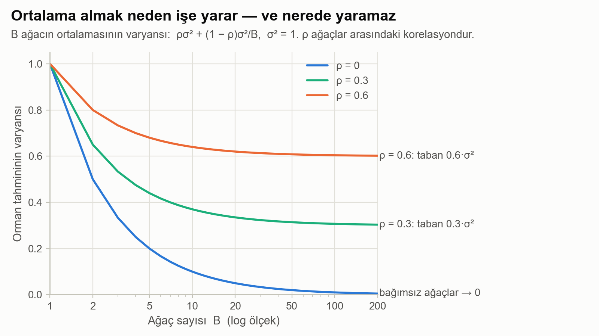

*Ağaçlar arasındaki üç farklı korelasyon düzeyi için, ağaç sayısına karşı orman tahmininin varyansı. Her eğri kendi tabanında düzleşir.*

### Kendi verimde görmek

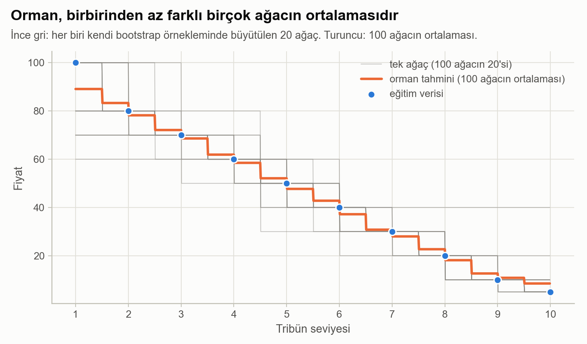

*100 ağacın yirmisi gri renkte, her biri biraz farklı bir basamak; ortalamaları turuncu.*

Tribün seviyesi **5.7** için ilk sekiz ağaç 60, 40, 40, 40, 30, 40, 40 ve 40 tahmin ediyor. 100 ağacın tahminlerinin standart sapması yaklaşık 6.8; ortalamaları, yani ormanın yanıtı **42.8**. Tam büyümüş tek bir ağaç 40 derdi.

> [!TIP]
> Bu veri setinde tek bir öznitelik var; rastgele öznitelik seçiminin seçebileceği bir şey yok. Buradaki çeşitliliğin tamamı bootstrap örneklemeden geliyor. Geniş veri setlerinde ikinci tür rastgelelik çok daha önemlidir.

### Önemli hiperparametreler

| Hiperparametre | Anlamı | Pratik kural |
|---|---|---|
| `n_estimators` | Ağaç sayısı (B) | Fazlası daha güvenli ama daha yavaş; 100 ile 500 arası tipiktir |
| `max_features` | Her bölmede dikkate alınan öznitelik sayısı | Küçüldükçe ağaçlar daha az ilişkili olur (ρ düşer), her ağaç biraz zayıflar |
| `max_depth`, `min_samples_leaf` | Her ağacın büyüklüğü | Genellikle derin bırakılır; zaman ya da bellek kazanmak için sınırla |
| `random_state = 42` | Sabit tohum (seed) | Rastgele örneklemeyi yeniden üretilebilir kılar |
| `oob_score = True` | Torba dışı satırlardaki puan | Bedava bir doğrulama tahmini |

### Örnek kullanım alanları

- Özniteliğe dayalı puanlama ve tahmin görevleri (bazı öneri sistemi hatları dahil)
- Sinyallerden ya da görüntülerden tıbbi ölçüm tahmini
- Finans ve iş tahminleri (dikkat: dağılım kayması yaygındır)

### Görselleştirme notu

Pürüzsüz bir tahmin eğrisi çizmek için x’i sık örnekle:

- `np.arange(min(x), max(x), 0.01).reshape(-1, 1)`

### Python uygulaması

```python
from sklearn.ensemble import RandomForestRegressor

df = pd.read_csv("random-forest-regression-dataset.csv", sep=";", header=None)
X, y = df[[0]].values, df[1].values

rf = RandomForestRegressor(n_estimators=100, random_state=42).fit(X, y)
print(rf.predict([[5.7]]))                               # [42.8]

# orman, kelimenin tam anlamıyla ağaçlarının ortalamasıdır
print(np.mean([t.predict([[5.7]])[0] for t in rf.estimators_]))   # 42.8
```

### Kurs notlarımdan

Çalışırken kaydettiğim iki referans görsel: ilki regresyon durumu için, ikincisi aynı topluluk fikrinin sınıflandırmadaki karşılığı.

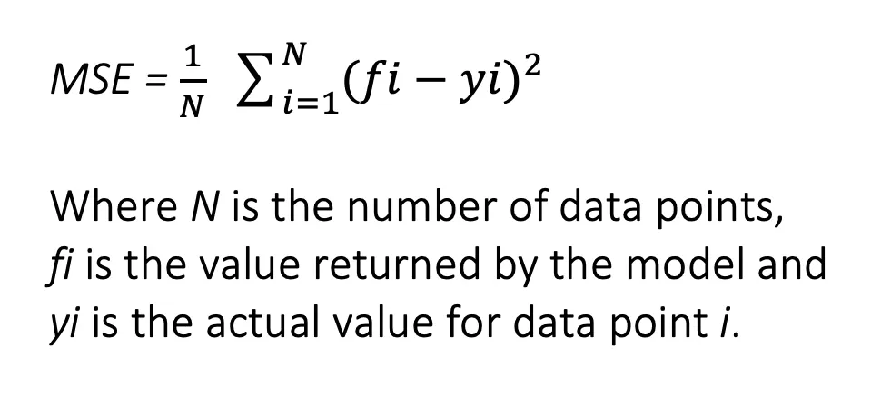

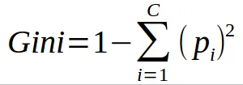

---

## 6) Regresyon Modeli Değerlendirme

Bir model, ancak ölçülen hatası kadar iyidir. Bütün regresyon metrikleri aynı ham maddeden yapılır: artıklar.

### 1) Artık ve kare hata

- **Artık:**

```math
\text{artık}_i = y_i - \hat{y}_i
```

- **Artığın karesi:**

```math
(\text{artık}_i)^2
```

### 2) SSR (Artık Kareler Toplamı, Sum of Squared Residuals)

Modelin açıklayamadığı hata:

```math
SSR = \sum_{i=1}^{n} (y_i - \hat{y}_i)^2
```

### 3) SST (Toplam Kareler Toplamı, Total Sum of Squares)

Ortalama etrafındaki toplam değişim:

- $`\bar{y}`$ = hedefin ortalaması

```math
SST = \sum_{i=1}^{n} (y_i - \bar{y})^2
```

SST, olabilecek en tembel modelin SSR değeridir: x’i yok sayıp her zaman ortalamayı tahmin eden model.

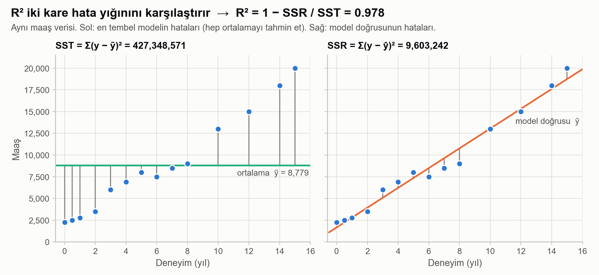

*Sol: her maaşın ortalama çizgisine uzaklığı (SST). Sağ: model doğrusuna uzaklığı (SSR). R², sağdaki çizgilerin ne kadar kısaldığını ölçer.*

### 4) R² (Belirlilik Katsayısı)

$`y`$ içindeki varyansın ne kadarını model açıklıyor:

```math
R^2 = 1 - \frac{SSR}{SST}
```

Maaş verimde:

```math
R^2 = 1 - \frac{9\,603\,242}{427\,348\,571} = 0.9775
```

Doğru, “hep ortalamayı tahmin et” modelinin yaptığı kare hatanın %97.75’ini ortadan kaldırıyor.

- **R² = 1** → kusursuz tahminler
- **R² ≈ 0** → ortalamayı tahmin etmekten daha iyi değil
- **R² 0’ın altında** → ortalamayı tahmin etmekten daha kötü (modelin eğitilmediği veride mümkündür)

<details>
<summary><b>Daha derin: neden “açıklanan varyans”? SST = SSR + ESS ayrışımı</b></summary>

Toplam kareler toplamının içine $`\hat{y}_i`$ ekleyip çıkar:

```math
\sum_i (y_i - \bar{y})^2 = \underbrace{\sum_i (y_i - \hat{y}_i)^2}_{SSR} + \underbrace{\sum_i (\hat{y}_i - \bar{y})^2}_{ESS} + 2\sum_i (y_i - \hat{y}_i)(\hat{y}_i - \bar{y})
```

Sabit terimli en küçük karelerde son terim tam olarak sıfırdır: normal denklemler, artıkların toplamının sıfır olduğunu ve uydurulan değerlere dik olduklarını söyler. Böylece toplam değişim, açıklanamayan kısım (SSR) ile açıklanan kısma (ESS, explained sum of squares) temiz biçimde ayrılır:

```math
R^2 = 1 - \frac{SSR}{SST} = \frac{ESS}{SST}
```

Basit doğrusal regresyonda R² aynı zamanda x ile y arasındaki korelasyonun karesidir: $`r = \sqrt{0.9775} \approx 0.989`$. İsimlere dikkat: bazı kitaplar kısaltmaları ters kullanır; artık toplamına SSE, açıklanan toplama SSR der.

</details>

### 5) Düzeltilmiş R² (Adjusted R²)

Bir öznitelik eklediğinde, işe yaramaz olsa bile, R² asla düşmez. Düzeltilmiş R² her ek öznitelik için bir bedel keser ($`p`$ = öznitelik sayısı):

```math
R^2_{\text{düz}} = 1 - (1 - R^2)\,\frac{n - 1}{n - p - 1}
```

| Model | R² | Düzeltilmiş R² |
|---|---|---|
| Deneyimden maaş (p = 1) | 0.9775 | 0.9757 |
| Deneyim + yaştan maaş (p = 2) | 0.9818 | 0.9785 |

Yaşı eklemenin kazancı, ek parametrenin bedeli ödendikten sonra neredeyse kayboluyor; bu da bölüm 2’deki çoklu doğrusal bağlantı kontrolünün söylediğiyle örtüşüyor.

### 6) MSE, RMSE ve MAE

| Metrik | Formül | Doğrusal modelim | Nasıl okunur |
|---|---|---|---|
| **MSE** | $`\frac{1}{n}\sum (y_i - \hat{y}_i)^2`$ | 685 946 | Eğitimin küçülttüğü şey; birimi karelidir, yorumlaması zordur |
| **RMSE** | $`\sqrt{\text{MSE}}`$ | 828.2 | Maaş biriminde tipik hata; büyük ıskalar daha ağır basar |
| **MAE** | $`\frac{1}{n}\sum \lvert y_i - \hat{y}_i \rvert`$ | 680.2 | Maaş biriminde ortalama ıska; aykırı değerlere dayanıklıdır |
| **R²** | $`1 - SSR/SST`$ | 0.9775 | Açıklanan varyansın birimsiz payı |

RMSE her zaman en az MAE kadar büyüktür. Aralarındaki büyük fark, birkaç büyük hatanın baskın olduğu anlamına gelir.

> [!WARNING]
> **Modelin görmediği veride ölç.** Yukarıdaki her sayı küçücük bir veri setindeki *eğitim* puanıdır; formülleri öğrenmek için bu yeterli. Gerçek bir modeli yargılamak için bir test kümesi ayır ya da çapraz doğrulama kullan. Bölüm 4’teki sınırsız derinlikli ağaç kendi eğitim verisinde kusursuz R² = 1 alır ve yine de en kötü seçim olurdu.

### scikit-learn

```python
from sklearn.metrics import mean_squared_error, mean_absolute_error, r2_score

y_pred = model.predict(X)

mse  = mean_squared_error(y, y_pred)      # 685945.85
rmse = mse ** 0.5                         # 828.22
mae  = mean_absolute_error(y, y_pred)     # 680.18
r2   = r2_score(y, y_pred)                # 0.9775
```

---

## Hızlı özet

- **Doğrusal / Çoklu Doğrusal Regresyon:** katsayıları MSE’yi en küçük yaparak öğrenir. Kapalı form: $`\boldsymbol{\beta} = (X^{\top}X)^{-1}X^{\top}\mathbf{y}`$.
- **Polinom Regresyon:** eğri ilişkileri modellemek için x’in kuvvetlerini ekler; katsayılarda hâlâ doğrusaldır.
- **Karar Ağacı Regresyonu:** veriyi böler; her yaprakta sabit bir değer (ortalama) tahmin eder.
- **Rastgele Orman Regresyonu:** daha kararlı tahminler için çok sayıda rastgeleleştirilmiş ağacın ortalamasını alır.
- **R²:** açıklanan varyansı $`1 - SSR/SST`$ olarak özetler.

| Model | Temel formül | Ana hiperparametre | Öznitelik ölçekleme gerekir mi? |
|---|---|---|---|
| Basit doğrusal | $`b_1 = \mathrm{Cov}(x,y)/\mathrm{Var}(x)`$ | yok | Yalnızca gradyan inişi için |
| Çoklu doğrusal | $`\boldsymbol{\beta} = (X^{\top}X)^{-1}X^{\top}\mathbf{y}`$ | yok | Yalnızca gradyan inişi için |
| Polinom | Aynısı; $`1, x, x^2, \dots, x^d`$ üzerinde | derece d | Önerilir (büyük kuvvetler) |
| Karar ağacı | $`\min \tfrac{n_L}{n}\text{MSE}_L + \tfrac{n_R}{n}\text{MSE}_R`$ | max_depth | Hayır |
| Rastgele orman | $`\mathrm{Var} = \rho\sigma^2 + \tfrac{1-\rho}{B}\sigma^2`$ | n_estimators, max_features | Hayır |

## Kendini sına

<details>
<summary>1. En küçük kareler doğrusu neden her zaman ortalamalar noktasından geçer?</summary>

Sabit terime göre türevi sıfıra eşitlemek $`b_0 = \bar{y} - b_1\bar{x}`$ verir. Doğruda $`x = \bar{x}`$ koy: $`\hat{y} = b_0 + b_1\bar{x} = \bar{y}`$.

</details>

<details>
<summary>2. 8. dereceden bir polinomun eğitim MSE değeri 45, 4. derecenin 171. 8. derece daha iyi model mi?</summary>

Bu kanıtla hayır. Esneklik arttıkça eğitim hatası her zaman düşer. 8. derece eğrisi veri noktaları arasında sert salınıyor; yeni arabalardaki hatası çok daha büyük olurdu. Bunun yerine doğrulama hatasını karşılaştır.

</details>

<details>
<summary>3. Derinliği 2 olan tribün ağacı 3. seviye için ne tahmin eder?</summary>

3 ≤ 5.5 mi? Evet → sola. 3 ≤ 2.5 mi? Hayır → 3. ile 5. seviyelerin yaprağı; ortalama fiyatı (70 + 60 + 50) / 3 = **60**.

</details>

<details>
<summary>4. Ağaç sayısını 100’den 200’e çıkarmak ormanın hatasını neredeyse hiç değiştirmiyor. Neden?</summary>

Varyansın ağaç sayısına bağlı kısmı, $`\tfrac{1-\rho}{B}\sigma^2`$, B = 100 iken zaten çok küçüktür. Geriye taban $`\rho\sigma^2`$ kalır; o da ancak ağaçlar daha az ilişkili olursa düşer.

</details>

<details>
<summary>5. R² negatif olabilir mi?</summary>

Evet. Modelin kare hatası yalnızca ortalamayı tahmin etmeninkinden büyük olduğunda $`R^2 = 1 - SSR/SST`$ sıfırın altına iner. En küçük kareler uyumunun eğitim verisinde bu olamaz; ama test verisinde olabilir.

</details>
